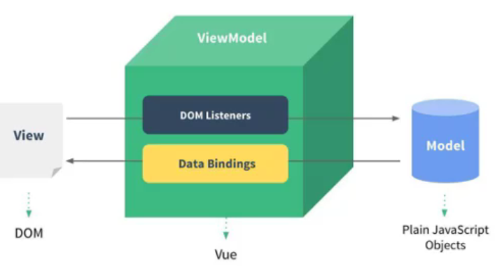
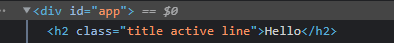
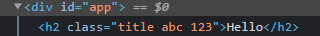

# 1. 简单认识Vue.js
- Vue（读音类似于view）
- Vue是一个渐进式的框架
  - 渐进式意味着可以将Vue作为应用的一部分嵌入其中，带来更丰富的交互体验
  - 如果希望将更多的业务使用Vue实现，那么Vue的核心库和生态系统也能满足要求
  - 比如：Core+Vue-router+Vuex
- Vue有很多特点和Web开发中常见的高级功能：
  - 解耦视图和数据
  - 可复用的组件
  - 前端路由技术
  - 状态管理
  - 虚拟DOM


# 2. Vue.js安装
安装方式：
- CDN引入
- 下载和引入(Vue官网下载Development Version,初学使用)
- npm安装

# 3. Hello Vuejs
原生JavaScript编程范式：命令式编程
Vue编程范式：声明式编程

声明式编程可以让数据和界面完全分离


##  3.1. Vue的响应式：
创建Vue对象的时候，传入了一些options:{}
- {}包含了`el`属性：该属性决定了这个Vue对象挂载到哪一个元素上
- {}中包含了data属性：该属性通常会储存一些数据
  - 这些数据可以是直接定义出来的
  - 也可能来自网络，从服务器加载的

代码示例：
```js
<div id="app">{{message}}</div>

<script>
    const app=new Vue({
        el:'#app',  // 用于挂载要管理的元素
        data:{  //定义数据
            message:'message test'

        }
    })


    // 原生js的做法（编程范式：命令式编程）
    // 1. 创建div元素
    // 2. 定义一个变量message
    // 3. 将message变量放在前面的div元素中显示
</script>
```
## 3.2. Vue列表显示
使用`v-for`指令，就不需要在JavaScript代码中完成DOM的拼接相关操作了

而且是响应式的，当数组中数据发生改变时，界面会自动改变
```js
<div id="app">
    <ul>
        <li v-for="item in movies">{{item}}</li>
    </ul>
</div>

<script>
    const app=new Vue({
    el:'#app',
    data:{
        message:'你好',
        movies:['film1','film2','film3','film4','film5']
    }
})
</script>
 ```

 ## 3.3. 案例-计数器
 ```js
<div id="app">
    <h2>当前计数：{{counter}}</h2>
    <!-- <button v-on:click="counter++">+</button>
    <button v-on:click="counter--">-</button> -->

    <button v-on:click="add">+</button>
    <button v-on:click="sub">-</button>
</div>
<script src="../js/vue.js"></script>


<script>
    const app = new Vue({
        el: '#app',
        data: {
            counter: 0
        },

        methods: {
            add: function () {
                // console.log('add被执行');
                this.counter++
            },
            sub: function () {
                // console.log('sub被执行');
                this.counter--
            }
        }
    })
</script>
```

- 新的属性：`methods`，该属性用于在Vue对象中定义方法
- 新的指令：`@click`,该指令用于监听某个元素的点击事件，并且需要指定当点击发生时，执行的方法（方法通常是methods中定义的方法）

# 4. Vue中的MVVM
什么是MVVM？



- View层：
  - 视图层
  - 在前端开发中，通常就是DOM层
  - 主要的作用就是给用户展示各种信息
- Model层：
  - 数据层
  - 数据可能是固定的数据，也可能是服务器请求下来的数据
- VueModel层：
  - 视图模型层
  - 视图模型层是View和Model沟通的桥梁
  - 一方面它实现了Data Banding,也就是数据绑定，将Model的改变实时的反映到View中
  - 另一方面它实现了DOM Listener，也就是DOM监听，当DOM发生一些事件（点击、滚动等）时，可以监听到，并在需要的情况下改变对应的Data


# 5. 创建Vue实例传入的options

目前掌握这些选项：
- el:
   - 类型：string/HMTLElement
   - 作用：决定之后Vue实例会管理哪一个DOM
- data:
   - 类型：Object/Function
   - 作用：Vue实例对应的数据对象
- methods:
   - 类型：{[key:string]:Function}
   - 作用：定义属于Vue的一些方法，可以在其他地方调用，也可以在指令中使用


# 6. Vue的生命周期
当自己写了一个 `new Vue()`时，看起来很简单，但是Vue在内部做了一系列的事情，在它做这一系列事情的时候，如果你自己写了对应的函数，它会通过回调函数告诉你它做到哪一步了

# 7. 插值的操作
## 7.1. Mustache语法

```js
<div id="app">
    <h2>{{message}}</h2>
    <!-- mustache语法中，不仅仅可以直接写变量，也可以写简单的表达式 -->
    <h2>{{firstName+' '+lastName}}</h2>
    <h2>{{firstName}} {{lastName}}</h2>
    <h2>{{counter*2}}</h2>
</div>

<script src="../js/vue.js"></script>

<script>
    const app = new Vue({
        el: '#app',
        data: {
            message: 'Hello',
            firstName: 'Jiaqin',
            lastName: 'Wang',
            counter:100
        },
        // methods: {}
    });
</script>
```


## 7.2. 一些常用指令
### 7.2.1. v-once
`v-once`指令使得数据不会在后续的改变中改变

```js
<div id="app">
    <h2>{{message}}</h2>    
    <h2 v-once>{{message}}</h2>
</div>

<script src="../js/vue.js"></script>

<script>
    const app = new Vue({
        el: '#app',
        data: {
            message: 'Hello'
        },
        methods: {}
    })
</script>
```

### 7.2.2. v-html
```js
<div id="app">

    <h2 v-html="url"></h2>
</div>

<script src="../js/vue.js"></script>

<script>
    const app = new Vue({
        el: '#app',
        data: {
            url:'<a href="http://www.baidu.com/">百度一下</a>',
        },
        methods: {}
    });
</script>
```

### 7.2.3. v-text
`v-text`的作用和`Mustache`比较相似：都是将数据显示在界面中

`v-text`通常情况下，接受一个string类型

```js
<div id="app">
    <h2>{{message}},World!</h2>   //Hello,World!
    <h2 v-text="message">,World!</h2>  //Hello
</div>

<script src="../js/vue.js"></script>

<script>
    const app = new Vue({
        el: '#app',
        data: {
            message: 'Hello'
        },
        methods: {}
    });
</script>
```

在开发中一般不用，因为不够灵活

### 7.2.4. v-pie

`v-pre`可以把{{}}里面的内容原封不动的显示出来，不要做解析

```js
<div id="app">
    <h2>{{message}}</h2>
    <h2 v-pre>{{message}}</h2>
</div>

<script src="../js/vue.js"></script>

<script>
    const app = new Vue({
        el: '#app',
        data: {
            message: 'Hello',
        },
        methods: {}
    });
</script>
```
结果是：
Hello
{{message}}

### 7.2.5. v-cloak
cloak:斗篷

浏览器解析HTML代码的时候是从上往下解析的，这就意味着先执行div中的代码，{{message}}。当出现执行下面的script代码卡住的时候，就会出现用户先看到“{{message}}”这些文字，过一会才看到它所代表的Hello文字出现，从而形成了一个闪动的效果，`cloak`指令可以很好的消除这样的闪动效果

```js
<head>
    <meta charset="UTF-8">
    <meta http-equiv="X-UA-Compatible" content="IE=edge">
    <meta name="viewport" content="width=device-width, initial-scale=1.0">
    <title>Document</title>
    <style>
        [v-cloak] {
            display: none;
        }
    </style>
</head>

<body>
    <div id="app">
        <h2 v-cloak>{{message}}</h2>
    </div>

    <script src="../js/vue.js"></script>

    <script>
        // 在vue解析之前，div中有一个属性v-cloak
        // 在vue解析之后，div中没有一个属性v-cloak
        setTimeout(function () {
            const app = new Vue({
                el: '#app',
                data: {
                    message: 'Hello'
                },
                methods: {}
            });
        }, 1000)
    </script>
</body>
```

## 7.3. 动态绑定属性
### 7.3.1. v-bind介绍
前面我们学习的指令主要作用是将值插入到模板的内容当中
但是，处理内容需要动态来决定外，某些属性我们也希望动态来绑定
- 比如动态绑定`a`元素的`href`属性
- 比如动态绑定img元素的`src`属性
这个时候，我们可以使用`v-bind`命令
- 作用：动态绑定属性
- 缩写:`:`
- 预期：any(with argument)|Object(without argument)
- 参数：attrOrProp(optional)

```js
<div id="app">
    
    <a v-bind:href="aHref">百度一下</a>
</div>

<script src="../js/vue.js"></script>

<script>
    const app = new Vue({
        el: '#app',
        data: {
            imgURL: 'https://www.baidu.com/img/PCtm_d9c8750bed0b3c7d089fa7d55720d6cf.png',
            aHref: 'https://www.baidu.com/',
        },

        methods: {}
    });
</script>
```
v-bind有一个对应的语法糖，也就是简写形式：

```js
<!-- 语法糖的写法 -->

<a :href="aHref">百度一下</a>
```

### 7.3.2. v-bind动态绑定class


#### 动态绑定class的对象语法

对象语法有下面这些用法：

用法一：直接通过{}绑定一个类
```js
<h2: class="{'active':isActive}">Hello World</h2>
```

用法二：可以通过判断，传入多个值
```js
<h2 :class="{active:isActive,line:isLine}">Hello World</h2>

```

用法三：和普通的类同时存在，并不冲突
```js
<h2 class="title" v-bind:class="{active:isActive,line:isLine}">{{message}}</h2>
```

用法四：如果过于复杂，可以放在一个methods或者computed中
```js
<h2 class="title" :class="classes">Hello World</h2>
```


```js
<!DOCTYPE html>
<html lang="en">

<head>
    <meta charset="UTF-8">
    <meta http-equiv="X-UA-Compatible" content="IE=edge">
    <meta name="viewport" content="width=device-width, initial-scale=1.0">
    <title>Document</title>
    <style>
        .active {
            color: red;
        }
    </style>

<body>
    <div id="app">
        <h2 class="title" v-bind:class="{active:isActive,line:isLine}">{{message}}</h2>
        <button v-on:click="btnClick">click me</button>
    </div>

    <script src="../js/vue.js"></script>

    <script>
        const app = new Vue({
            el: '#app',
            data: {
                message: 'Hello',
                isActive: true,
                isLine: true

            },
            methods: {
                btnClick: function () {
                    this.isActive = !this.isActive
                }
            }
        });
    </script>
</body>

</html>
```


#### 动态绑定class的数组语法


中括号内的元素加上单引号就是字符串
```js
<div id="app">
<!-- 中括号内的元素加上单引号就是字符串，不加单引号就是变量 -->
<h2 class="title" :class="['active','line']">{{message}}</h2>
<!-- <h2 class="title" :class="[active,line]">{{message}}</h2> -->
</div>

<script src="../js/vue.js"></script>

<script>
    const app = new Vue({
    el:'#app',
    data:{
        message:'Hello',
        active:'abc',
        line:'123'
    },
    methods:{}
    }) ;
    </script>
```


中括号内的元素不加单引号就是变量
```js
<div id="app">
<!-- 中括号内的元素加上单引号就是字符串，不加单引号就是变量 -->
<!-- <h2 class="title" :class="['active','line']">{{message}}</h2> -->
<h2 class="title" :class="[active,line]">{{message}}</h2>
</div>

<script src="../js/vue.js"></script>

<script>
    const app = new Vue({
    el:'#app',
    data:{
        message:'Hello',
        active:'abc',
        line:'123'
    },
    methods:{}
    }) ;
    </script>
```



### 7.3.3 v-bind绑定style

我们可以使用`v-bind:style`来绑定一些CSS内联样式

在写CSS属性的时候，比如：font-size
- 我们可以使用驼峰式： fontSize
- 或者短横线分隔(记得用单引号括起来) ： 'font-size'

绑定class有两种方式：
- 对象语法
- 数组语法

#### 绑定方式一：对象语法
```js
<div id="app">
    <!-- 50px 必须加上单引号，否则是当做一个变量去解析的 -->
<!-- <h2 :style="{fontSize:'50px'}">{{message}}</h2> -->

<h2 :style="{fontSize:finalSize+'px',color:finalColor}">{{message}}</h2>


</div>

<script src="../js/vue.js"></script>

<script>
    const app = new Vue({
    el:'#app',
    data:{
        message:'Hello',
        finalSize:100,
        finalColor:'red',
    },
    methods:{}
    }) ;
    </script>
```

#### 绑定方式二：数组语法
```js
<div id="app">
    <!-- 多个值之间以逗号进行分割即可 -->
    <h2 :style="[baseStyle,baseStyle1]">{{message}}</h2>
</div>

<script src="../js/vue.js"></script>

<script>
    const app = new Vue({
        el: '#app',
        data: {
            message: 'Hello',
            baseStyle: {
                backgroundColor: 'red'
            },
            baseStyle1: {
                fontSize: '100px'
            },
        },
        methods: {}
    });
</script>
```

# 8. 计算属性
在模板中可以直接通过插值语法显示一些data中的数据

但是在某些情况，我们可能需要对数据进行一些转化后再进行显示，或者需要将多个数据结合起来进行显示

比如我们有`firstName`和`lastName`两个变量，我们需要显示完整额名称
但是如果在多个地方都需要显示完整的名称，我们就需要写多个`{{firstName}} {{lastName}}`


## 8.1. 计算属性最基本的使用
```js
<div id="app">
    <h2>{{getFullName()}}</h2>
    
    <h2>{{fullName}}</h2>
</div>

<script src="../js/vue.js"></script>

<script>
    const app = new Vue({
        el: '#app',
        data: {
            firstName: 'Jianqin',
            lastName: 'Wang',
        },
        methods: {
            getFullName() {
                return this.firstName + ' ' + this.lastName
            }
        },

        // computed:计算属性
        computed:{
            fullName:function(){
                return this.firstName+' '+this.lastName
            }
        }
    });
</script>
```
## 8.2. 计算属性的复杂操作
```js
    <div id="app">
        <h2>总价格：{{totalPrice}}</h2>
    </div>

    <script src="../js/vue.js"></script>

    <script>
        const app = new Vue({
            el: '#app',
            data: {
                books: [{
                    id: 001,
                    name: '斗破苍穹',
                    price: 9
                }, {
                    id: 002,
                    name: '斗罗大陆',
                    price: 199
                }, {
                    id: 003,
                    name: '盘龙',
                    price: 299
                }, {
                    id: 004,
                    name: '遮天',
                    price: 19
                }, ]
            },
            methods: {},
            computed: {
                totalPrice: function () {
                    let result = 0
                    for (let i = 0; i < this.books.length; i++) {
                        result += this.books[i].price
                    }
                    return result
                }
            }
        });
    </script>
```


