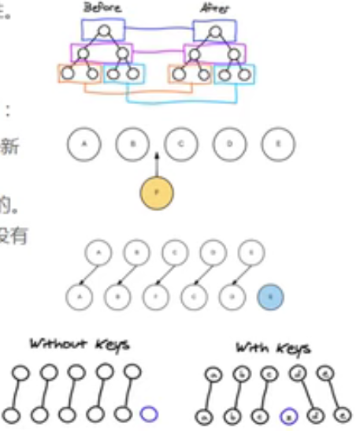

## 8.3. 计算属性的setter和getter
每个计算属性 都包含一个setter和一个getter
一般情况下，只用到getter来读取，在某些情况下，也可以提供一个setter方法（不常用）

```js
    <div id="app">
        <h2>{{fullName}}</h2>
    </div>

    <script src="../js/vue.js"></script>

    <script>
        const app = new Vue({
            el: '#app',
            data: {
                firstName: 'Jianqin',
                lastName: 'Wang',
            },
            methods: {},
            computed: {

                // 计算属性一般是没有set方法，只读属性
                fullName: {
                    set: function () {

                    },
                    get: function () {
                        return this.firstName+' '+this.lastName
                    }
                }

            }
        });
    </script>
```
## 8.4. 计算属性的缓存

计算属性相对于methods的优势是：
- 让代码变得简洁
- 提高性能,计算属性会进行缓存，如果多次使用时，计算属性只会调用一次

```js
    <div id="app">
        <!-- 1. 直接拼接 -->
        <h2>{{firstName}} {{lastName}}</h2>

        <!-- 2. 通过定义methods -->
        <h2>{{getFullName()}}</h2>

        <!-- 3. 通过computed -->
        <h2>{{fullName}}</h2>
    </div>

    <script src="../js/vue.js"></script>

    <script>
        const app = new Vue({
            el: '#app',
            data: {
                firstName: 'Jianqin',
                lastName: 'Wang',
            },
            methods: {
                getFullName: function () {
                    return this.firstName + ' ' + this.lastName
                }
            },
            computed: {
                fullName: function () {
                    return this.firstName + ' ' + this.lastName
                }
            }
        });
    </script>
```
# 9. ES6知识补充
## 9.1. let/var

事实上var的设计可以看成JavaScript语言设计上的错误，但是这种错误多半不能修复和移除，需要向后兼容，Brendab Eich就决定解决这个问题，于是他添加了一个新的关键字：let

let可以被看做一个更完美的var

JavaScript设计之初只有函数是有作用域的。其他像是for if等都是没有作用域的。以前使用var作为变量的时候，为了解决引用外面变量造成变量污染的问题，必须借助function的作用域来解决，即使用闭包这样的手段。

ES6中加入了`let`，let是有if和for块级作用域的


```html
    <button>按钮1</button>
    <button>按钮2</button>
    <button>按钮3</button>
    <button>按钮4</button>
    <button>按钮5</button>
    <button>按钮6</button>
    <script>
        // 1.变量作用域
        // {
        //     var name = 'spongebob';
        //     console.log(name);
        // }
        // console.log(name);


        // 没有块级作用域引起的问题:if 的块级
        // if(true){
        //     var name="abc"
        // }

        // console.log(name);

        // 没有块级作用域引起的问题 for的块级
        var btns=document.getElementsByTagName('button')

        for (var i=0;i<btns.length;i++){
            btns[i].addEventListener('click',function(){
                console.log('第'+i+'个按钮被点击了');
            })
        }
    </script>
```

## 9.2. const的使用
const关键字：
- 在很多语言中已经存在，主要的作用是将某个变量修饰为常量
- 在JavaScript中也是如此，使用`const`修饰的标识符为常量，不可以再次赋值

什么时候使用const
- 当我们修饰的标识符不会被再次赋值时，就可以使用`const`来保证数据的安全性

建议：在开发中优先使用`const`，只有需要改变某一个标识符的时候，才使用`let`


```html
<script>
    // 1. 一旦给const修饰的标识符被赋值后，不能修改
    // const name="spongebob";
    // name="abc"

    // 2. 在使用const定义标识符必须进行赋值
    // const name;

    // 3. 常量的含义是指向的对象不能修改，但是可以改变对象内部的属性
    const obj={
        name:'spongebob',
        age:3,
        adress:'pineapple house'
    }

    console.log(obj);

    obj.name='Patrick Star'
    obj.age=18
    obj.adress='stone house'
    console.log(obj);
</script>
```

## 9.3. 对象字面量的增强写法
```html
<script>
    // 1. 属性的增强写法
    const name = 'spongebob'
    const age = '12'
    const height = 1.0

    // ES5的写法
    // const obj = {
    //     name: name,
    //     age: age,
    //     height: height
    // }

    // ES6的写法
    const obj = {
        name,
        age,
        height
    }

    console.log(obj);


    // 2. 函数的增强写法
    // ES5的写法
    const obj = {
        run: function () {

        },
        eat: function () {

        }
    }

    // ES6的写法
    const obj = {
        run() {},
        eat() {}
    }
</script>
```

# 10. 事件监听
> 监听事件用`v-on`指令

v-on介绍
- 作用：绑定事件监听器
- 缩写：@
- 预期：Function|Inline Statement|Object
- 参数：event

## 10.1. v-on的基本使用

```html
<div id="app">
    <h2>{{counter}}</h2>
    <button @click="increment">+</button>
    <button @click="decrement">-</button>
</div>

<script src="../js/vue.js"></script>

<script>
    const app = new Vue({
        el: '#app',
        data: {
            counter:0
        },
        methods: {
            increment() {
                this.counter++
            },
            decrement() {
                this.counter--
            }
        }
    });
</script>
```

## 10.2. v-on参数
```html
<div id="app">
    <!-- 事件调用的方法没有参数 -->
    <button @click="btn1Click">button1</button>

    <!-- 在事件定义时，写参数时省略了小括号，但是方法本身是需要一个参数的，这个时候，Vue会默认将浏览器生成的event事件对象作为参数传入到方法 -->
    <button @click="btn2Click(123)">button2</button>


    <!-- 方法定义时，我们需要event对象，同时又需要其他参数 -->
    <!-- 在调用方法时，如何手动的获取到浏览器参数的event对象：$event -->
    <button @click="btn3Click(123,$event)">button3</button>


</div>

<script src="../js/vue.js"></script>

<script>
    const app = new Vue({
        el: '#app',
        data: {},
        methods: {
            btn1Click(){
                console.log('btn1Click');
            },
            btn2Click(event){
                console.log(event,'-------');
            },
            btn3Click(abc,event){
                console.log(abc,event);
            }
        }
    });
</script>
```

## 10.3. v-on修饰符

在某些情况下，我们拿到event的目的可能是进行一些事件处理

Vue提供了修饰符来帮助我们方便的处理一些事件：
- `.stop` 相当于调用event.stopPropagation(),可以用来消除事件冒泡
- `.prevent` 相当于调用event.preventDefault()
- `.{keyCode|keyAlias}` 只当事件是从特定键触发时才触发回调
- `.native` 监听事件根元素的原生事件
- `.once` 只触发一次回调


```html
<div id="app">
    <div @click="divClick">
        <!--1. 使用 .stop 修饰符 解决事件冒泡问题 -->
        <button @click.stop="btnClick">BUTTON</button>
    </div>

    <!-- 2. 使用 .prevent 修饰符 阻止默认事件 -->

    <br/>
    <form action="baidu">
        <input type="submit" value="submit" @click.prevent="submitClick">
    </form>


    <!-- 3. 监听某个键盘的键的点击 -->
    <input type="text" @keyup.enter="keyUp">


    <!-- 4. 自定义组件 -->
    <!-- <cpn @click.native="cpnClick"></cpn> -->

    <!-- 5.  .once修饰符的使用 -->
    <button @click.once="btn2Click">button2</button>
</div>

<script src="../js/vue.js"></script>

<script>
    const app = new Vue({
        el: '#app',
        data: {},
        methods: {
            btnClick() {
                console.log("btnClick");
            },
            divClick() {
                console.log("divClick");
            },
            submitClick(){
                console.log('submitClick');
            },
            keyUp(){
                console.log('keyUp');
            },
            // cpnClick(){

            // },
            btn2Click(){
                console.log('btn2Click');
            }
        }
    });
</script>
```

# 11. 条件判断
这三个指令与JavaScript的条件语句if、else、else if类似
Vue的条件指令可以根据表达式的值在DOM中渲染或者销毁元素或者组件

## 11.1.  v-if v-esle-if v-else
### v-if:
```html
<div id="app">
    <h2 v-if="isShow">{{message}}</h2>
</div>

<script src="../js/vue.js"></script>

<script>
    const app = new Vue({
        el: '#app',
        data: {
            message: 'Hello',
            isShow: true
        },
        methods: {}
    });
</script>
```
### v-else-if 和v-else
```html
<div id="app">
    <!-- 实际开发中不会这样写，而是会写一个计算属性computed -->
    <h2 v-if="score>=90">优秀</h2>
    <h2 v-else-if="score>=80">良好</h2>
    <h2 v-else-if="score>=60">及格</h2>
    <h2 v-else>不及格</h2>

    <h1>{{result}}</h1>
</div>

<script src="../js/vue.js"></script>

<script>
    const app = new Vue({
        el: '#app',
        data: {
            score: 90
        },
        methods: {},
        computed: {
            result() {
                let showMessage = '';
                if (this.score >= 90) {
                    showMessage = '优秀'
                } else if (this.score >= 80) {
                    showMessage = '良好'
                } else if (this.score >= 60) {
                    showMessage = '及格'
                } else {
                    showMessage = '不及格'
                }
                return showMessage
            }
        }
    });
</script>
```

### 条件渲染案例
账号登录与邮箱登录的切换
```html
<div id="app">
    <span v-if="isUser">
        <label for="username">用户账号</label>
        <!-- 分别给用户账号和用户邮箱的input设置不同的key就可以解决切换登录方式但是先前输入未清空的问题 -->
        <input type="text" id="username" placeholder="用户账号"key="username">
    </span>

    <span v-else> <label for="email">用户邮箱</label>
        <input type="text" id="email" placeholder="用户邮箱" key="email"></span>
    </span>
    <button @click="isUser=!isUser">切换类型</button>
</div>

<script src="../js/vue.js"></script>

<script>
    const app = new Vue({
        el: '#app',
        data: {
            isUser: true
        },
        methods: {}
    });
</script>
```
#### 案例小问题
##### 问题：
如果我们在有输入内容的情况下，切换了类型，我们会发现文字依然显示之前的输入的内容，但是按道理讲，我们应该切换到另外一个`input`元素中了，在另一个`input`元素中，我们并没有输入内容，为什么会出现这个问题？


##### 问题解答
这是因为Vue在进行DOM渲染时，出于性能考虑，会尽可能的复用已经存在的元素（虚拟DOM），而不是重新创建新的元素

在上面的案例中，Vue内部会发现原来的input元素不再使用，直接作为`else`中的`input`来使用了


##### 解决方案
如果我们不希望Vue出现此类重复利用的问题，可以给对应的input 添加`key`
需要保证`key`的不同

# 11.2. v-show
> `v-show`的用法和`v-if`非常相似，也用于决定一个元素是否渲染

### `v-if`和`v-show`的对比
- 当`v-if`条件为false时，压根不会有对应的元素在DOM中
- `v-show`条件为false时，仅仅是将元素的`display`属性设置为`none`而已

### 开发中如何选择
- 当需要在显示与隐藏之间切换很频繁时，选择`v-show`
- 当只有一次切换时，选择`v-if`

# 12. 循环遍历
## 12.1. v-for

### 12.1.1 v-for 遍历数组
```html
    <div id="app">
        <!-- 1. 在遍历过程中没有使用索引值（下标值） -->
        <ul>
            <li v-for="item in names">{{item}}</li>
        </ul>


        <!-- 2. 在遍历的过程中获取索引值 -->
        <ul>
            <li v-for="(item,index) in names">{{index+1}}.{{item}}</li>
        </ul>
    </div>

    <script src="../js/vue.js"></script>

    <script>
        const app = new Vue({
            el: '#app',
            data: {
                names: ['a', 'b', 'c', 'd', 'e', 'f']
            },
            methods: {}
        });
    </script>
```

### 12.1.2 v-for 遍历对象
```html
<div id="app">
    <!-- 1. 在遍历对象的过程中，如果只是获取一个值，那么获取到的是value -->
    <ul>
        <li v-for="item in info">{{item}}</li>
    </ul>

    <!-- 2. 获取key和value 格式：(value,key) -->
    <ul>
        <li v-for="(value,key) in info">{{value}}-{{key}}</li>
    </ul>

    <!-- 3. 获取key和value和index   格式：(value,key，index) -->
    <ul>
        <li v-for="(value,key,index) in info">{{value}}-{{key}}-{{index}}</li>
    </ul>
</div>

<script src="../js/vue.js"></script>

<script>
    const app = new Vue({
        el: '#app',
        data: {
            info: {
                name: 'spongebob',
                age: '3',
                address: 'pineapple house',
            }
        },
        methods: {}
    });
</script>
```

### 12.1.3 组件的key属性
官方推荐我们在使用`v-for`的时候，给对应的元素或者组价加上一个`:key`属性

为什么要加上`key`属性呢？
目的是让我们能够更好的复用

这个其实和Vue的虚拟DOM的Diff算法有关系
这里我们使用一张图来简单说明一下：


当某一层有很多节点时，我们希望插入一个新的节点

我们希望在B和C之间插入一个F,Diff算法默认执行起来是这样的：即把C更新成F，D更新成E，E更新成D，最后再插入E，很没有效率

所以我们希望使用key来给每一个节点做一个唯一标识
- diff算法就可以正确的识别此节点
- 找到正确的位置插入新的节点
  
所以，`key`的作用主要是为了高效的更新虚拟DoM


### 12.1.4 检测数组更新
因为Vue是响应式的，所以当数据发生改变时，Vue会自动检测数据变化，视图会发生相应的更新

Vue包含了一组观察数组编译的方法，使用他们改变数组也会触发视图的更新
- push()
- pop()
- shift()
- unshift()
- splice()
- sort()
- reverse()

```html
<div id="app">
    <ul>
        <li v-for="item in letters">{{item}}</li>
    </ul>
    <button @click="btnClick">按钮</button>
</div>

<script src="../js/vue.js"></script>

<script>
    const app = new Vue({
        el: '#app',
        data: {
            letters: ['a', 'b', 'c', 'd', 'e']
        },
        methods: {
            btnClick() {
                // 可以做到响应式的方法：

                // 1. push方法
                // this.letters.push('test')
                // push 可以一次性添加多个元素
                // this.letters.push('first','second','third')

                // 2. pop()
                // this.letters.pop();

                // 3. shift() 删除数组中的第一个元素
                // this.letters.shift();

                // 4. unshift() 在数组最前面添加元素
                // this.letters.unshift('first')
                // unshift可以一次性添加多个元素
                // this.letters.unshift('first','second','third')

                // 5. splice(start)
                // splice作用：删除元素、插入元素、替换元素
                // 删除元素：第二个参数传入你要删除几个元素(如果没有传，就是删除后面所有的元素)
                // this.splice(1,1) //从1号删，删除1个元素

                // 替换元素：第二个参数表示我们要替换几个元素，后面是用来替换前面的元素
                // this.letters.splice(1,3,'o','m','g') //从1号开始替换，替换三个元素，分别替换为 o m g 

                // 插入元素：第二个参数设为0（可以理解为一个元素都不删），后面的参数是插入的值
                // this.splice(1,0,'o','m','g')  //从1号开始插入，插入三个值：o,m,g

                // 6. sort() 排序，可以传参数，传入函数参数
                // this.letters.sort()

                // 7. reverse(
                // this.letters.reverse()


                // 注意：通过索引值修改数组中的元素就不能做到响应式
                // this.letters[0]='test';
                
                // 如果想要做到响应式，可以这样做：
                // this.letters.splice(0,1,'test')
                // 或者：使用 set(要修改的对象，索引值，修改后的值)
                // Vue.set(this.letters,0,'test')
            }
        }
    });
</script>
```

## 12.2 作业
默认第一个元素为红色，之后点击谁谁就变红色

```html
<div id="app">
    <ul>
        <li v-for="(item,index) in movies" :class="{active:currentIndex===index}" @click="liClick(index)">
            {{index}}{{item}}</li>
    </ul>
</div>

<script src="../js/vue.js"></script>

<script>
    const app = new Vue({
        el: '#app',
        data: {
            movies: ['a', 'b', 'c', 'd', 'e'],
            currentIndex: 0
        },
        methods: {
            liClick(index) {
                this.currentIndex = index
            }
        }
    });
</script>
```


