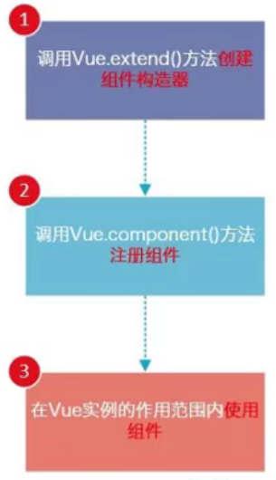

# 1. JavaScript高阶函数的使用
filter/map/reduce

filter中的回调函数有一个要求，必须返回一个boolean值：
- true:当返回true时1，函数内部会自动将这次的回调的n加入到新的数组中
- false:当返回false时，函数内部会自动过滤掉这次的n

```js
// 1. filter函数的使用
const nums = [1, 2, 3, 4, 5, 6, 7, 8]
let newNums = nums.filter(function (n) {
    // return true
    return n < 5
})

// console.log(newNums);


// 2. map函数的使用
let new2Nums = newNums.map(function (n) {
    return n * 2
})
console.log(new2Nums);


// 3. reduce函数的使用
// reduce作用就是对数组中所用的内容进行汇总

let total = new2Nums.reduce(function (preValue, n) {
    return preValue + n
}, 0)

console.log(total);
```

# 2. 表单绑定 v-model
> Vue中使用`v-model`指令来是实现表单元素和数据的双向绑定

## 2.1. `v-model`实现双向绑定：
当我们在输入框输入内容时，因为input中的v-model绑定了message，所以会实时将输入的内容传递给message，message发生改变

当message发生改变时，因为上面我们使用Mustache语法，将message的值插入到DOM中，所以DOM会发生响应的改变。

所以，通过v-model实现了双向的绑定

## 2.2. v-model的原理
v-model其实是一个语法糖，它的背后本质上包含两个操作：
- v-bind绑定一个value属性
- v-on指令给当前元素绑定input事件

也就是说，代码：
```js
<input type="text" v-model="message">
```
等同于：
```js
<input type="text" :value="message" @input="message=$event.target.value">
```

## 2.3. v-model:radio 
v-model结合radio（单选按钮）可以实现在选择的同时进行内容的修改
```html
<div id="app">
    <label for="">
        <input type="radio" id="male"  value="男" v-model="sex">男
    </label>
    <label for="">
        <input type="radio" id="female"  value="女" v-model="sex">女
    </label>

    <h2>您选择的性别是：{{sex}}</h2>
</div>

<script src="../js/vue.js"></script>

<script>
    const app = new Vue({
        el: '#app',
        data: {
            sex: '男'
        },
        methods: {}
    });
</script>
```

## 2.4. v-model:checkbox
复选框分为单个勾选框和多个勾选框：
- 单个勾选框对应的是boolean类型
- 多个勾选框对应的是数组类型

```html
<div id="app">
    <!-- 1. checkbox单选框 -->
    <label for="agree">
        <input type="checkbox" id="agree" v-model="isAgree">同意协议
    </label>

    <h2>您选择的是：{{isAgree}}</h2>
    <button :disabled="!isAgree">下一步</button>

    <!-- 2. checkbox多选框 -->
    <label for="">
        <input type="checkbox" value="篮球" v-model="hobbies">篮球
        <input type="checkbox" value="足球" v-model="hobbies">足球
        <input type="checkbox" value="网球" v-model="hobbies">网球
        <input type="checkbox" value="羽毛球" v-model="hobbies">羽毛球
    </label>

    <h2>您的爱好是：{{hobbies}}</h2>
</div>

<script src="../js/vue.js"></script>

<script>
    const app = new Vue({
        el: '#app',
        data: {
            isAgree: false,
            hobbies: []
        },
        methods: {}
    });
</script>
```

## 2.5. v-model:select
和CheckBox一样，select也分单选和多选两种情况
```html
<div id="app">
    <!-- 1. 选择一个 -->
    <select name="abc" v-model="abcd">
        <option value="a">a</option>
        <option value="b">b</option>
        <option value="c">c</option>
        <option value="d">d</option>
        <option value="e">e</option>
        <option value="f">f</option>
        <option value="g">g</option>
    </select>
    <h2>您选择的字母是：{{abcd}}</h2>

    <!-- 2. 选择多个 -->
    <select name="abc" v-model="abcde" multiple>
        <option value="a">a</option>
        <option value="b">b</option>
        <option value="c">c</option>
        <option value="d">d</option>
        <option value="e">e</option>
        <option value="f">f</option>
        <option value="g">g</option>
    </select>
    <h2>您选择的字母是：{{abcde}}</h2>

</div>

<script src="../js/vue.js"></script>

<script>
    const app = new Vue({
        el: '#app',
        data: {
            abcd: 'e',
            abcde:'d',
        },
        methods: {}
    });
</script>
```

## 2.6. 值绑定

> 值绑定就是动态的给value赋值

之前value中的值都是在定义input的时候直接给定的

但是在真实开发中，这些input的值可能是从网络获取或定义在data中的

所以我们可以通过v-bind:value动态的给value绑定值

这其实就是v-bind在input中的应用

## 2.7. 修饰符

### 2.7.1. lazy修饰符
默认情况下，v-model默认是在Input事件中同步输入框的数据的

一旦有数据发生改变对应的data中的数据就会自动发生改变
> lazy修饰符可以让数据在失去焦点或者回车时才会更新

### 2.7.2. number修饰符
默认情况下，在输入框中无论我们输入的是字母还是数字，都会被当做是字符串类型进行处理

但是如果我们希望处理的是数字类型，那么最好直接将内容当做数字处理

> number修饰符可以让在输入框中国输入的内容自动转成数字类型
### 2.7.3. trim修饰符
如果输入的内容首尾有很多空格，通常我们希望将其去除

> trim 修饰符可以过滤内容左右两边的空格

```html
<div id="app">

    <!-- 1. 修饰符：lazy -->
    <input type="text" v-model.lazy="message">
    <h2>{{message}}</h2>

    <!-- 2. 修饰符：number  -->
    即使将input标签的type设置为number，input输入框获取到的值依旧是string类型，只不过限制了除
    <input type="number" v-model.number="age">
    <h2>{{age}}-{{typeof age}}</h2>

    <!-- 3. 修饰符：trim -->
    <input type="text" v-model.trim="name">
    <h2>您输入的名字：{{name}}</h2>
</div>

<script src="../js/vue.js"></script>

<script>
    const app = new Vue({
        el: '#app',
        data: {
            message: 'Hello',
            age: 0,
            name:''
        },
        methods: {

        }
    });
</script>
```
# 3. 组件化
组件化的思想：
- 如果我们将一个页面中所有的处理逻辑全部放在一起，处理起来就会变得非常复杂，而且不利于后续的管理以及扩展
- 但是，我们将一个页面拆分成一个个小的功能块，每个功能块完成属于自己这部分独立的功能，那么之后整个页面的管理和维护就变得非常容易了

## 3.1. Vue组件化思想
组件化是Vue.js中的重要思想
- 它提供了一种抽象，让我们可以开发出一个个独立可复用的小组件来构造我们的应用
- 任何的应用都会被抽象成一颗组件树

组件化思想的应用：
- 尽可能的将页面拆分成一个个小的、可复用的组件
- 代码更方便组织和管理，并且扩展性更强

## 3.2. 注册组件的基本步骤
组件的使用分为三个步骤：
- 创建组件的构造器
- 注册组件
- 使用组件



```html
    <!-- 3. 使用组件 -->
    <my-cpn></my-cpn>
    <my-cpn></my-cpn>
    <my-cpn></my-cpn>
    <my-cpn></my-cpn>
</div>

<script src="../js/vue.js"></script>

<script>
    // 1. 创建组件构造器对象
    const cpnC = Vue.extend({
        template: `
        <div>
            <h2>我是标题</h2>
            <p>我是内容</p>
            <p>我是内容2号</p>
        </div>`
    })

    // 2. 注册组件
    // Vue.component('组件的标签名','组件的构造器')
    Vue.component('my-cpn', cpnC)
    // 3. 使用组件
    const app = new Vue({
        el: '#app',
        data: {},
        methods: {}
    });
</script>
```


##  3.3. 注册组件的步骤解析
### 3.3.1. Vue.extend()
- 调用Vue.extend()创建的是一个组价构造器
- 通常在创建组件构造器时，传入template代表我们自定义组件的模板
- 该模板就是在使用到组件的地方，要显示的HTML代码
- 事实上，这种写法在Vue2.x的文档中几乎已经看不到了，它会直接使用语法糖（后续课程），这种方式是学习后面方式的基础

### 3.3.2. Vue.component()
- 调用Vue.component()是将刚才的组件构造器注册成为一个组件，并且给它起一个组件的标签名称
- 需要传递两个参数：
  - 注册组件的标签名
  - 组件构造器

### 3.3.3. 组件必须挂载在某个Vue实例下，否则它不会生效
可以允许在Vue实例下做嵌套，但是不能超出Vue实例的范围之外

## 3.4. 全局组件和局部组件
- 当我们通过调用Vue.component()注册组件时，组件的注册时全局的
- 当我们注册的组件时挂载在某一个实例中，那么就是一个局部组件

```html
<div id="app">
    <cpn></cpn>
</div>
<div id="app2">
    <cpn></cpn>

</div>

<script src="../js/vue.js"></script>

<script>
    // 1. 创建组件构造器
    const cpnC = Vue.extend({
        template: `
        <div>
            <h2>我是标题</h2>
            <p>我是内容</p>
            <p>我是内容2号</p>
        </div>`
    })


    // 2. 注册组件（全局组件,意味着可以在多个Vue的实例下面使用）
    // Vue.component('cpn', cpnC)

    const app = new Vue({
        el: '#app',
        data: {},
        methods: {},
        components: {
            // 注册局部组件
            // cpn使用组件时的标签名
            cpn: cpnC
        }
    });

    const app2 = new Vue({
        el: '#app2'
    })
</script>
```

## 3.5. 父组件和子组件
前面的提到了组件树：
- 组件和组件存在层级关系
- 其中一种非常重要的关系就是父子组件的关系

```html
<div id="app">
    <cpn2></cpn2>
</div>

<script src="../js/vue.js"></script>

<script>
    // 1. 创建第一个组件构造器（子组件）
    const cpnC1 = Vue.extend({
        template: `
        <div>
            <h2>我是标题1</h2>
            <p>我是内容1</p>
        </div>`
    })

    // 1. 创建第二个组件构造器(父组件)
    const cpnC2 = Vue.extend({
        template: `
        <div>
            <h2>我是标题2</h2>
            <p>我是内容2</p>
            <cpn1></cpn1>
        </div>`,
        components: {
            cpn1: cpnC1
        }
    })

    // 可以认为这是一个root组件
    const app = new Vue({
        el: '#app',
        data: {},
        methods: {},
        components: {
            cpn2: cpnC2,
        }
    });
</script>
```

父子组件错误用法：以子标签的形式在Vue实例中使用
- 因为当子组件注册到父组件的components时，Vue会编译好父组件的模块
- 该模板的内容已经决定了父组件将要渲染的HTML（相当于父组件中已经有了子组件的内容了）
- &lt;child-cpn&gt;&lt;/child-cpn&gt;是只能在父组件中被识别的
- 类似这种用法，&lt;child-cpn&gt;&lt;/child-cpn&gt;是会被浏览器忽略的

## 3.6. 注册组件的语法糖
语法糖主要是省去了调用Vue.extend()的步骤，而是可以直接使用一个对象来代替

```html
<div id="app">
    <cpn1></cpn1>
    <cpn2></cpn2>
</div>

<script src="../js/vue.js"></script>

<script>
    const cpnC1 = Vue.extend()

    Vue.component('cpn1', {
        template: `
        <div>
            <h2>我是标题1</h2>
            <p>我是内容1</p>
        </div>`
    })

    const app = new Vue({
        el: '#app',
        data: {},
        methods: {},

        // 注册局部组件的语法糖
        components: {
            cpn2: {
                template: `
        <div>
            <h2>我是标题2</h2>
            <p>我是内容2</p>
        </div>`
            }
        }
    });
</script>
```


