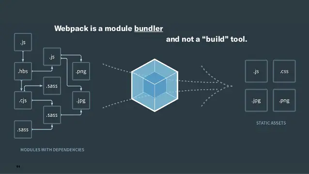

# 1. 父子组件的访问方式：$children

有时候我们需要父组件直接访问子组件，子组件直接访问父组件，或者子组件访问根组件

- 父组件访问子组件：使用`$children`或者`$refs`
- 子组件访问父组件：使用`$parent`

```html
```

```html
```

# 2. 插槽（slot）
## 2.1. 为什么要使用插槽、
插槽的目的是让我们原来的设备具备更多的扩展性
#### 组件的插槽：
- 组件的插槽是为了让我们封装的组件更具有扩展性
- 让使用者可以决定组件内部的一些内容到底展示什么

#### 开发中插槽的例子：
移动开发中，几乎每个页面都有导航栏，导航栏必然会封装成一个插件，比如nav-bar组件，一旦有了这个组件，我们就可以在多个页面中复用了

## 2.2. 如何封装这类组件呢？slot
像是导航栏这类组件，他们有很多区别，也有很多共性

#### 如何封装合适呢？抽取共性，保留不同
- 最好的封装方式就是将共性抽取到组件中，将不同暴露为插槽
- 一旦我们预留了插槽，就可以让那个使用者根据自己的需求，插槽中插入什么内容

```html
<div id="app">
    <cpn><button>button</button></cpn>
    <cpn><span>span</span></cpn>
    <cpn><i>i</i></cpn>
    <cpn>
        <i>i</i>
        <div>div</div>
        <p>p</p>
    </cpn>
    <cpn></cpn>
</div>

<template id="cpn">
    <div>
        <h2>我是组件</h2>
        <p>我是组件p</p>
        <!-- 如果没有特殊指定，则插槽处就是下面默认的button,如果指定了插槽的类型，则就会覆盖掉默认的button -->
        <slot><button>button</button></slot>
    </div>
</template>

<script src="../js/vue.js"></script>

<script>
    const app = new Vue({
        el: '#app',
        data: {},
        methods: {},
        components: {
            cpn: {
                template: '#cpn'
            }
        }
    });
</script>
```
## 2.3. 具名插槽
```html
    <div id="app">
   
        <cpn><span slot="center">title</span></cpn>
    </div>

    <template id="cpn">
        <div>
           
            <slot name="left"><span>left</span></slot>
            <slot name="center"><span>center</span></slot>
            <slot name="right"><span>right</span></slot>
            <slot></slot>
        </div>
    </template>

    <script src="../js/vue.js"></script>

    <script>
        const app = new Vue({
            el: '#app',
            data: {},
            methods: {},
            components: {
                cpn: {
                    template: '#cpn'
                }
            }
        });
    </script>
```
## 2.4. 编译作用域
在真正学习作用域插槽之前，我们需要先理解一个概念：**编译作用域**


```html
    <div id="app">
        <!-- isshow指令主要是看在哪一个模板里面，这里是在根模板（Vue实例模板）里面所以isShow=true，内容得以显示 -->
        <cpn v-show="isShow"></cpn>
    </div>

    <template id="cpn">
        <div>
            <h2>我是子组件</h2>
            <p>我是子组件的内容</p>
        </div>
    </template>

    <script src="../js/vue.js"></script>

    <script>
        const app = new Vue({
            el: '#app',
            data: {
                isShow: true,
            },
            methods: {},
            components: {
                cpn: {
                    template: '#cpn'
                },
                data() {
                    return {
                        isShow: false
                    }
                }
            }
        });
    </script>
```

我们来考虑上面的代码是否最终可以渲染出来：
-     <cpn v-show="isShow"></cpn>中我们使用了isShow属性、
- isShow属性包含在组件中，也包含在Vue实例中

答案：可以渲染出来，也就是使用的Vue实例的属性

> 官方准则：父组件模板的所有东西都会在父级作用域内编译；子组件模板的所有东西都会在子级作用域内编译

## 2.5. 作用域插槽
### 2.5.1. 作用域插槽:准备
> 一句话总结：父组件替换插槽的标签，但是内容由子组件来提供

```html
    <div id="app">
       
        <cpn></cpn>
        <cpn>
            <!-- 目的：获取子组件的pLanguage，但是这是在Vue实例中，由于编译作用域的原因拿不到子组件中的pLanguage数据 -->
            <template slot-scope="slot">
            <!-- <span v-for="item in slot.data">{{item}} - </span>-->
            <span>{{slot.data.join(' - ')}}</span>
                    
                
            </template>
        </cpn>
    </div>


    <template id="cpn">
        <div>
            <!-- :data不是固定写法，也可以写:abc等等 -->
            <slot :data="pLanguage">
                <ul>
                    <li v-for="item in pLanguage">{{item}}</li>
                </ul>
            </slot>
        </div>
    </template>

    <script src="../js/vue.js"></script>

    <script>
        const app = new Vue({
            el: '#app',
            data: {},
            methods: {},
            components: {
                cpn: {
                    template: '#cpn',
                    data() {
                        return {
                            pLanguage: ['JavaScript', 'C++', 'Java', 'C#', 'Python']
                        }
                    }
                }
            }
        });
    </script>
```

# 3. 模块化开发
## 3.1. JavaScript原始功能
在网页开发早期，JS制作作为一门脚本语言，做一些简单的表单验证或者动画实现等，那个时候代码还是很少

随着Ajax异步请求的出现，慢慢形成了前后端的分离：
客户端需要完成的事情越来越多，代码量也与日俱增
为了应对代码量的剧增，我们通常会将代码组织在多个JS文件中，进行维护

但是这种维护方式，依然不能避免一些灾难性的问题：
- 全局变量同名问题
- 代码编写方式对于js文件的依赖顺序几乎是强制性的

## 3.2. 匿名函数的解决方案

匿名函数可以解决变量命名冲突的问题，但是带来了另一个问题：**代码几乎不可复用**


## 3.3. 使用模块作为出口
我们可以使用将需要暴露在外面的变量，使用一个模块作为出口：
- 在匿名函数内部，定义一个对象
- 给对象添加各种需要暴露到外面的属性和方法（不需要暴露的直接定义即可）
- 最后将这个对象返回，并且在外面使用了一个ModelA接收
- 接下来，我们只需要使用属于自己模块的属性和方法即可

幸运的是，前端模块化开发已经有了很多既有的规范，以及对应的实现方案

常见的模块化规范：
- CommonJS
- AMD
- CMD
- ES6的Modules

## 3.4. CommonJS(了解)

模块化有两个核心：导出和导入

#### CommonJS的导出：
```js
module.exports={
    flag:true,
    test(a,b){
        return a+b
    },
    demo(a,b){
        return a*b
    }
}
```

#### CommonJS的导入：
```js
let {test,demo,flag}=require('moduleA')

//等同于：
let _mA=require('moduleA')
let test=_mA.test;
let demo=_mA.demo;
let flag=_mA.flag;
```
# 4. ES6模块化


## 4.1. export基本使用
export指令用于导出变量

```js
export let name='spongebob'
export let age=3
```
上面的代码还有另外一种写法：
```js
let name='spongebob'
let age=3
export {name,age}
```

export还可用于导出函数或者类：
```js
export function mul(num1,num2){
    return num1*num2
}

export class Person{
    run(){
        console.log('running......');
    }
}
```
上面的代码也可以写成：
```js
function mul(num1,num2){
    return num1*num2
}

class Person{
    run(){
        console.log('running......')
    }
}

export(mul,Person)
```
### export default
> 某些情况下，一个模块中包含某个的功能，我们并不希望给这个功能命名，而且让导入者可以自己来命名，这个时候就可以使用`export default`

```js
const address='pineapple house'

export default address
```
#### 需要注意：
`export default`在同一个模块中，不允许同时存在多个


## 4.2. import使用
我们使用export指令导出了模块对外提供的接口，然后可以通过Import命令来加载对应的这个模块

首先，我们需要在HTML代码中引入两个js文件，并且类型设置为`module`
```html
<script scr="info.js" type="moudle"></script>
<script scr="main.js" type="moudle"></script>
```

import 指令用于导入模块中的内容，比如info.js的代码：
```js
import {name,age,height} from "./info.js"
```


统一全部导入：
```js
import * as aaa from './aaa.js'
```


# 5. Webpack
## 5.1. 什么是webpack

> 官方解释：从本质来讲，webpack是一个现代的JavaScript应用的静态模块打包工具

两个重点：模块、打包




## 5.2. 前端模块化
在ES6之前，我们想要进行模块化开发，就必须借助于其他的工具，让我们可以进行模块化开发

并且在模块化开发完成了项目之后，还需要处理模块间的各种依赖，并且将其进行整合打包

webpack其中一个核心就是让我们进行模块化开发，并且会帮我们进行处理模块间的依赖关系

而且不仅仅是JavaScript文件，我们的CSS、图片、JSON文件等等在webpack中都可被当做模块来使用

这就是webpack模块化的概念


> 打包：就是将webpack中的各种资源进行打包合并成一个或者多个包（Bundle），并且在打包过程中，还可以对资源进行处理，比如压缩图片，将scss转成css，将ES6语法转成ES5语法，将TypeScript转成JavaScript等等操作


## 5.3. webpack和grunt/gulp的对比

grunt/gulp的核心是Task，我们可以配置一系列的Task，并且定义task要处理的事务（例如ES6，ts转化，图片压缩，scss转成css) 之后让grunt/gulp来依次执行这些task，并且让整个流程自动化，所以grunt/gulp也被称为**前端自动化任务管理工具**


#### 使用grunt/gulp的场景：
如果工程模块依赖非常简单，甚至是没有用到模块化的概念，只需要进行简单的合并、压缩就使用grunt/gulp即可

但是如果整个项目使用了模块化管理，而且相互依赖非常强，就需要使用webpack

#### grunt/gulp和webpack的不同：
- grunt/gulp更加强调的是前端流程的自动化，模块化不是它的核心
- webpack更加强调模块化开发管理，而文件压缩，预处理等功能，是他附带的功能


## 5.4. 什么是loader
loader是webpack中一个非常核心的概念

在之前的实例中，主要是用webpack来处理我们写的js代码，并且webpack会自动处理js之间相关的依赖

但是在开发中，不仅仅有基本的js代码处理，我们也需要加载css、图片，也包括一些高级的将ES6转成ES5代码，将scss、less转成css等等

那对于webpack本身的能力来说，对于这些转化是不支持的

这时候给webpack扩展对应的loader就可以了

loader使用过程：
- 步骤一：通过npm安装需要使用的loader
- 步骤二：在webpack.config.js中的modules关键字下进行配置

