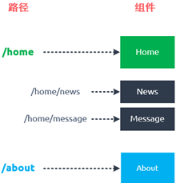

# 1. vue-router
## 1.1. 动态路由
在某些情况下，一个页面的path路径可能是不确定的，比如我们进入用户界面时，希望是如下的路径：
/user/aaa或者/user/bbb，除了前面的/user外，后面还跟上了用户的ID
这种path和Component的匹配关系，我们称之为动态路由（也是路由传递数据的一种方式）

步骤：
- 创建User组件（页面），name:"User"
- 在index.js中注册router：
  ```js
   {
    path:'/user/:userId',
    component:User,
  }
  ```
- 将router挂载到App.vue:
  ```html
  <router-link v-bind:to="'/user/'+userId">用户</router-link>
  <script>
  export default {
  name:'App',
  data(){
    return {
      userId:'abc'
        }
    }
  }
  </script>
  ```
- 在User.vue组件中拿到User数据：
  ```html
  <template>
   <div>
      <h2>我是用户界面</h2>
      <h2>{{userId}}</h2>
   </div>
  </template>

  <script>
   export default {
    name:"User",
    computed:{
        userId(){
            return this.$route.params.userId
        }
    }
  }
  </script>
  ```


## 1.2. 路由的懒加载
当我们打包构建应用时，JavaScript包会变得非常大，影响页面加载
如果我们能把不同的路由对应的组件分割成不同的代码块，然后当路由被访问的时候才加载对应组价，这样就要更加高效了


##### 将项目打包后dist文件夹下的js文件夹会有3个js文件：
- app.xxxxx.js：当前应用程序的所有代码（业务代码）
- chunk-vendors.xxxxx.js：vendor（提供商/第三方）例如Vue、vue-router、axios等第三方的代码
- about.xxxxx.js:提供一些底层支撑

##### 路由懒加载做了什么：
- 路由懒加载的主要作用就是将路由对应的组件打包成一个个的js代码块
- 只有在这个路由被访问到的时候，才加载对应的组件

##### 懒加载的方式：
在ES6中，我们可以有更加简单的写法来组织Vue异步组件和webpack的代码分割
```js
const Home=()=>import('../components/Home.vue')
```
## 1.3. 路由的嵌套
嵌套路由是一个很常见的功能：
- 比如在home页面中，我们希望通过/home/news和/home/message访问一些内容
- 一个路径映射一个组件，访问这两个路径也会分别渲染两个组件

路径和组件的映射关系：



实现嵌套路由有两个步骤：
- 创建对应的子组件，并且在路由映射中配置对应的子路由
- 在组件内部使用&lt;router-view&gt;标签

## 1.4. 参数传递
参数传递主要有两种方式：params和query

#### params的类型：
- 配置路由格式：/router/:id
- 传递的方式：在path后面跟上对应的值
- 传递后形成的路径：/router/1123,/router/abc

#### query的类型：
- 配置路由格式：/router,也就是普通配置
- 传递的方式：对象中使用query的key作为传递方式
- 传递后形成的路径：/router?id=123,/router?id=abc


URL:协议://主机://端口/路径？查询(query)
URL:scheme://host:port/path?query#fragment


## 1.5. $route和$router的区别
- $router为VueRouter实例，想要导航到不同的URL，则使用$router.push方法
- $route为当前router跳转对象里面可以获取name,path,query,params等

## 1.6. 导航守卫
需求：在一个SPA应用中，如何改变网页的标题呢？
- 网页标题是通过&lt;title&gt;来显示的，但是SPA只有一个固定的 HTML，切换不同的页面时，标题不会发生改变

- 我们可以通过JavaScript来修改&lt;title&gt;的内容，window.document.title='新的标题'

##### 普通的修改方式：
- 我们比较容易想到的修改标题的位置是每一个路由对应的组件.vue文件中
- 通过mounted声明周期函数（created)，执行对应的代码进行修改即可
- 但是当页面比较多时，这种方式不容易维护（因为需要在多个页面执行相似的代码）


有什么比较简单快速的方法可以实现上述效果吗？

##### 导航守卫：
（1）在route中加入：
```js
 meta:{
      title:'首页'
    },
```
(2)
```js
router.beforeEach((to,from,next)=>{

  // 从from跳转到to 
  document.title=to.matched[0].meta.title
  next()
})
```


##### 导航守卫补充

###### 补充一：
前置钩子：beforeEach()
后置钩子：afterEach(),不需要主动调用next()函数
```js
router.afterEach((to,from)=>{
  console.log('--------------------');
})
```
###### 补充二：
导航守卫：
- 全局守卫
- 路由独享守卫
- 组件内的守卫


## 1.7. keep-alive

> keep-alive是Vue内置的一个组件，可以使被包含的组价保留状态，或者避免重新渲染

它有两个非常重要的属性：
- include:字符串或者正则表达，只有匹配的组件会被缓存
- exclude：字符串或者正则表达式，任何匹配的组件都不会被缓存


 

router-view是一个组件，如果直接被包在keep-alive里面，所有路径匹配到的视图组件都会被缓存


## 1.8. tabbar案例

### 1.8.1. TabBar实现思路
- 封装tabbar
  - 自定义tabbar组件，在APP中使用
  - 让tabbar出于底部，并且设置相关的样式
- TabBar中显示的内容由外界决定
  - 定义插槽
  - flex布局平分TabBar
- 自定义TabBarItem,可以传入图片和文字
  - 定义TabBarItem,并且定义两个插槽：图片、文字
  - 给两个插槽包装div，用于设置样式
  - 填充插槽，实现底部TabBar的效果

