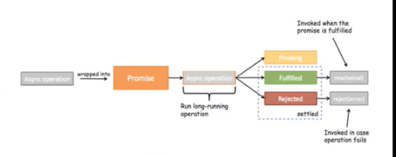

# 1. Promise
## 1.1. 什么是Promise
> Promise是异步编程 的一种解决方案

在开发中，在进行一些网络请求或进行一些异步相关的操作的话，一般情况下就不再是同步了

同步的话，会有很严重的问题，假如用户在进行某一项操作的时候，需要向服务器发送网络请求，而网络请求一般是比较耗时的，如果程序执行还是同步的话，代码执行到网络请求这一步就不会再往下执行，而是等到网路请求成功，服务器将用户请求的数据发送到用户服务器上才会执行下面的代码。

这种情况称为同步阻塞，阻塞发生时，不仅用户界面上不会显示任何内容，而且浏览器也不会响应用户的操作。

所以一般情况下不会这样做。通常情况下，当需要向服务器发送网络请求时，就开启一个异步任务，当网络请求的数据回来的时候，一般会在下面有一个回调的函数，这个回调函数就会拿到服务器返回来的数据，之后再使用这个数据就可以了

但是，当网络请求非常复杂时，就会出现**回调地狱**

## 1.2. 定时器的异步事件
我们用一个定时器来模拟异步事件：
- 假设下面的data是从网络上1秒后请求的数据
- console.log就是我们的处理方式

```js
setTimeout(function () {
    let data = 'hello world'
    console.log(data);
}, 1000)
```

Promise就是对异步操作进行一些封装：
```js
new Promise((resolve, reject) => {

    // 第一次网络请求的代码
    setTimeout(() => {
        resolve()
    }, 1000).then(() => {

        // 第一次拿到结果的处理代码
        console.log("Hello,Wro");
        console.log("Hello,Wro");
        console.log("Hello,Wro");
        console.log("Hello,Wro");
        console.log("Hello,Wro");

        return new Promise((resolve, reject) => {

            // 第二次网络请求的代码
            setTimeout(() => {
                resolve()
            }, 1000)
        })
    }).then(() => {

        // 第二次拿到结果的处理代码
        console.log('Hello,Vuejs');
        console.log('Hello,Vuejs');
        console.log('Hello,Vuejs');
        console.log('Hello,Vuejs');
        console.log('Hello,Vuejs');
        console.log('Hello,Vuejs');

        return new Promise((resolve, reject) => {

            // 第三次网络请求的代码
            setTimeout(() => {
                resolve()
            }, 1000)
        })
    }).then(() => {

        // 第三次拿到结果的处理代码
        console.log('Hello,Python');
        console.log('Hello,Python');
        console.log('Hello,Python');
        console.log('Hello,Python');
        console.log('Hello,Python');
        console.log('Hello,Python');
    })
})
```

什么情况下会用到Promise？一般情况下是有异步操作时，使用Promise对这个异步操作进行封装

new ->构造函数（1. 保存了一些状态信息，2. 执行传入的参数）
在执行传入的回调函数时，会传入两个参数，resolve,reject，这两个参数本事又是函数

Promise将网络请求的代码和处理的代码进行了分离

```js
new Promise((resolve, reject) => {
        setTimeout((data) => {
            // 成功的时候调用resolve
            resolve(data)

            // 失败的时候调用reject
            reject('error message')
        }, 1000)
    }).then((data) => {
        处理的代码
        处理的代码
        处理的代码
        处理的代码
        处理的代码
        处理的代码
    }).catch((err)=>{
        console.log(err)
    })
```

## 1.3. Promise的三种状态
开发中有异步操作时，可以给异步操作包装一个Promise


异步操作之后有三种状态：
- Pending：等待状态，比如正在进行网络请求，或者定时器没有到时间
- fullfill:满足状态，当我们主动回调了resolve时，就处于该状态，并且会回调`.then()`
- reject：拒绝状态，当我们主动回调了reject时，就处于该状态，并且会回调`.catch()`




## 1.4. Promise另外一种写法
```js
new Promise((resolve,reject)=>{
    setTimeout(()=>{
        // resolve('Hello, Vuejs')
        reject('error message')
    },1000)
}).then(data=>{
    console.log(data);
},err=>{
    console.log(err);
})
```

## 1.5. Promise链式调用

```js
// 网络请求：aaa->自己处理（10行）
// 处理：aaa111->自己处理（10行）
// 处理：aaa111222->自己处理（10行）

// new Promise((resolve, reject) => {
//     setTimeout(() => {
//         resolve('aaa')
//     }, 1000)
// }).then(res=>{
//     // 1. 自己处理10行代码
//     console.log(res,'第一层的10行处理代码');

//     // 2. 对结果进行第1次的处理
//     return new Promise((resolve)=>{
//         resolve(res+'111')
//     })
// }).then(res=>{
//     console.log(res,'第二层10行处理代码');


//     return new Promise((resolve)=>{
//         resolve(res+'222')
//     })
// }).then(res=>{
//     console.log(res,'第三层10行处理代码');
// })


// 简写
// new Promise((resolve, reject) => {
//     setTimeout(() => {
//         resolve('aaa')
//     }, 1000)
// }).then(res=>{
//     // 1. 自己处理10行代码
//     console.log(res,'第一层的10行处理代码');

//     // 2. 对结果进行第1次的处理
//     return Promise.resolve(res+'111')

// }).then(res=>{
//     console.log(res,'第二层10行处理代码');


//     return  Promise.resolve(res+'222')

// }).then(res=>{
//     console.log(res,'第三层10行处理代码');
// })


// 更简介的版本：省略掉Promise.resolve()
// new Promise((resolve, reject) => {
//     setTimeout(() => {
//         resolve('aaa')
//     }, 1000)
// }).then(res => {
//     // 1. 自己处理10行代码
//     console.log(res, '第一层的10行处理代码');

//     // 2. 对结果进行第1次的处理
//     return res + '111'

// }).then(res => {
//     console.log(res, '第二层10行处理代码');


//     return res + '222'

// }).then(res => {
//     console.log(res, '第三层10行处理代码');
// })


// 包含reject
// new Promise((resolve, reject) => {
//     setTimeout(() => {
//         resolve('aaa')
//     }, 1000)
// }).then(res => {
//     // 1. 自己处理10行代码
//     console.log(res, '第一层的10行处理代码');

//     // 2. 对结果进行第1次的处理
//     return Promise.reject('error message')

// }).then(res => {
//     console.log(res, '第二层10行处理代码');


//     return res + '222'

// }).then(res => {
//     console.log(res, '第三层10行处理代码');
// }).catch(err=>{
//     console.log(err);
// })


// 包含reject的简写
new Promise((resolve, reject) => {
    setTimeout(() => {
        resolve('aaa')
    }, 1000)
}).then(res => {
    // 1. 自己处理10行代码
    console.log(res, '第一层的10行处理代码');

    // 2. 对结果进行第1次的处理
    throw 'error message'

}).then(res => {
    console.log(res, '第二层10行处理代码');


    return res + '222'

}).then(res => {
    console.log(res, '第三层10行处理代码');
}).catch(err=>{
    console.log(err);
})
```


## 1.6. Promise.all()
如果在开发中遇到一个需求需要发送多次请求才可以完成，那么可以使用`Promise.all()`对他们进行包装

```js
Promise.all([
    // new Promise((resolve, reject) => {
    //     $ajax({
    //         url: 'url1',
    //         success: function (data) {
    //             resolve(data)
    //         }
    //     })
    // }),
    // new Promise((resolve, reject) => {
    //   $ajax({
    //       url:'url2',
    //       success:function(data){
    //           resolve(data)
    //       }
    //   })
    // })

    new Promise((resolve, reject) => {
        setTimeout(() => {
            resolve('result1')
        }, 1000)
    }),

    new Promise((resolve, reject) => {
        setTimeout(() => {
            resolve('results2')
        }, 1000)
    })


]).then(results => {
    console.log(results);
})
```

# 2. Vuex
> Vuex是一个专门为Vue.js应用程序开发的**状态管理模式**

- 它采用集中式存储管理应用的所有组价的状态，并以响应的规则保证状态以一种可预测的方式发生变化
- Vuex也集成到vue官方调试工具`devtools extension`，提供了诸如零配置的`time-travel`调试，状态快照导入导出等高级调试功能

## 2.1.  状态管理是什么？
状态管理可以简单地将其看成把需要多个组件共享的变量全部存储在一个对象里面
然后将这个对象放置在顶层的Vue实例中，让其他组件可以使用
多个组件就可以共享这个对象中所有变量属性了


但是，上述对象自己也可以封装，Vue官方为什么要专门出一个插件Vuex？
自己封装的对象不能保证它里面的所有属性都做到响应式
Vuex就是为了提供这样一个在多个组件间共享状态的插件

## 2.2. 管理什么状态呢？
有什么状态需要我们在多个组件间共享呢？
比如用户的登录状态，用户名称、头像、地理信息位置等，商品的收藏、购物车中的物品等
这些状态信息，我们可以都放在统一的地方，对他们进行保存和管理，而且他们还是响应式的

 
## 2.3. 单界面的状态管理
 