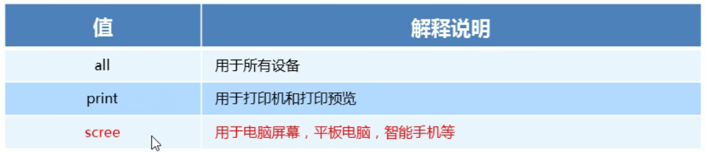
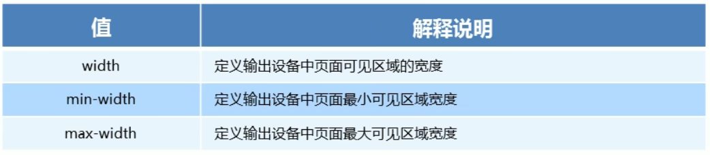
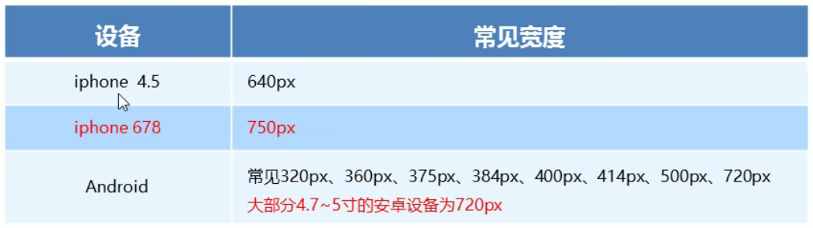

# 1. rem基础
**rem单位**
rem(root em)是一个相对单位，类似于em,em是父元素字体大小

不同的是rem的基准是相对于HTML元素的字体大小

比如根元素（HTML）设置font-size=12px;非根元素设置
width:2rem；则换成px表示就是24px;

rem的优势：可以通过修改HTML里面的文字大小来改变页面中元素的大小来整体控制


# 2. 媒体查询
## 2.1. 什么是媒体查询
媒体查询(Media Query)是css3新语法

使用@media查询，可以针对不同的媒体类型定义不同的样式

@media可以针对不同的屏幕尺寸设置不同的样式

当你重置浏览器大小的过程中，页面也会根据浏览器的宽度和高度重新渲染画面

目前针对很多苹果手机、Android手机，平板等设备都用的到媒体查询

## 2.2. 语法规范
```css
@media mediatype and|not|only (media feature) {
    CSS-Code;
}
```
用@media开头，注意@符号
mediatype媒体类型
关键字 and not only
media feature 媒体特性必须有小括号包含

### (1)mediatype查询类型
将不同的终端设备划分成不同的类型，称为媒体类型
(图：媒体类型)


### (2)关键字
关键字将媒体类型或多个媒体特性连接到一起作为媒体查询的条件
- and：可以将多个媒体特性连接到一起，相当于“且”的意思
- not：排除某个媒体类型，相当于“非”的意思，可以省略
- only：指定某个特定的媒体类型，可以省略

### (3)媒体特性
每种媒体类型都具有各自不同的特性，根据不同媒体类型的媒体特性设置不同的展示风格。暂且了解三个，注意他们要加小括号包含
（图：媒体特性）

注意：and和小括号之间要有一个空格，否则不起作用


## 2.3. 媒体查询+rem实现元素动态大小变化
rem单位是跟着HTML来走的，有了rem页面元素可以设置不同大小尺寸

媒体查询可以根据不同设备宽度来修改样式

媒体查询+rem就可以实现不同设备宽度，实现页面元素大小的动态变化


## 2.4. 引入资源（理解）
当样式繁多时，我们可以针对不同的媒体使用不同的stylesheets（样式表）

原理就是直接在link中判断设备的尺寸，然后引用不同的css文件

语法规范：
```css
<link rel="stylesheet" media="mediatype and|not|only (media feature)" href="mystylesheet.css">
```


# 3. less基础
## 3.1. 维护css的弊端
css是一门非程序式语言，没有变量、函数、scope（作用域）等概念

css需要书写大量看似没有逻辑的代码，css冗余度是比较高的
不方便维护及拓展，不利于复用

css没有良好的计算能力

非前端开发工程师来讲，往往会因为缺少css编写经验而很难写出组织良好且易于维护的css代码项目


## 3.2. less介绍
less（Leaner Style Sheets）是一门css扩展语言，也成为css预处理器

作为css一种形式的扩展，它并没用减少css的功能，而是在现有的css语法上，为css加入程序式语言的特性

它在css的语法基础上，引入了变量，mixin(混入)，运算以及函数等功能，大大简化了css的编写，并且降低了css的维护成本，就像它的名称所说的那样，less可以让我们用很少的代码做更多的事情
常见的css预处理器：sass less stylus

一句话：less是一门**css预处理语言**，它扩展了css的动态特性

## 3.3. less使用：
我们首先新建一个后缀名为less的文件，在这个less文件里面书写- less语句
- less变量
- less编译
- less嵌套
- less运算


## 3.4. less变量
变量是指没有固定的值，可以改变的。因为我们css中的一些颜色和数值等经常使用

语法规范：
```css
@变量名:值;
```

变量命名规范：
- 必须有@为前缀
- 不能包含特殊字符
- 不能以数字开头
- 大小写敏感


## 3.5. less编译
本质上，less包含一套自定义的依法及一个解释器，用户根据这些语法定义自己的样式规则，这些规则最终会通过解析器，编译生成对应的css文件

所以，我们需要把我们的less文件，编译生成css文件，这样我们的HTML页面才能使用

vscode less插件：
**EasyLESS**插件用来把less文件编译为css文件


## 3.6. less嵌套
我们经常用到选择器的嵌套
```css
.header logo{
    width:300px;
}
less嵌套写法
.header{
    .logo{
        width:300px;
    }
}
```
如果遇见（交集|伪类|伪元素选择器）
内层选择器的前面没有&符号，则它被解析为父选择器的后代
如果有&符号，它就被解析为父元素自身或者父元素的伪类

css中：
```css
a:hover{
    oclor:red;
}
less嵌套写法a{
    &:hover{
        color:red;
    }
}
```

## 3.7. less运算（重点）
任何数字、颜色或者变量都可以参与运算。就是less提供了加减乘除算数运算
```css
/*less 里面写*/
@width:10px+5;
div{
    border:@width solid red;
}
/*生成的css*/
div{
    border:15px solid red;
}
/*less甚至可以这样*/
width:(@width+5)*2;
```
注意：
- 运算符中间左右有个空格隔开 比如：1px + 5;
- 对于两个不同的单位的值之间的运算，运算结果的值取第一个值的单位
- 如果两个值只有一个值有单位，则运算结果就取该单位
- 除法不能直接运算，否则编译不过去，必须在外面加一个小括号，如：width:(82 / 5rem); 


# 4. rem适配方案
## 4.1. rem实际开发适配方案
按照设计稿与设备宽度的比例，动态计算并设置HTML根标签的font-size大小；（媒体查询）

css中，设计稿元素的宽高相对位置等取值，按照同等比例换算为rem为单位的值

（图：rem实际开发适配方案）


## 4.2. rem适配方案技术使用（市场主流）
技术方案1
- less
- 媒体查询
- rem
技术方案2（推荐）
- flexible.js
- rem
- 
总结：
- 两种方案都存在
- 方案2更简单，现阶段无需了解里面的js代码


## 4.3. rem实际开发适配方案1
rem+媒体查询+less技术

设计稿常见尺寸宽度：
（图：设计稿常见尺寸宽度）


一般情况下，我们以一套或者两套效果图适应大部分的屏幕，放弃极端屏或对其优雅降级，牺牲一些效果，现在基本以750为准

### 动态设置HTML标签font-size大小:
假设设计稿是750px

假设我们把整个屏幕划分为15等份（划分标准不一，可以是20份也可以是10份）

每一份作为HTML字体大小，这里就是50px

那么在320px设备的时候，字体大小是320/15就是21.33px

用我们页面元素的大小除以不同的HTML字体大小会发现他们比例还是相同的

比如我们以750为标准设计稿

一个100*100像素的页面元素在750屏幕下，就是100/50转换为rem是2rem*2rem比例是1比1

320屏幕下，HTML字体大小为21.33，则2rem就是42.66px，此时宽高都是42.66 但是宽和高的比例还是1比1

但是已经能实现不同屏幕下页面元素盒子等比例缩放的效果

### 元素大小的取值方法：
最后的公式：页面元素的rem值=页面元素值(px)/(屏幕宽度/划分的份数)

屏幕宽度/划分的份数就是HTML font-size的大小

或者：页面元素的rem值=页面元素值(px)/HTML font-size字体大小
 


# 5. 苏宁网首页案例制作
## 5.1. 技术选型
- 方案：采取单独直走移动页面方案
- 技术：布局采取rem适配布局（less+rem+媒体查询）
- 设计图：本设计图采用750px设计尺寸


## 5.2. 搭建相关文件夹结构


## 5.3. 设置视口标签以及引入初始化样式


## 5.4. 设置公共common.less文件
新建common.less设置好最常见的屏幕尺寸，利用媒体查询设置不同的HTML字体大小，因为除了首页其他页面也需要

我们关心的尺寸有320px,360px,375px,384px,400px,414px,424px,480px,540px,720px,750px

划分的份数我们定为15份

因为我们PC端也可以打开苏宁移动端首页，我们默认HTML字体大小为50px,注意这句话写到最上面


## 5.5. 新建index.less文件
新建index.less这里面写首页的样式

将刚才设置好的common.less引入到index.less里面，语法如下：
```css
//在index.less 中导入 common.less文件@import "common"
```


# 6. rem适配方案2
## 6.1. 简介高效的rem适配方案flexible.js
手机淘宝团队出的简洁高效移动端适配库

我们再也不需要在写不同屏幕的媒体查询，因为里面js做了处理

他的原理是把当前设备划分为10等份，但是不同设备下，比例还是一致的

我们要做的，就是确定好我们当前的HTML文字大小就可以了
比如当前设计稿是750px，那么我们只需要把HTML文字大小设置为75px(75px/10)就可以了

里面页面元素rem值：页面元素的px值/75
剩余的，让flexible.js来去算


## 6.2. 使用适配方案2制作苏宁移动端首页
技术选型：
- 方案：采取单独制作移动页面方案
- 技术：布局采取rem适配布局2（flexible+rem）
- 设计图：本设计图采用750px设计尺寸

搭建相关文件夹结构

设置视口标签以及引入初始化样式还有js文件


## 6.3. vscode px 转换rem插件cssrem
- 设置HTML字体大小基准值：
- 打开“设置” 快捷键Ctrl+，
- 搜索设置框内输入cssroot
- 将rootFontSize从16修改为75px


