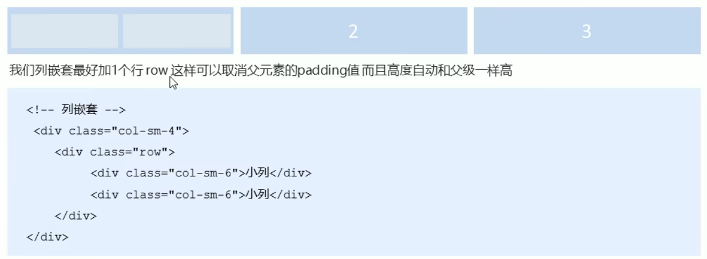

# 1. 响应式开发
## 1.1.  响应式开发原理
就是使用媒体查询针对不同宽度的设备进行布局和样式的调整，从而适配不同设备的目的
（图：响应式开发原理）


## 1.2. 响应式布局容器
响应式需要一个父级作为布局容器，来配合子级元素来实现变化效果

原理就是在不同屏幕下，通过媒体查询来改变这个布局容器的大小，再改变里面子元素的排列方式和大小，从而实现不同屏幕下，看到不同的页面布局和样式变化

平时我们的响应式尺寸划分:
- 超小屏幕（手机，小于768px）：设置宽度为100%
- 小屏幕：（平板，大于等于768px）：设置宽度为750px
- 中等屏幕（桌面显示器，大于等于992px）：宽度设置为970px
- 大屏幕（大桌面显示器，大于等于1200px）：宽度设置为1170px


# 2. Bootstrap前端开发框架
## 2.1 Bootstrap简介
Bootstrap来自Twitter，是目前最受欢迎的前端框架，bootstrap是基于HTML、css和JavaScript的，他简洁灵活，使得web开发更加快捷

用于开发响应式布局，移动设备优先的web项目

框架：顾名思义是一套架构，他有一套比较完整的网页功能解决方案，而且控制权在框架本身，有预制样式库，组件和插件。使用者要按照框架所规定的的某种规范进行开发

优点：
- 标准化的HTML和css编码规范
- 提供了一套简介、直观、强悍的组件
- 有自己的生态圈，不断的更新迭代
- 让开发更简单，提高了开发的效率
  
版本：
- 2.x.x：停止维护，兼容性好，代码不够简介，功能不够完善
- 3.x.x：目前使用最多，稳定，但是放弃了IE6-7.对IE8支持但是界面效果不好，偏向用于开发响应式布局、移动设备优先的web项目
- 4.x.x：最新版，目前还不是很流行


## 2.2. bootsrap使用
现阶段还没有接触js相关课程，所以我们只考虑使用它的样式库
控制权在框架本身，使用者要按照框架所规定的某种规范来进行开发

bootstrap使用四部曲：1.创建文件夹结构2.创建HTML骨架结构3.引入相关样式文件4.书写内容

### 书写内容：
- 直接拿Bootstrap预先定义好的样式来使用
- 修改Bootstrap原先的样式，注意权重问题
- 学好Bootstrap的关键在于知道他定义了哪些样式，以及这些样式能实现什么样的效果


## 2.3. 布局容器
bootstrap需要为页面内容和栅格系统包裹一个.container容器，bootstrap预先定义好了这个类，叫.container它提供了两个作此用处的类

### container类：

响应式布局的容器，固定宽度
大屏（>=1200px）宽度固定为1170px
中屏（>=9920px）宽度固定为970px
小屏（>=768px）宽度固定为750px
超小屏（100%）

### container-fluid类：
流式布局容器百分百宽度
占据全部视口（viewport）的容器
适合于单独做移动端开发


# 3. Bootstrap栅格系统
## 3.1. 栅格系统简介
栅格系统英文为"grid systems" ，也有人翻译为”网格系统“，它是指将页面布局划分为等宽的列，然后通过列数的定义来模块化页面布局

Bootstrap提供了一套响应式、移动设备优先的流式栅格系统，随着屏幕或者视口（viewport)尺寸的增加，系统就会自动分为最多12列

Bootstrap里面container宽度是固定的，但是不同屏幕下，container的宽度不同，我们再把container划分为12等份


## 3.2. 栅格选项参数
栅格系统通过一系列的行（row）与列（column）的组合来创建页面布局，内容就可以放入这些创建好的布局中
(图：栅格选项参数)


行（row）必须放到container布局容器里面

我们实现列的平均划分，需要给列添加类前缀

xs-extra smll:超小;sm-small:小；md-medium:中等;lg-large:大；

列（column）大于12，多余的列（column）所在的元素将被作为一个整体另起一行排列

每一列默认有左右15像素的padding

可以同时为一列指定多个设备的类名，以便划分不同份数，例如：class="col-md-4 col-sm-6"


## 3.3. 列嵌套
栅格系统内置的栅格系统将内容再次嵌套。简单理解就是一个列内再分成若干份小列。我们可以通过添加一个新的.row元素和一系列.col-sm-*元素到已经存在的.col-sm-*元素内

我们列嵌套最好加一个行row这样可以取消父元素的padding值而且高度自动和父级一样高

（图：列嵌套）


## 3.4. 列偏移
使用.col-md-offset-*类可以将列向右侧偏移，这些类实际上是通过使用*选择器为当前元素增加了左侧的边框
```css
<!--列偏移-->
<div class="row">
    <div class="col-lg-4">1</div>
    <div class="col-lg-4 col-lg-offset-4">2</div>
</div>
```

## 3.5. 列排序
通过使用.col-md-push-*和.col-md-pull-*类就可以很容易的改变列（column）的顺序
```html
 <div class="container">
        <div class="row">
            <div class="col-md-3">left</div>
            <!-- 偏移的份数就是12-两个盒子的份数=6 -->
            <div class="col-md-3 col-md-offset-6">right</div>
        </div>
        <div class="row">
            <!-- 中间盒子 -->
            如果只有一个盒子 那么就偏移=（12-8）/2=2份
            <div class="col-md-8 col-md-offset-2">right</div>
        </div>
    </div>
```

## 3.6. 响应式工具
为了加快对移动设备友好的页面开发工作，利用媒体查询功能，并使用这些工具类可以方便的针对不同的设备展示或隐藏页面内容

（图：响应式工具）


与之相反的是**visible-xs visible-sm visible-md visible-lg**是显示某个页面内容

Bootstrap其他（按钮、表单、表格）请参考Bootstrap文档

