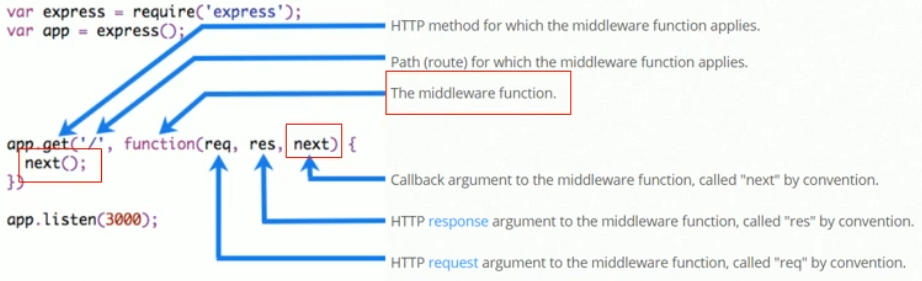

# 1. Express路由
## 1.1. 路由的概念
### 1. 什么是路由
广义上来说，路由就是**映射关系**

### 2. Express中的路由
在Express中，路由指的是**客户端的请求**与**服务器处理函数**之间的映射关系

Express中的路由分3部分组成：
- 请求的类型
- 请求的URL地址
- 处理函数

格式如下：
```js
app.METHOD(PATH,HANDLER)
```  
## 1.2. 路由的使用
### 1. 最简单的用法
在 Express中使用路由最简单的方式，就是把路由挂载到APP上，示例代码如下：
```js
const express=require('express')
const app=express()

// 挂载路由
app.get('/',(req,res)=>{
    res.send('hello world')

})

app.post('/',(req,res)=>{
    res.send('post request')
})

app.listen(80,()=>{
    console.log('http://127.0.0.1');
})
```

### 2. 模块化路由
为了方便的对路由进行模块化的管理，Express不建议将路由直接挂载到app上，而是推荐将路由抽离为单独的模块
步骤如下：
- 创建路由模块对应的.js文件
-  调用`express.Router()`函数创建路由对象
-  向路由对象上挂载具体的路由 
-  使用`module.exports`向外共享路由对象
-  使用`app.use()`函数注册路由模块

```js
// 这是路由模块
// 1. 导入express
const express=require('express')

// 2. 创建路由对象
const router=express.Router()

// 3.挂载具体的路由
router.get('/user/list',(req,res)=>{
res.send('get user list')
})

router.post('/user/add',(req,res)=>{
    res.send('add new user')
    })
// 4. 向外导出路由对象
module.exports=router
```
### 4. 注册路由模块
```js
// 1. 导入路由模块
const router=require('./03-router')
// 2. 注册路由模块
app.use(router)
```
### 5. 为路由模块添加前缀
类似于托管静态资源时，为静态资源统一挂载访问前缀一样，路由模块添加前缀的方式也十分简单
```js
// 1. 导入路由模块
const userRouter=require('./router/user.js')

//2. 使用app.use()注册路由模块，并添加统一的访问前缀 /api
app.use('/api',userRouter)
```
# 2. Express中间件
## 2.1. 中间件的概念
### 1. 什么是中间件
> 中间件(Middleware)，特指业务流程的中间处理环节

### 2. Express中间件的调用流程
当一个请求到达Express服务器之后，可以连续 调用多个中间件，从而对这次请求进行**预处理**
### 3. Express中间件的格式
Express中间件，本质上就是一个function处理函数，Express中间件的格式如下：


注意：中间件函数的形参列表中，必须包含next参数，而路由处理函数中只包含req和res

### 4. next函数的作用
> next函数是实现多个中间件连续调用的关键，它表示把流转关系转交给下一个中间件或者路由

## 2.2. Express中间件的初体验
### 1. 定义中间件函数
可以通过以下方式，定义一个最简单的中间件函数
```js
const { application } = require('express')
const express=require('express')

const app=express()

// 定义一个最简单的中间件函数
const mw=function (req,res,next){
    console.log('这是最简单的中间件函数');

    //把流转关系，转交给下一个中间件或者路由
    next()
}

app.listen(80,()=>{
    console.log('http://127.0.0.1');
})
```

### 2. 全局生效的中间件
> 客户端发起的任何请求，到达服务器之后，都会触发的中间件，叫做全局生效的中间件

通过调用`app.use(中间件函数)`，即可定义一个全局生效的中间件，示例代码如下：
```js
// 将mw注册为全局生效的中间件
app.use(mw)
```
### 3. 定义全局中间件的简化形式
```js
// 这是定义全局中间件的简化形式
app.use(function (req, res, next) {
    console.log('这是最简单的中间件函数');

    //把流转关系，转交给下一个中间件或者路由
    next()
})
```
### 4. 中间件的作用
> 多个中间件之间，可以共享同一份req和res，基于这样的特性，我们可以在上游的中间件中，统一为req或res对象添加自定义的属性或方法，供下游的中间件或者路由进行使用

```js
const {
    application
} = require('express')
const express = require('express')

const app = express()


// 这是定义全局中间件的简化形式
app.use(function (req, res, next) {

    // 获取到请求到达服务器的时间
    const time=Date.now()

    // 为req对象，挂载自定义属性，从而把时间共享给后面的所用路由
    req.startTime=time


    //把流转关系，转交给下一个中间件或者路由
    next()
})

app.get('/', (req, res) => {
    res.send('Home page'+req.startTime)
})

app.get('/user', (req, res) => {
    res.send('User page'+req.startTime)
})
app.listen(80, () => {
    console.log('http://127.0.0.1');
})
```
### 5. 定义多个全局中间件
可以使用`app.use()`连续定义多个全局中间件，客户端请求到达服务器之后，会按照中间件定义的先后顺序依次进行调用，示例代码如下：
```js   
const express=require('express')
const app=express()

// 定义第一个全局中间件、
app.use((req,res,next)=>{
    console.log('调用了第一个全局中间件');
    next()
})

// 定义第二个全局中间件
app.use((req,res,next)=>{
    console.log('调用了第二个全局中间件');

    next()
})

// 定义一个路由
app.get('/user',(req,res)=>{
    res.send('User page')
})

app.listen(80,()=>{
    console.log('http://1217.0.0.1');
})
```

### 6. 局部生效的中间件
> 不使用`app.use()`定义的中间件，叫做局部生效的中间件

示例代码如下：
```js
const express = require('express')
const app = express()

// 定义中间件函数 
const n = mw1 = (req, res, next) => {
    console.log('调用了局部生效的中间件');
    next()
}

// 定义一个路由
app.get('/', mw1, (req, res) => {
    res.send('Home page')
})

app.get('/user', (req, res) => {
    res.send('User page')
})

app.listen(80, () => {
    console.log('http://1217.0.0.1');
})
```
### 7. 定义多个局部中间件
可以在路由中，通过如下两种等价的方式，使用多个局部中间件：
```js
const express = require('express')
const app = express()

// 定义中间件函数 
const mw1 = (req, res, next) => {
    console.log('调用了第一个局部生效的中间件');
    next()
}

const mw2 = (req, res, next) => {
    console.log('调用了第二个局部生效的中间件');
    next()
}

// 定义一个路由
// app.get('/', mw1,mw2,(req, res) => {
//     res.send('Home page')
// })

// 或者将中间件函数用一个数组包起来
app.get('/', [mw1,mw2],(req, res) => {
    res.send('Home page')
})

app.get('/user', (req, res) => {
    res.send('User page')
})

app.listen(80, () => {
    console.log('http://1217.0.0.1');
})
```
### 8. 了解中间件的5个使用注意事项
- 一定要在路由**之前**注册中间件
- 客户端发过来的请求，可以**连续调用**多个中间件进行处理
- 执行完中间件的业务代码之后，不要忘记调用`next()`函数
- 为了防止代码逻辑混乱，调用完`next()`函数之后不要再写额外的代码
- 连续调用多个中间件时，多个中间件之间，共享req和res对象

## 2.3. 中间件的分类
为了方便大家理解和记忆中间件的使用，Express官方把常见的中间件用法，分为了5大类，分别是：
- 应用级别的中间件
- 路由级别的中间件
- 错误级别的中间件
- Express内置的中间件
- 第三方的中间件

### 1. 应用级别的中间件
> 通过`app.use()`或者`app.get()`或者`app.post()`，绑定到app实例上的中间件，叫做应用级别的中间件

示例代码：
```js
// 应用级别的中间件（全局中间件）
app.use((req,res,next)=>{
    next()
})

// 应用级别的中间件（局部中间件）
app.get('/',mw1,(req,res)=>{
    res.send('Home page')
})
```
### 2. 路由级别的中间件
> 绑定到`express.Router()`实例上的中间件，叫做路由级别的中间件

它的用法和应用级别的中间件没有任何区别，只不过，应用级别的中间件时绑定到app实例上，路由级别的中间件绑定到router实例上

示例代码：
```js
var app=express()
var router=express.Router()

// 路由级别的中间件
router.use(function(res,req,next){
    console.log('Time',Date.now())
    next()
})

app.use('/'.router)
```
### 3. 错误级别的中间件
> 错误级别的中间件的作用：专门用来捕获整个项目中发生的异常错误，从而防止项目异常崩溃的问题

格式：错误级别中间件的function处理函数中，必须有4个形参，形参顺序从前到后，分别是`(err,req,res,next)`

```js
const express = require('express')
const app = express()


// 定义一个路由
app.get('/',(req, res) => {
    // 1.1 人为的制造错误
    throw new Error('服务器内部发生了错误')

    res.send('Home page')
})

// 2. 定义错误级别的中间件，捕获整个项目的异常错误，从而防止程序的崩溃
app.use((err,req,res,next)=>{
    console.log('发生了错误'+err.message);
    res.send('Error'+err.message)
})

app.listen(80, () => {
    console.log('http://1217.0.0.1');
})
```

注意：错误级别的中间件必须注册在所有路由之后

### 4. Express内置级别的中间件
> 自Express4.16.0版本开始，Express内置了3个常用的中间件，极大地提高了Express项目的开发效率和体验

他们分别是：
- `express.static`快速托管静态资源的内置中间件，例如：html文件、图片、css样式等（无兼容性）
- `express.json`解析JSON格式的请求体数据（有兼容性，仅在4.16.0+版本可用）
- `express.urlencoded`解析URL-encoded格式的请求体数据（有兼容性，仅在4.16.0+版本中可用）

```js
const express = require('express')
const app = express()


// 除了错误级别的中间件，其他的中间件必须在错误之前

//通过express.json()这个中间件，解析表单中json格式的数据
app.use(express.json())

// 通过express.urlencoded()这个中间件，来解析表单中的url-encoded格式的数据
app.use(express.urlencoded({extended:false}))

// 定义一个路由
app.post('/user',(req, res) => {
    // 在服务器可以使用req.body这个属性来接收客户端发送过来的请求体数据

    //默认情况下如果不配置解析表单数据的中间件，则req.body默认等于undefined
    console.log(req.body);

    res.send('ok')
})

app.post('/book',(req,res)=>{
    // 在服务器端，可以通过req.body来获取JSON格式的表单数据和url-encoded格式的数据
    console.log(req.body);
    res.send('ok')
})

app.listen(80, () => {
    console.log('http://1217.0.0.1');
})
```
### 5. 第三方的中间件
> 非Express官方内置的，而是由第三方开发出来的中间件，叫做第三方中间件

在项目中，可以按需下载并配置第三方中间件，从而提高项目的开发效率

例如：在express@4.16.0之前的版本，经常使用body-parser这个第三方中间件，来解析请求体数据。使用步骤如下：
- 运行`npm i body-parser`安装中间件
- 使用require导入中间件
- 调用`app.use()`注册并使用中间件

```js
const express = require('express')
const app = express()

// 如果没有配置任何解析表单数据的中间件，则req.body默认等于undefined

// 1. 导入解析表单数据的中间件
const parser=require('body-parser')

// 2. 使用app.use()注册中间件
app.use(parser.urlencoded({extended:false}))

// 定义一个路由
app.post('/user', (req, res) => {
    console.log(req.body);
    res.send('User page')
})

app.listen(80, () => {
    console.log('http://1217.0.0.1');
})
```
注意：Express内置的express.urlencoded中间件，就是基于body-parser这个第三方中间件进一步封装出来的
## 2.4. 自定义中间件
### 1. 需求描述与实现步骤
自己手动模拟一个类似于`express.urlencoded`这样的中间件，来解析post提交到服务器的表单数据

实现步骤：
- 定义中间件
- 监听req的data事件
- 监听req的end事件
- 使用querystring模块解析请求体数据
- 将解析出来的数据挂载到req.body
- 将自定义中间件封装为模块


### 2. 定义中间件
> 使用`app.use()`来定义全局生效的中间件

代码：
```js
app.use(function(req,res,next){
    //中间件的业务逻辑
})
```

### 3. 监听req的data事件
> 在中间件中，需要监听req对象的data事件，来获取客户端发送到服务器的数据

如果数据量比较大，无法一次性发送完毕，则客户端会把数据切割后，分批发送到服务器，所以data事件可能会触发多次，**每一次触发data事件时，获取到的数据只是完整数据的一部分**，需要手动对接收到的数据进行拼接
```js
// 1. 定义一个str字符串，专门用来存储客户端发送过来的请求体数据
let str=''
// 2. 监听req的data事件
req.on('data',(chunk)=>{
    str+=chunk
})
```
### 4. 监听req的end事件
> 当请求体数据接收完毕后，会自动触发req的end事件

因此，我们可以在req的end事件中，拿到并处理完整的请求体数据

示例代码如下：
```js
req.on('end',()=>{
    // 在str中存放的是完整的请求体数据
    console.log(str);

    //TODO:把字符串格式的请求体数据，解析成对象格式
})
```
### 5. 使用querystring模块解析请求体数据
Node.js内置了一个querystring模块，专门用来处理查询字符串。通过这个模块提供的`post()`函数，可以轻松的把查询字符串，解析成对象的格式

示例代码如下：
```js
// 导入Node.js内置的querystring模块
const qs=require('querystring')
const body=qs.parse(str)
console.log(body);
```
### 6. 将解析出来的数据对象挂载为req.body
上游的中间件和下游的中间件及路由之间，共享同一份req和res。因此，我们可以将解析出来的数据，挂载为req的自定义属性，命名为req.body，供下游使用

示例代码如下：
```js
// 3. 监听req的end事件
req.on('end',()=>{
    // 在str中存放的是完整的请求体数据
    console.log(str);

    //TODO:把字符串格式的请求体数据，解析成对象格式
    const body= qs.parse(str)
    // console.log(body);
    req.body=body
    next()
})
})
```
### 7. 将自定义中间件封装为模块
为了优化代码的结构，可以把自定义的中间件函数，封装为独立的模块

示例代码：

封装：
```js
// 导入Node.js内置的querystring模块
const qs = require('querystring')


// 解析表单数据的中间件
const bodyParser = (req, res, next) => {
    // 定义中间件具体的业务逻辑
    // 1. 定义一个str字符串，专门用来存储客户端发送过来的请求体数据
    let str = ''
    // 2. 监听req的data事件
    req.on('data', (chunk) => {
        str += chunk
    })

    // 3. 监听req的end事件
    req.on('end', () => {
        // 在str中存放的是完整的请求体数据
        console.log(str);

        //TODO:把字符串格式的请求体数据，解析成对象格式
        const body = qs.parse(str)
        // console.log(body);
        req.body = body
        next()
    })
}

module.exports=bodyParser
```
使用：
```js
const express = require('express')

const app = express()

// 1. 导入自己封装的中间件模块
const customBodyParser=require('./14-custom-body-parse')

// 2. 将自定义的中间件注册为全局可用的中间件
app.use(customBodyParser)

app.post('/user',(req,res)=>{
    res.send(req.body)
})


app.listen(80, function () {
    console.log('http://127.0.0.1');
})
```
# 3. 使用Express写接口
## 3.1. 创建基本的服务器
```js
const express=require('express')
const app=express()

app.listen(80,()=>{
    console.log('http://127.0.0.1');
})
```
## 3.2. 创建API路由模块
创建：
```js
const express=require('express')
const router=express.Router()


// 在这里挂载对应的路由

module.exports=router 
```

导入：
```js
// 导入路由模块
const router=require('./16-apiRouter')

// 把路由模块注册到app上
app.use('/api',router)
```
## 3.3. 编写get接口
```js
router.get('/get',(req,res)=>{
    //通过req.query获取客户端通过查询字符串，发送到服务器的数据
    const query=req.query
    
    //调用res.send()方法，向客户端响应处理的结果
    res.send({
        status:0,  //0表示处理成功，,1表示处理失败
        msg:'GET请求成功',   //状态的描述
        data:query   //需要响应给客户端的数据
    })
})
```
## 3.4. 编写post接口
```js
// 定义post接口
router.post('/post',(req,res)=>{
    //通过req.body来获取请求体中包含的url-encoded格式的数据
    const body=req.body

    // 调用req.send()方法向客户端响应结果
    res.send({
        status:0,  //0表示处理成功，,1表示处理失败
        msg:'POST请求成功',   //状态的描述
        data:body   //需要响应给客户端的数据
    })
})
```

注意：如果要获取URL-encoded格式的请求体数据，必须配置中间件app.use(express.urlencoded({extended:false}))

## 3.5. CORS跨域资源共享
### 1. 接口的跨域问题
刚才的get和post接口，存在一个非常严重的问题：**不支持跨域请求**

解决接口跨域问题的方案主要有两种：
- CORS（主流的解决方案，推荐使用）
- JSONP（有缺陷的解决方案：只支持GET请求）

### 2. 使用cors中间件解决跨域问题
> cors是Express的一个第三方中间件。通过安装和配置cors中间件，可以很方便地解决跨域问题

使用步骤：
- 运行`npm i cors`安装中间件
- 使用`const cors =require('cors')`导入中间件
- 在路由之前调用`app.use(cors())`配置中间件

```js
// 一定要在路由之前配置cors这个中间件，从而解决接口跨域的问题
const cors=require('cors')
app.use(cors())
```

### 3. 什么是CORS
> CORS(Cross-Origin Resource Sharing,跨域资源共享)由一系列HTTP响应头组成，这些HTTP响应头决定浏览器是否阻止前端js代码跨域获取资源

浏览器的同源安全策略默认会阻止网页“跨域”获取资源，但是如果接口服务器配置了CORS相关的HTTP响应头，就可以解除浏览器端的跨域访问限制

### 4. CORS的注意事项
- cors主要在服务器端进行配置，客户端浏览器无需做任何额外的配置，即可请求开启了cors的接口
- cors在浏览器中是有兼容性的。只有支持了XMLHttpRequest Level2的浏览器，才可以

### 5. CORS响应头部-Access-Control-Allow-Origin
> 响应头中可以携带一个`Access-Control-Allow-Origin`的字段

语法如下：
```js
Access-Control-Allow-Origin:<roigin> | *
```
其中，origin参数的值指定了允许访问该资源的外域URL

例如，下面的字段值将只支持来自http://www.baidu.com的请求
```js
res.setHeader('Access-Control-Allow-Origin','http://www.baidu.com')
```

如果指定了`Access-Control-Allow-Origin`字段的值为通配符`*`，表示允许来自任何域的请求

示例代码：
```js
res.setHeader('Access-Control-Allow-Origin','*')
```

### 6. CORS响应头部-Access-Control-Allow-Headers
默认情况下，CORS仅支持客户端向服务器发送如下的9个请求头：
- Accept
- Accept-Language
- Content-Language
- DPR
- Downlink
- Save-Data
- Viewport-Width
- Width
- Content-Type(值仅限于text/plain,mulitpart/form-data,application/x-www-form-urlencoded三者之一)


如果客户端向服务器发送了额外的请求头信息，则需要在服务器端，通过`Access-Control-Allow-Headers`对额外的请求头进行声明，否则这次请求会失败

```js
//允许客户端额外向服务器发送 Content-Type 请求头和X-Custom-Header请求头

res.setHeader('Access-Control-Allow-Headers','Content-Type,X-Custom-Header')
```
### 7. CORS响应头部-Access-Control-Allow-Methods
> 默认情况下，CORS仅支持客户端发起GET,POST,HEAD请求

如果客户端希望通过PUT，DELETE等方式请求服务器的资源，则需要在服务器端，通过`Access-Control-Alow-Methods`来指明实际请求所允许使用的HTTP方法

示例代码：
```js
res.setHeader('Access-Control-Allow-Methods','POST,GET,DELETE,HEAD')

//允许所有的http请求方法
res.setHeader('Access-Control-Allow-Methods','*')
```
### 8. CORS请求的分类
客户端在请求CORS接口时，根据请求方式和请求头的不同，可以将CORS的请求分为两大类，分别是：
- 简单请求
- 预检请求

### 9.简单请求
同时满足以下两大条件的请求，就属于简单请求：
- 请求方式：GET,POST,HEAD三者之一
- http头部信息不能超过以下几种字段：
  - 无自定义头部字段
  - Accept
  - Accept-Language
  - Content-Language
  - DPR
  - Downlink
  - Save-Data
  - Viewport-Width
  - Width
  - Content-Type(application/x-www-form-urlencoded,mulitpart/form-data,text/plain)

### 10. 预检请求
> 在浏览器与服务器正式通信之前，浏览器会先发送OPTION请求进行预检，以获知服务器是否允许该实际请求，所以这次的OPTION请求被称为预检请求。服务器成功响应预检请求之后，才会发送真正的请求，并且携带真实数据


只要符合以下任何一个条件的请求，都需要进行预检请求：
- 请求方式为GET,POST,HEAD之外的Mehthod类型
- 请求头中包含自定义头部字段
- 向服务器发送了`application/json`格式的数据


### 11. 简单请求和预检请求之间的区别
简单请求的特点：客户端与服务器之间只会发生一次请求
预检请求的特点：客户端与服务器之间会发生两次请求，OPTION请求成功之后，才会发起真正的请求

## 3.6. JSONP接口
### 1. 回顾JSONP的概念与特点
> 概念：浏览器通过&lt;script&gt;标签的src属性，请求服务器上的数据，同时，服务器返回一个函数的调用，这种请求数据的方式叫做JSONP

特点：
- JSONP不属于真正的Ajax请求，因为它没有使用XMLHttpRequest这个对象
- JSONP仅支持GET请求

### 2. 创建JSONP接口的注意事项
如果项目中已经配置了CORS跨域资源请求，为了防止冲突，必须在CORS中间件之前声明JSONP的接口。否则JSONP接口会被处理成CORS的接口

示例代码：
```js
// 必须在配置cors中间件之前配置JSONP的接口
app.get('/api/jsonp',(req,res)=>{
    //TODO:定义JSONP接口具体的实现过程
})

// 一定要在路由之前配置cors这个中间件，从而解决接口跨域的问题
const cors=require('cors')
app.use(cors())
```
### 3. 实现JSONP接口的步骤
- 获取客户端发送过来的回调函数的名字
- 得到要通过JSONP形式发送给客户端的数据
- 根据前两步得到的数据，拼接处一个函数调用的字符串
- 把上一步拼接得到的字符串，响应给客户端的&lt;script&gt;标签进行解析执行

### 4. 实现JSONP接口的具体代码

```js
// 必须在配置cors中间件之前配置JSONP的接口
app.get('/api/jsonp', (req, res) => {
    //TODO:定义JSONP接口具体的实现过程
    //     - 获取客户端发送过来的回调函数的名字
    const funcName = req.query.callback
    // - 得到要通过JSONP形式发送给客户端的数据
    const data = {
        name: 'zs',
        age: '22'
    }
    // - 根据前两步得到的数据，拼接处一个函数调用的字符串
    const scriptStr = `${funcName}(${JSON.stringify(data)})`
    // - 把上一步拼接得到的字符串，响应给客户端的<script>标签进行解析执行
    res.send(scriptStr)
})
```
### 5. 在网页中使用jQuery发起JSONP请求
调用$.ajax()函数，提供JSONP的配置选项，从而发起JSONP的请求

示例代码：
```js
// 为JSONP按钮绑定点击事件处理函数
$('#btnJSONP').on('click', function () {
    $.ajax({
        type: 'GET',
        url: 'http://127.0.0.1/api/jsonp',
        dataType: 'jsonp',
        success: function (res) {
            console.log(res);
        }
    })
})
```

