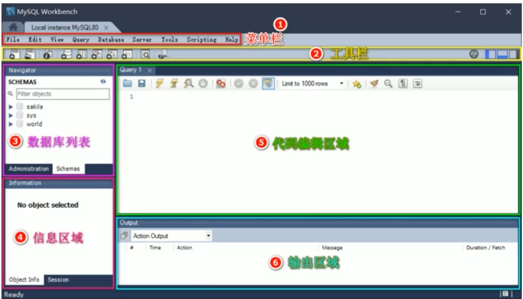
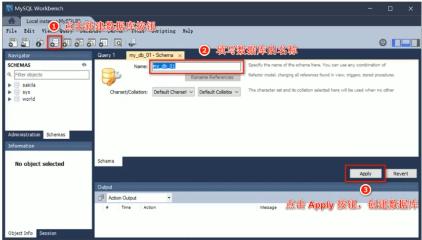
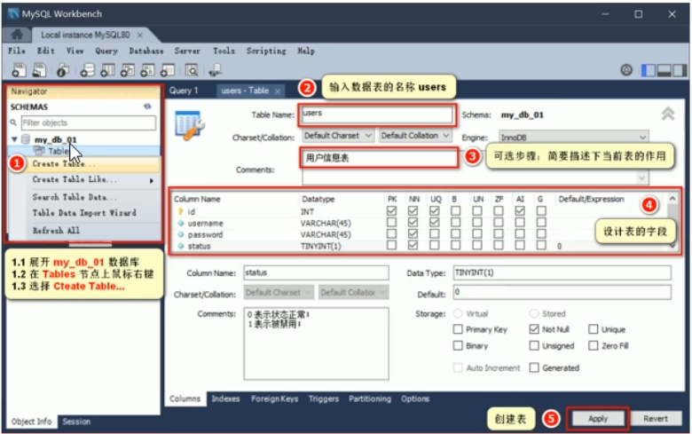
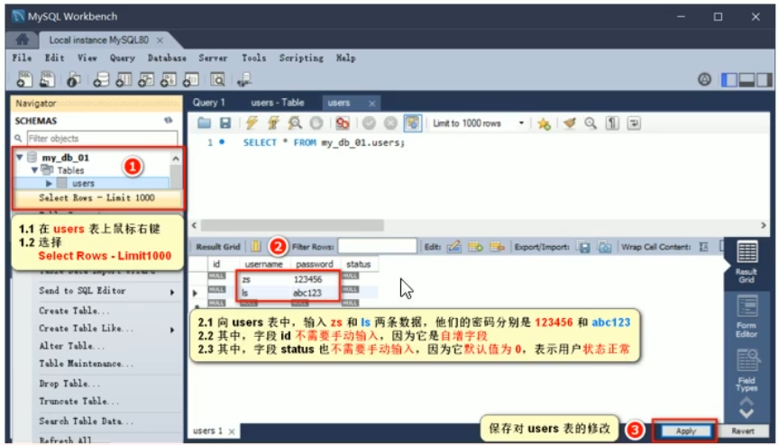
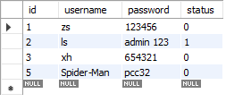

# 1. 数据库的基本概念
## 1.1. 什么是数据库
> 数据库(database)是用来组织、存储、和管理数据的仓库

为了方便管理互联网世界中的数据，就有了**数据库管理系统**的概念（简称数据库）。用户可以对数据库中的数据进行**新增**、**查询**、**更新**、**删除**等操作。

## 1.2. 常见的数据库及分类
最常见的数据库
- MySQL(Community+Enterprise)
- Oracle(收费)
- SQL Server(收费)
- Mongodb(Community+Enterprise)

其中，MySQL、Oracle、SQL Server属于**传统型数据库**（又叫做关系型数据库或者SQL数据库），这三个的设计理念相同，用法比较相似
而Mongodb属于 **新型数据库**（又叫做非关系型数据库或者NoSQL数据库），他在一定程度上弥补了传统型数据库的缺陷

## 1.3. 传统型数据库的数据组织结构
> 数据的组织结构：指的是数据以什么样的结构进行存储

传统型数据库的数据组织结构，与Excel中数据的组织结构比较类似
### 1. Excel中的数据组织结构
每个Excel中，数据的组织结构分为**工作簿**、**工作表**、**数据行**、**列**这四大部分

### 2. 传统型数据库的数据组织结构
在传统数据库中，数据的组织结构分为**数据库（database)**、**数据表（table）**、**数据行（row）**、**字段（field）**这四大部分组成

- 数据库类似于Excel的工作簿
- 数据表类似于Excel的工作表
- 数据行类似于Excel的每一行数据
- 字段类似于Exc的列
- 每个字段都有对应的数据类型

### 3. 实际开发中库、表、行、字段的关系
- 实际开发中，每个项目都对应实际的数据库
- 不同的数据要存储到数据库的不同表中
- 每个表中具体存储哪些信息，由字段来决定
- 表中的行，代表每一条具体的数据


# 2. 安装并配置MySQL
## 2.1. 了解需要安装哪些MySQL相关的软件
- MySQL Server:专门用来提供数据存储和数据服务的软件
- MySQL Workbench:可视化的MySQL管理工具，通过它，可以方便的操作存储在MySQL Server中的数据

# 3. MySQL的基本使用
## 3.1. 使用MySQL Workbench管理数据库
### 1. 连接数据库

### 2. 创建数据库


注意：数据库名称中不要包含中文和空格

### 3. 创建数据表


DataType数据类型：
- int 整数
- varchar(len)  字符串
- tinyint(1)  布尔值


字段的特殊标识：
- PK（Primary Key）主键、唯一标识
- NN（Not Null）值不允许为空
- UQ（Unique）值唯一
- AI（Auto Increment）值自动增长
  


### 4. 向表中写入数据

## 3.2. 使用SQL管理数据库
### 1. 什么是SQL
> SQL（英文全称：Srtuctured Query Language）是结构化查询语言，专门用来访问和处理数据库的编程语言。能够让我们以编程的形式，操作数据库里面的数据

三个关键点：
- SQL是一门数据库编程语言
- 使用SQL语言编写出来的语句，叫做SQL语句
- SQL语言只能在关系型数据库中使用

### 2. SQL能做什么
- 从数据库中查询数据
- 向数据库中插入新数据
- 更新数据库中的数据
- 从数据库删除数据
- 可以创建新的数据库
- 可在数据库中创建新表
- 可在数据库中创建存储过程、视图
- ...

### 3. SQL学习目标
重点掌握如何使用SQL从数据表中：
- 查询数据
- 插入数据
- 更新数据
- 删除数据

额外掌握4种SQL语法
- where条件
- and和or运算符
- order by排序
- count(*)函数

## 3.3. SQL中的SELECT语句
### 1. 语法
> SELECT语句用于从表中查询数据。执行的结果被存储在一个结果表中（称为结果集）

语法格式：
```sql
-- 从FROM指定的表中，查询出所有的数据  *表示所有列
SELECT * FROM 表名称

-- 从FROM指定的表中，查询出指定的 列名称（字段） 的数据
SELECT 列名称 FROM 表名称
```

注意：SQL语句中的关键字对大小写不敏感。SELECT等效于select，FROM等效于from

### 2. SELECT * 示例
我们希望从user表中选取所有的列，可以使用符号`*`取代列的名称

示例：
```sql
-- 通过 * 把users表中所有的数据查询出来
select * from users
```
### 3. SELECT列名称示例
如需获取名为username和password的列的内容，使用下面的select语句

```sql
-- 从users表中把username和password对应的数据查询出来
select username,password from users
```
## 3.4. SQL的INSERT INTO语句
### 1. 语法
> INSERT INTO语句用于向数据表中插入新的数据行

语法格式如下:
```sql
-- 向users 表中插入新数据，username的值为tony stark password的值为098123
-- insert into users (username,password) values ('tony stark','098123')
```
## 3.5. SQL中的UPDATE语句
### 1. 语法
> update语句用于修改表中的数据。

语法格式如下：
```sql
-- 将id为4 的用户密码更新成888888
-- update users set password='888888' where id=4
select * from users
```
### 2. UPDATE示例-更新某一行中的若干列
```js
-- 更新id为2 的用户，把用户密码更新为admin123同时，把用户的状态更新为1
-- update users set password='admin 123',status=1 where id=2 
```
## 3.6. SQL的DELETE语句
### 1. 语法
DELETE语句用于删除表中的行

语法格式如下：
```sql
delete from 表名称 where 列名称 = 值
```
```sql
-- 删除users表中id为4 的用户
-- delete from users where id=4
```
## 3.7. SQL中的WHERE子句
### 1. 语法
> where子句用于限定选择的标准，在select、delete、update中，皆可使用where子句来限定选择的标准

### 2. 可在where子句中使用的运算符

下面的运算符可在where子句中使用，用来限定选择的标准：
| 操作符  | 描述         |
| ------- | ------------ |
| =       | 等于         |
| <>      | 不等于       |
| >       | 大于         |
| <       | 小于         |
| >=      | 大于等于     |
| <=      | 小于等于     |
| BETWEEN | 在某个范围内 |
| LIKE    | 搜索某种模式 |

注意：在某些版本的SQL中，操作符<>可以写为!=

### 3. where 子句示例
可以通过where子句来限定select的查询条件

```sql
-- 演示where子句的使用
-- select *from users where status=1
-- select * from users where id>=2
-- select * from users where username<>'ls'
```
## 3.8. SQL中的and和or运算符
### 1. 语法
and和or可在where子句中把两个或者多个条件结合起来

`and`表示必须同时满足多个条件，相当于JavaScript中的`&&`
`or`表示只要满足任意一个条件即可，相当于JavaScript中的`||`运算符


### 2. and 运算符示例
使用and来显示所有status为0，并且id小于3的用户
```sql
-- 使用and显示所有装态为0且id小于3的用户
select * from users where status=0 and id<3
```

### 3. or运算符示例
使用or来显示所有status为1，或者username为zs的用户
```sql
-- 使用 or来显示所有状态为1或者username为zs的用户
select * from users where status=1 or username='zs'
```
## 3.9. SQL的ORDER BY子句
### 1. 语法
> ORDER BY 语句用于根据指定的列对结果集进行排序

order by 语句默认按照升序对记录进行排序

如果希望按照 **降序**对记录进行排序，可以使用`DESC`关键字
### 2. ORDER BY 子句-升序排序
对users表中的数据，按照status字段进行升序排序

```sql
-- 对users表中的数据，按照status字段进行升序排序
select * from users order by status
```
### 3. ORDER BY 子句-降序排序
```sql
-- 对users表中的数据，按照id字段进行降序排序  desc表示降序排序   asc表示升序排序
select * from users order by id desc
```
### 4. ORDER BY 子句-多重排序
对users表中的数据，先按照status字段进行降序排序，再按照username的字母顺序进行升序排序

```sql
-- 对users表中的数据，先按照status字段进行降序排序，再按照username的字母顺序进行升序排序
select * from users order by status desc,username asc
```
## 3.10. SQL的COUNT(*)函数
### 1. 语法
> COUNT(*)函数用于返回查询结果的总数据条数

```sql
select count(*)  form 表名称
```
### 2. COUNT(*)示例
查询users表中status为0的总数据条数
```sql
-- 查询users表中status为0的总数据条数
select count(*) from users where status=0
```
### 3. 使用AS为列设置别名
> 如果希望给查询出来的列名称设置别名，可以使用`AS`关键字

示例：
```sql
-- 使用AS关键字给列起别名
select count(*) as total from users where status=0
```

# 4. 在项目中操作MySQL
## 4.1. 在项目中操作数据库的步骤
- 安装操作MySQL数据库的第三方模块(mysql)
- 通过mysql连接到MySQL数据库
- 通过mysql模块执行SQL语句

## 4.2. 安装与配置mysql模块
### 1. 安装mysql模块
> mysql模块是托管于npm上的第三方模块。它提供了Node.js项目中连接和操作MySQL数据库的能力

想要在项目中使用它，需要先运行如下命令，将mysql 安装为项目依赖包：
```
npm i mysql
```
### 2. 配置mysql模块
在使用mysql模块操作MySQL数据库之前，必须先对mysql模块进行必要的配置，主要配置如下：
```js
// 1. 导入mysql模块
const mysql=require('mysql')

// 2. 建立与MySQL数据库的连接关系
const db=mysql.createPool({
    host:'127.0.0.1',   //数据库的IP地址
    user:'root',        //登录数据库的账号
    password:'admin123', //登录数据库的密码
    database:'my_db_01'   //指定要操作哪个数据库
})
```
### 3. 测试mysql模块能否正常工作
调用`db.query()`函数，指定要执行的SQL语句，通过回调函数拿到执行的结果：
```js
// 测试mysql模块能否正常工作
db.query('select 1',(err,results)=>{

    // mysql工作期间报错
    if (err) return console.log(err.message)

    // 能够成功的执行sql语句
    console.log(results);

})
```
## 4.3. 使用mysql模块操作MySQL数据库
### 1. 查询数据
查询users表中所有的数据
```js
// 查询users表中所有的数据
const sqlStr='select * from users'
db.query(sqlStr,(err,results)=>{
    if (err) return console.log(err.message);

    console.log(results);
})
```
结果：是一个数组
```
[
  RowDataPacket {      
    id: 1,
    username: 'zs',    
    password: '123456',
    status: 0
  },
  RowDataPacket {      
    id: 2,
    username: 'ls',
    password: 'admin 123',
    status: 1
  },
  RowDataPacket {
    id: 3,
    username: 'xh',
    password: '654321',
    status: 0
  }
]
```
### 2. 插入数据
向users表中新增数据，其中`username`为`Spider-Man`，`password`为`pcc321`

```js
// 向users表中新增数据，其中`username`为`Spider-Man`，`password`为`pcc321`
const user = {
    username: 'Spider-Man',
    password: 'pcc32'
}

//定义待执行的SQL语句
const sqlStr = 'insert into users (username,password) values (?,?)'

//执行SQL语句
db.query(sqlStr, [user.username, user.password], (err, results) => {
    if (err) return console.log(err.message);
    
    // 成功了
    // 注意：如果执行的是insert into 插入语句，则results是一个对象，可以通过affectedRows属性，来判断是否插入数据成功
    if (results.affectedRows===1){
        console.log('插入数据成功');
    }
})
```

注意：新插入的数据的id可以看到是5：

这是因为id为4 的数据之前是有的，只不过被删除了，而id具有唯一性，已经使用过的id就不能在使用第二次了，所以新插入的数据的id从5开始
### 3. 插入数据的便捷方式
向表中新增数据时，如果数据对象的每个属性和数据表的字段**一一对应**，则可以通过如下的方式快速插入数据：
```js
// 演示插入数据的便捷方式
// 向users表中新增数据，其中`username`为`Spider-Man2`，`password`为`pcc4321`
const user = {
    username: 'Spider-Man2',
    password: 'pcc4321'
}

//定义待执行的SQL语句
const sqlStr='insert into users set ?'

//执行SQL语句
db.query(sqlStr,user,(err,results)=>{
    if (err) return console.log(err.message);

    if (results.affectedRows===1){
        console.log('插入数据成功');
    }
})
```
### 4. 更新数据
可以通过如下的方式，更新表中的数据：
```js
// 演示如何更新用户的信息
const user = {
    id:6,
    username: 'aaa',
    password: '000'
}

// 定义SQL语句
const sqlStr='update users set username=?,password=? where id=?'

//执行SQL语句
db.query(sqlStr,[user.username,user.password,user.id],(err,results)=>{
    if (err) return console.log(err.message);

    if (results.affectedRows===1){
        console.log('更新成功啦！');
    }
})
```
### 5. 更新数据的便捷方式
向表中更新数据时，如果数据对象的每个属性和数据表的字段**一一对应**，则可以通过如下的方式快速更新数据：
```js
// 演示更新数据的便捷方式
const user = {
    id: 6,
    username: 'aaaa',
    password: '0000'
}

const sqlStr = 'update users set ? where id=?'

db.query(sqlStr, [user, user.id], (err, results) => {
    if (err) return console.log(err.message);

    if (results.affectedRows === 1) {
        console.log('更新数据成功啦！');
    }
})
```
### 6. 删除数据
在删除数据时，推荐根据id这样的唯一的标识，来删除对应的数据
```js
// 删除id为5的用户
const sqlStr = 'delete from users where id=?'
db.query(sqlStr, 5, (err, results) => {
    if (err) return console.log(err.message);

    if (results.affectedRows === 1) {
        console.log('删除数据成功啦！');
    }
})
```

### 7. 标记删除
使用DELETE语句，会真正的把数据从表中删除掉。为了保险起见，推荐使用标记删除的形式，来模拟删除动作

> 所谓的标记删除，就是在表中设置类似于status这样的状态字段，来标记当前这条数据是否被删除

当用户执行了删除的动作时，我们并没有执行DELETE语句把数据删除掉，而是执行了UPDATE语句，将这条数据对应的status字段标记为删除即可

```js
// 标记删除
const sqlStr = 'update users set status=? where id=?'

db.query(sqlStr, [1, 6], (err, results) => {
    if (err) return console.log(err.message);

    if (results.affectedRows === 1) {
        console.log('标记删除数据成功啦！');
    }
})
```