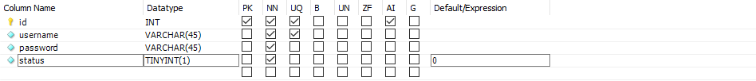

# 1. 数据库的基本概念
## 1.1. 什么是数据库
> 数据库(database)是用来组织、存储、和管理数据的仓库

为了方便管理互联网世界中的数据，就有了**数据库管理系统**的概念（简称数据库）。用户可以对数据库中的数据进行**新增**、**查询**、**更新**、**删除**等操作。

## 1.2. 常见的数据库及分类
最常见的数据库
- MySQL(Community+Enterprise)
- Oracle(收费)
- SQL Server(收费)
- Mongodb(Community+Enterprise)

其中，MySQL、Oracle、SQL Server属于**传统型数据库**（又叫做关系型数据库或者SQL数据库），这三个的设计理念相同，用法比较相似
而Mongodb属于 **新型数据库**（又叫做非关系型数据库或者NoSQL数据库），他在一定程度上弥补了传统型数据库的缺陷

## 1.3. 传统型数据库的数据组织结构
> 数据的组织结构：指的是数据以什么样的结构进行存储

传统型数据库的数据组织结构，与Excel中数据的组织结构比较类似
### 1. Excel中的数据组织结构
每个Excel中，数据的组织结构分为**工作簿**、**工作表**、**数据行**、**列**这四大部分

### 2. 传统型数据库的数据组织结构
在传统数据库中，数据的组织结构分为**数据库（database)**、**数据表（table）**、**数据行（row）**、**字段（field）**这四大部分组成

- 数据库类似于Excel的工作簿
- 数据表类似于Excel的工作表
- 数据行类似于Excel的每一行数据
- 字段类似于Exc的列
- 每个字段都有对应的数据类型

### 3. 实际开发中库、表、行、字段的关系
- 实际开发中，每个项目都对应实际的数据库
- 不同的数据要存储到数据库的不同表中
- 每个表中具体存储哪些信息，由字段来决定
- 表中的行，代表每一条具体的数据


# 2. 安装并配置MySQL
## 2.1. 了解需要安装哪些MySQL相关的软件
- MySQL Server:专门用来提供数据存储和数据服务的软件
- MySQL Workbench:可视化的MySQL管理工具，通过它，可以方便的操作存储在MySQL Server中的数据

# 3. MySQL的基本使用
## 3.1. 使用MySQL Workbench管理数据库
### 1. 连接数据库

### 2. 创建数据库


注意：数据库名称中不要包含中文和空格

### 3. 创建数据表


DataType数据类型：
- int 整数
- varchar(len)  字符串
- tinyint(1)  布尔值


字段的特殊标识：
- PK（Primary Key）主键、唯一标识
- NN（Not Null）值不允许为空
- UQ（Unique）值唯一
- AI（Auto Increment）值自动增长
  


### 4. 向表中写入数据

## 3.2. 使用SQL管理数据库
### 1. 什么是SQL
> SQL（英文全称：Srtuctured Query Language）是结构化查询语言，专门用来访问和处理数据库的编程语言。能够让我们以编程的形式，操作数据库里面的数据

三个关键点：
- SQL是一门数据库编程语言
- 使用SQL语言编写出来的语句，叫做SQL语句
- SQL语言只能在关系型数据库中使用

### 2. SQL能做什么
- 从数据库中查询数据
- 向数据库中插入新数据
- 更新数据库中的数据
- 从数据库删除数据
- 可以创建新的数据库
- 可在数据库中创建新表
- 可在数据库中创建存储过程、视图
- ...

### 3. SQL学习目标
重点掌握如何使用SQL从数据表中：
- 查询数据
- 插入数据
- 更新数据
- 删除数据

额外掌握4种SQL语法
- where条件
- and和or运算符
- order by排序
- count(*)函数

## 3.3. SQL中的SELECT语句
### 1. 语法
> SELECT语句用于从表中查询数据。执行的结果被存储在一个结果表中（称为结果集）

语法格式：
```sql
-- 从FROM指定的表中，查询出所有的数据  *表示所有列
SELECT * FROM 表名称

-- 从FROM指定的表中，查询出指定的 列名称（字段） 的数据
SELECT 列名称 FROM 表名称
```

注意：SQL语句中的关键字对大小写不敏感。SELECT等效于select，FROM等效于from

### 2. SELECT * 示例
我们希望从user表中选取所有的列，可以使用符号`*`取代列的名称

示例：
```sql
-- 通过 * 把users表中所有的数据查询出来
select * from users
```
### 3. SELECT列名称示例
如需获取名为username和password的列的内容，使用下面的select语句

```sql
-- 从users表中把username和password对应的数据查询出来
select username,password from users
```
## 3.4. SQL的INSERT INTO语句
### 1. 语法
> INSERT INTO语句用于向数据表中插入新的数据行

语法格式如下:
```sql
-- 向users 表中插入新数据，username的值为tony stark password的值为098123
-- insert into users (username,password) values ('tony stark','098123')
```
## 3.5. SQL中的UPDATE语句
### 1. 语法
> update语句用于修改表中的数据。

语法格式如下：
```sql
-- 将id为4 的用户密码更新成888888
-- update users set password='888888' where id=4
select * from users
```
### 2. UPDATE示例-更新某一行中的若干列
```js
-- 更新id为2 的用户，把用户密码更新为admin123同时，把用户的状态更新为1
-- update users set password='admin 123',status=1 where id=2 
```
## 3.6. SQL的DELETE语句
### 1. 语法
DELETE语句用于删除表中的行

语法格式如下：
```sql
delete from 表名称 where 列名称 = 值
```
```sql
-- 删除users表中id为4 的用户
-- delete from users where id=4
```
## 3.7. SQL中的WHERE子句
### 1. 语法
> where子句用于限定选择的标准，在select、delete、update中，皆可使用where子句来限定选择的标准

### 2. 可在where子句中使用的运算符

下面的运算符可在where子句中使用，用来限定选择的标准：
| 操作符  | 描述         |
| ------- | ------------ |
| =       | 等于         |
| <>      | 不等于       |
| >       | 大于         |
| <       | 小于         |
| >=      | 大于等于     |
| <=      | 小于等于     |
| BETWEEN | 在某个范围内 |
| LIKE    | 搜索某种模式 |

注意：在某些版本的SQL中，操作符<>可以写为!=

### 3. where 子句示例
可以通过where子句来限定select的查询条件

```sql
-- 演示where子句的使用
-- select *from users where status=1
-- select * from users where id>=2
-- select * from users where username<>'ls'
```
## 3.8. SQL中的and和or运算符
### 1. 语法
and和or可在where子句中把两个或者多个条件结合起来

`and`表示必须同时满足多个条件，相当于JavaScript中的`&&`
`or`表示只要满足任意一个条件即可，相当于JavaScript中的`||`运算符


