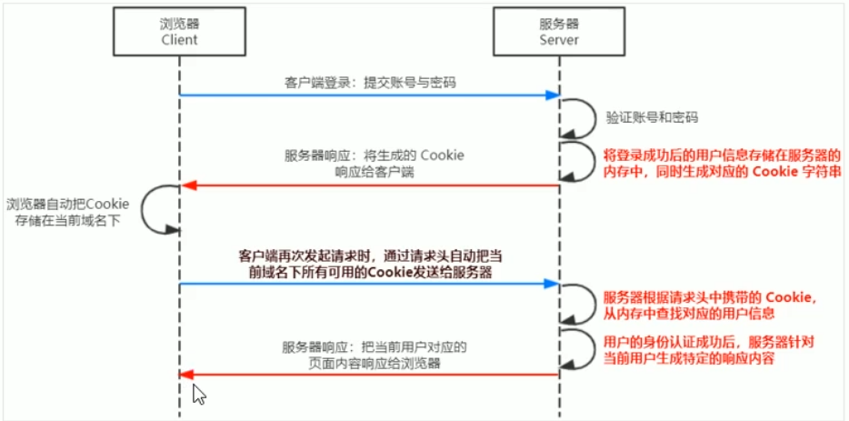
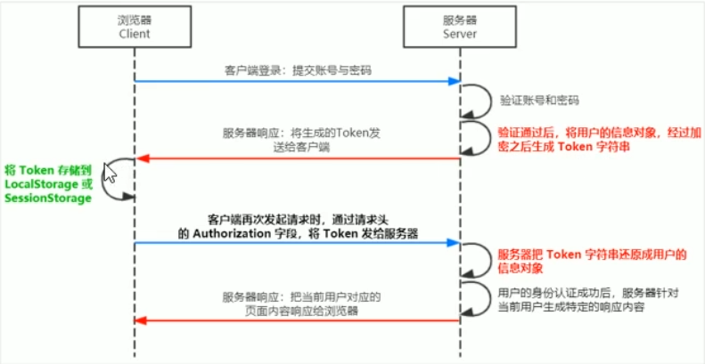

# 1. 前后端的身份认证
## 1.1. web开发模式
目前主流的web开发模式有两种，分别是：
- 基于服务端渲染的传统web开发模式
- 基于前后端分离的新型web开发模式

### 1. 服务端渲染的web开发模式
> 服务端渲染的概念：服务器发送给客户端的HTML页面，是在服务器通过字符串的拼接，动态生成的。因此，客户端不需要使用Ajax这样的技术额外请求页面的数据

### 2. 服务端渲染的优缺点
优点：
- **前端耗时少**。因为服务器负责动态生成HTML内容，浏览器只需要直接渲染页面即可。尤其是移动端，更省电
- **有利于SEO**。因为服务器响应的是完整的HTML页面内容。所以爬虫更容易爬取获得信息，更有利于SEO

缺点：
- **占用服务器端资源**。即服务器端完成HTML页面内容的拼接，如果请求较多，会对服务器造成一定的访问压力
- **不利于前后端分离，开发效率低**。使用服务器端渲染，则无法进行分工合作，尤其对前端复杂度高的项目，不利于项目高效开发
### 3. 前后端分离的web开发模式
> 前后端分离的概念：前后端分离的开发模式，依赖于Ajax技术的广泛应用。简而言之，前后端分离的web开发模式，就是后端负责提供API接口，前端使用Ajax调用接口的开发模式

### 4. 前后端分离的优缺点
优点：
- **开发体验好**。前端专注于UI页面的开发。后端专注于API的开发，且前端有更多选择性
- **用户体验好**。Ajax的技术的广泛应用，极大地提高了用户的体验，可以轻松实现页面的局部刷新
- **减轻了服务器端的渲染压力**。因为页面最终是在每个用户的浏览器中生成的

缺点：
- 不利于SEO。（解决方案：利用Vue、react等前端框架的SSR（sever side render）技术能够很好的解决SEO问题）

### 5. 如何选择开发模式
- 企业级的官网，主要功能是展示而没有复杂的交互，并且需要良好的SEO，则这时我们就需要使用服务器端渲染
- 类似后台管理项目，交互性比较强，不需要考虑SEO，那么就可以使用前后端分离的开发模式

具体使用何种开发模式并不是绝对的，为了同时兼顾首页的渲染速度和前后端分离的开发效率，一些网站采用了首屏服务器端渲染+其他页面前后端分离的开发模式

## 1.2. 身份认证
### 1. 什么是身份认证
> 身份认证(Authentication)又称“身份验证”、“鉴权”，是指通过一定的手段，完成对用户身份的确认

### 2. 为什么需要身份认证
> 身份认证的目的：是为了确认当前所声称是某种身份的用户，确实是所声称的用户

### 3. 不同开发模式下的身份认证
- 服务器端渲染推荐使用Session认证机制
- 前后端分离推荐使用JWT认证机制

## 1.3. Session认证机制
### 1. http协议的无状态性
> http协议的无状态性，指的是客户端的每次http请求都是独立的，连续多个请求之间没有直接关系，服务器不会主动保留每次http请求的状态

### 2. 如何突破http无状态的限制
Cookie
### 3. 什么是Cookie
> Cookie是存储在用户浏览器中的一段不超过4kb的字符串。它由一个名称(Name)、一个值(Value)和其他的几个用于控制Cookie有效期、安全性、使用范围的可选属性组成

 不同域名下的Cookie各自独立，每当客户端发起请求时，会自动把当前域名下所有未过期的Cookie一同发送给服务器

 Cookie的几大特性：
 - 自动发送
 - 域名独立
 - 过期时限
 - 4kb限制

### 4. Cookie在身份认证中所起到的作用
客户端第一次请求服务器的时候，服务器通过响应头的形式，向客户端发送一个身份认证的Cookie,客户端会自动的将Cookie保存在服务器中

随后，当客户端浏览器每次请求服务器的时候，浏览器会自动将身份认证相关的Cookie，通过请求头的形式发送给服务器，服务器即可验明客户端的身份

### 5. Cookie不具有安全性
由于Cookie是存储在浏览器中的，而且浏览器也提供了读写Cookie的API，因此Cookie很容易被伪造，不具有安全性。因此不建议服务器将重要的隐私数据，通过Cookie的形式发送给浏览器

### 6. Session的工作原理

## 1.4. 在Express中使用Session认证
### 1. 安装express-session中间件
在Express项目中，只需要安装`express-session`中间件，即可在项目中使用Session认证
```
npm i express-session
```
### 2. 配置express-session中间件
express-session中间件安装成功后，需要通过`app.use()`来注册session中间件

示例代码：
```js
const session=require('express-session')
app.use(session({
  secret:'itheima',
  resave:false,
  saveUninitialized:true
}))
```
### 3. 向session中存数据
当express-session中间件配置成功后，即可通过`req.session`来访问session对象，从而存储用户的关键信息

```js
  // TODO_02：请将登录成功后的用户信息，保存到 Session 中
  // 注意：只有成功配置了express-session这个中间件之后，才能通过req点出来session这个属性
  req.session.user=req.body   //用户信息
  req.session.islogin=true    //用户登录状态
  ```
### 4. 从session中取数据
可以直接从`req.session`对象上获取之前存储的数据

示例代码：
```js
  // TODO_03：请从 Session 中获取用户的名称，响应给客户端
  if (!req.session.islogin){
    return res.send({status:1,msg:'fail'})
  }

  res.send({
    status:0,
    msg:'success',
    username:req.session.user.username
  })
  ```
### 5. 清空session
调用`req.session.destroy()`函数，即可清空服务器保存的session信息
```js
// 退出登录的接口
app.post('/api/logout', (req, res) => {
  // TODO_04：清空 Session 信息
  req.session.destroy()

  res.send({
    status:0,
    msg:'退出登录成功'
  })
})
```
## 1.5. JWT认证机制
### 1. 了解Session认证的局限性
Session认证机制需要配合Cookie才能实现。由于Cookie默认不支持跨域访问，所以，当涉及到前端跨域请求后端接口的时候，需要做很多额外的配置，才能实现跨域session认证

注意：
- 当前端请求后端接口不存在跨域问题的时候，推荐使用Session身份认证机制
- 当前端需要跨域请求后端接口的时候，不推荐使用Session身份认证机制，推荐使用JWT认证机制

### 2. 什么是JWT
> JWT(英文全称：JSON Web Token)是目前最流行的跨域认证解决方案

### 3. JWT的工作原理



总结：用户的信息通过Token字符串的形式，保存在客户端浏览器中。服务器通过还原Token字符串的形式来认证用户的身份
### 4. JWT的组成部分
> JWT通常由三部分组成，分别是Header(头部)、Payload（有效荷载）、Signature（签名）

三者之间使用英文`.`分隔

格式如下：
```js
Header.Payload.Signature
```
### 6. JWT三个部分各自代表的含义
- Payload部分才是真正的用户信息，它是用户信息经过加密之后生成的字符串
- Header和Signature是安全性相关的部分，只是为了保证Token的安全性

### 7. JWT的使用方式
客户端收到服务器返回的JWT之后，通常会将它存储在`localStorage`或者`sessionStorage`中
此后，客户端每次与服务器通信，都要带上这个JWT的字符串，从而进行身份验证。推荐的做法是把 JWT放在HTTP请求头的Authorization字段中

格式如下：
```js
Authorization:Bearer<token>
```
## 1.6 在Express中使用JWT
### 1. 安装JWT相关的包
运行如下命令，安装如下两个JWT相关的包
```
npm i jsonwebtoken express-jwt
```

其中：
- jsonwebtoken用于生成JWT字符串
- express-jwt用于将JWT字符串解析还原成JSON对象

### 2. 导入JWT相关的包
使用`require()`方法，分别导入JWT相关的两个包
```js
const jwt=require('jsonwebtoken')
const expressJWT=require('express-jwt')
```
### 3. 定义secret密钥
为了保证JWT字符串的安全性，防止JWT字符串在网络传输过程中被别人破解，我们需要专门定义一个用于加密和解密的secret密钥：

- 当生成JWT字符串的时候，需要使用secret密钥对用户的信息进行加密，最终得到加密好的JWT字符串
- 当把JWT字符串解析还原成JSON对象的时候，需要使用secret密钥进行解密

```js
// secret 密钥的本质：就是一个字符串
const secretKey='jiu shi sui bian de yi chuan zi fu chuan'
```
### 4. 在登陆成功后生成JWT字符串
调用`jsonwebtoken`包提供的`sign()`方法，将用户的信息加密成JWT字符串，响应给客户端：
```js
  // TODO_03：在登录成功之后，调用 jwt.sign() 方法生成 JWT 字符串。并通过 token 属性发送给客户端
  // 参数1：用户的信息对象
  // 参数2：加密的密钥
  //  参数3：配置对象，可以配置当前token的有效期
  const tokenStr = jwt.sign({
    username: userinfo.username
  }, secretKey, {
    expiresIn: '30s'
  })
  ```
### 5. 将JWT字符串还原为JSON对象
客户端每次在访问那些有权限接口的时候，都需要主动通过请求头中的Authorization字段，将Token字符串发送到服务器进行身份认证

此时，服务器可以通过expres-jwt这个中间件，自动将客户端发送过来的Token解析还原成JSON对象：
```js
app.use(expressJWT({secret:secretKey}).unless({path: [/^\/api\//]}))
```
### 6. 使用req.user获取用户信息
当express-jwt这个中间件配置成功后，即可在哪些有权限的接口中，使用req.user对象，来访问JWT字符串中解析出来的那些用户信息了，示例代码如下：

