# 起步-Git基础概念
## 1. 什么是Git
Git是一个开源分布式版本控制系统，是目前世界上最先进，最流行的版本控制系统
## 2. Git的特性
- 直接记录快照，而非差异比较
- 近乎所有的操作都是本地执行
### 2.1. SVN差异比较
传统的版本控制系统（例如SVN）是基于差异的版本控制，他们存储的是**一组基本文件**和**每个文件随时间积累的差异**

好处：节省磁盘空间
缺点：耗时、效率低

### 2.2. Git的记录快照
Git快照是在原有文件版本的基础上重新生成一份新的文件，类似于**备份**。为了效率，如果文件没有修改，Git不再重新储存该文件，而是只保留一个链接指向之前储存的文件

缺点：占用磁盘空间较大
优点：版本切换时非常快，因为每个版本都是完整的文件快照，切换版本时直接恢复目标版本的快照即可
特点:空间换时间


### 2.3. 近乎所有的操作都是在本地执行
在Git中的绝大多数操作都只需要访问本地文件和资源，一般不需要来自网络上其他计算机的信息

特性：
- 断网之后依旧可以在本地对项目进行版本管理
- 联网后，把本地修改的记录同步到云端服务器即可

## 3. Git中的三个区域
- 工作区
- 暂存区
- Git仓库

## 4. Git中的三种状态


注意：
- 工作区的文件被修改了，但是还没有放到暂存区，就是已修改状态
- 如果文件已修改并放入暂存区，就是已暂存状态
- 如果Git仓库保存着特定版本的文件，就属于已提交状态

## 5. 基本的Git工作流程
基本的Git工作流程如下：
- 在工作区中修改文件
- 将你想要下次提交的更改进行暂存
- 提交更新，找到暂存区的文件，将快照永久性存储到Git仓库

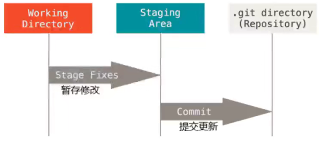

# Git基础- 安装并配置Git
## 1. Git的全局配置文件
Git全局配置文件，配置一次即可永久生效

文件路径：C:/Users/用户名文件夹/.gitconfig

## 2.检查配置信息
查看全局配置项
```java
git config --list --global
```

查看指定的全局配置项
```
git config user.name
git config user.email
```
## 3. 获取帮助信息
可以使用 git help &lt;verb&gt; 命令，无需联网即可在浏览器中打开帮助手册
```
# 想要打开git config 命令的帮助手册
git help config
```

如果不想查看完整手册，那么可以使用 -h 选项获得更简明的“help”输出
```
git config -h
```

# Git基础-Git的基本操作
## 1. 获取Git仓库的两种方式
- 将尚未进行版本控制的本地目录转换为Git仓库
- 从其他服务器克隆一个已存在的Git仓库

## 2. 在现有目录中初始化仓库
如果自己有一个尚未进行版本控制的项目目录，想要用Git来控制它，需要执行如下两个步骤：
- 在项目目录中，通过鼠标右键打开"Git Bash"
- 执行git init命令将目前的目录转化为Git仓库


git init 命令会创建一个名为.git的隐藏目录，这个.git目录就是当前项目的Git仓库，里面包含了初始的必要文件，这些文件是Git仓库的必要组成部分

## 3. 工作区中文件的4种状态
工作区中每一个文件可能处于4种状态，这4种状态共分为两大类

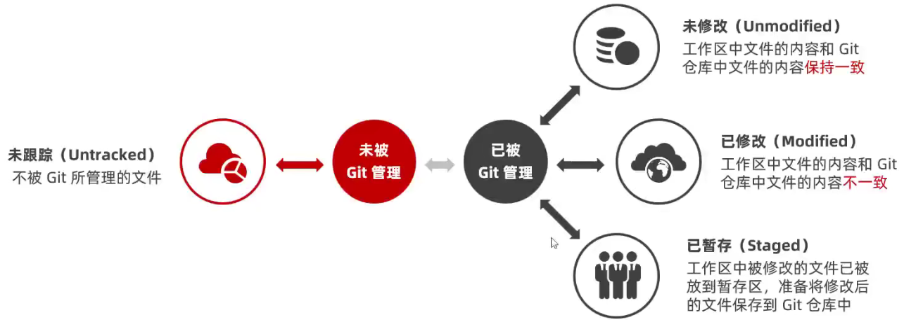

Git操作的终极结果：让工作区中的文件都处于“**未修改**”的状态
## 4. 检查文件的状态
可以使用git status 命令查看文件处于什么状态

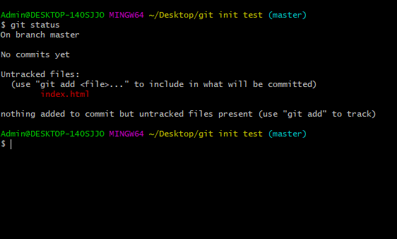

在状态报告中可以看到新建的 index.html 文件出现在Untracked files （未跟踪的文件）下面

未跟踪的文件意味着Git在之前的快照（提交）中没有这些文件；Git也不会自动将之纳入跟踪范围，除非明确地告诉它“我需要使用Git跟踪管理该文件”
## 5. 以精简的方式显示文件状态

以精简的方式显示文件状态：
两条命令完全等价
```
git status -s

git status --short
```


未跟踪文件前面有红色的？？标记：

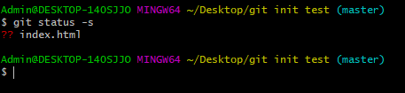

## 6. 跟踪新文件
使用命令  git add 开始跟踪一个文件。

所以，要跟踪index.html文件，运行如下命令即可：
```
git add index.html
```
此时再次运行 git status 命令，会看到 index.html 文件在 Changes to be committed 这行下面，说明已经被跟踪，并处于暂存状态

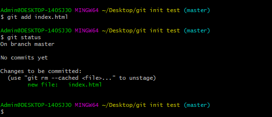


以精简的方式显示文件的状态：
新添加到暂存区的文件前面会有一个绿色的A标记

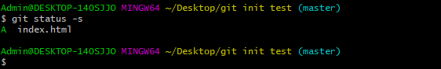

## 7. 提交更新
现在暂存区有一个 index.html 文件等待被提交到Git仓库中进行保存。可以执行 git commit 命令进行提交， 其中m 选项后面是本次的提交消息，用来对提交的内容做进一步的描述
```
git commit -m "新建了index.html文件"
```

提交成功后会显示如下信息：

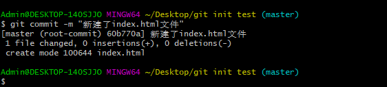

提交成功后，再次检查文件的状态，得到提示如下：

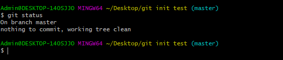
证明工作区中所有的文件都处于“未修改”状态，没有任何文件需要被提交

总结：
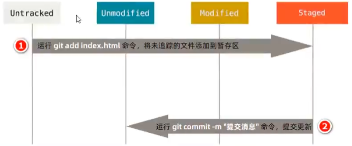

## 8. 对已提交的文件进行修改
目前，index.html文件已经被Git跟踪，并且工作区和Git仓库中的 index.html 文件内容保持一致。当我们修改了工作区中的index.html文件的内容之后，再次运行 git status 和 git status -s命令，会看到如下的内容：

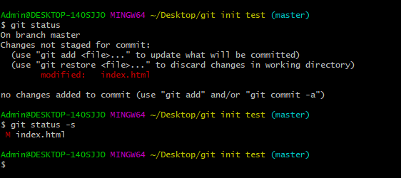

文件index.html出现在 Changes not staged for commit 这行下面，说明已跟踪文件的内容发生了变化，但是还没有放到暂存区

修改过的并且没有放入暂存区的文件前面有红色的M标记

## 9. 暂存已修改的文件
目前，工作区中的 index.html文件已经被修改，如果要暂存这次修改，需要再次运行 git add 命令，这个命令是个多功能命令，主要有3个功效：
- 可以使用它**开始跟踪新文件**
- 把**已跟踪的、且已修改的**文件放到暂存区
- 把有冲突的文件标记为已解决状态

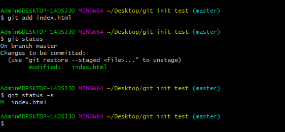

注意：
- 已修改但是还没有放入暂存区的文件是红色的modified
- 已修改且已经放入暂存区的文件是绿色的modified

## 10. 提交已暂存的文件
再次运行 git commit -m “提交消息”命令，即可将暂存区中记录的 index.html的快照，提交到Git仓库中进行保存

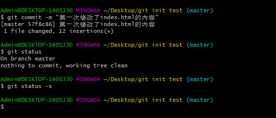

总结：
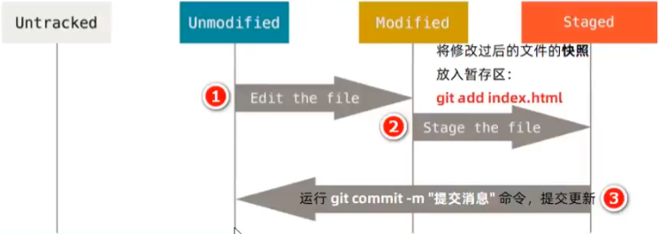

## 11. 撤销对文件的修改
撤销对文件的修改指的是：把对工作区中对应文件的修改，**还原**成Git仓库只给你所保存的版本

操作的结果：所有的修改都会丢失，且无法恢复！ **危险性较高，请谨慎操作**

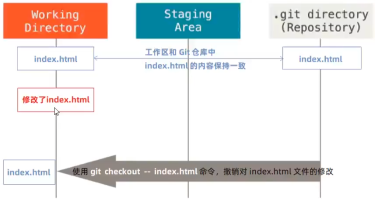

撤销操作的本质： **用Git仓库中保存的文件，覆盖工作区中指定的文件**

## 12. 向暂存区中一次性添加多个文件
如果需要被暂存的文件个数比较多，可以使用如下的命令，一次性的将所有的新增和修改过的文件加入暂存区

```
git add .
```

注意：今后的项目开发中，会经常使用这个命令，将新增和修改后的文件加入暂存区

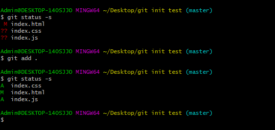

## 13. 取消暂存的文件
如果需要从暂存区中移除对应的文件，可以使用如下命令：
```
git reset HEAD 要移除的文件名称
```
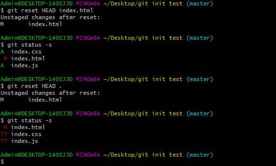

## 14. 跳过使用暂存区
Git标准的工作流程是 **工作区->暂存区->Git仓库**，但是有时候这么做略显繁琐，此时可以跳过暂存区，直接将工作区中的修改提交到Git仓库，这时候Git的工作流程简化为了 **工作区->Git仓库**

Git提供了一个跳过使用暂存区域的方式，只要在提交的时候，给 git commit 加上** -a **选项，Git就会自动把所有已经跟踪过的文件暂存起来一并提交，从而跳过 git add 步骤：
```
git commit -a -m "描述消息"
```
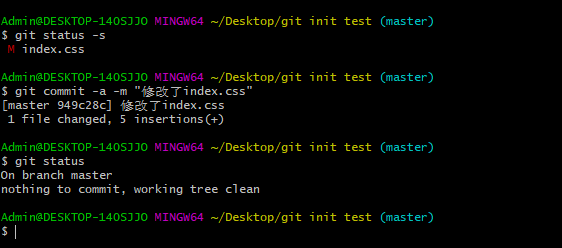


## 15. 移除文件
从Git仓库中移除文件的方式有两种：
- 从Git仓库和工作区中同时移除对应文件
- 只从Git仓库中移除指定的文件，但保留工作区中对应的文件

```java
# 从Git仓库和工作区中同时移除对应文件
git rm -f index.js

# 只从Git仓库中移除指定的文件，但保留工作区中对应的文件
git rm --cached index.js
```

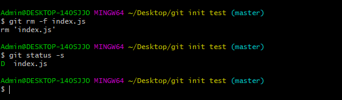
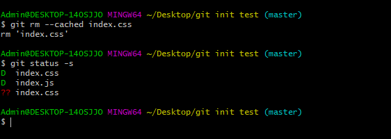

## 16. 忽略文件
一般我们总会有一些文件无需纳入Git的管理，也不希望他们总出现在未跟踪文件列表，在这种情况下，我们可以创建一个名为 .gitignore 的配置文件，列出要忽略的文件的匹配格式

文件 .gitignore 的格式规范如下：
- 以#开头的是注释
- 以/结尾的是目录
- 以/开头防止递归
- 以!开头表示取反
- 可以使用glob模式进行文件和文件夹的匹配（glob指简化了的正则表达式）


## 17. glob模式
所谓的glob模式是指简化了的正则表达式
- 星号* 表示匹配零个或者多个任意字符
- [abc]匹配任何一个列在方括号中的字符
- 问号？表示只匹配一个任意字符
- 在方括号中可以使用短划线分隔两个字符，表示所有在这两个字符范围内的都可以匹配（比如[0-9]表示匹配所有0到9的数字）
- 两个星号表示匹配任意中间目录（比如a/**/z可以匹配a/z a/b/z 或者 a/b/c/z等

## 18. 查看提交历史
如果希望查看项目的提交历史，可以使用 git log 这个简单且有效的命令

按照时间的先后顺序，列出所有的提交历史，最近的提交排在最上面
```
git log
```

只展示最新的两条提交历史，数字可以按照需求进行填写
```
git log -2
```

在一行上展示最近两条提交历史的信息
```
git log -2 --pretty=oneline
```

在一行上展示最近的两条提交历史的消息，并自定义输出的格式

%h提交的简写哈希值  %an作者名字  %ar作者修订日期，按多久以前的方式显示  %s提交说明
```
git log -2 --pretty=format:"%h | %an | %ar | %s"
```

## 19. 回退到指定的版本
在一行上展示所有的提交历史
```
git log --pretty=oneline
```

使用 git reset --hard 命令，根据指定的提交ID回退到指定版本
```
git reset --hard <CommitID>
```

在旧版本中使用 git reflog --pretty=oneline命令：查看命令操作的历史
```
git reflog --pretty=oneline
```

再次根据最新的提交ID，跳转到最新的版本
```
git reset --hard <CommitID>
```


