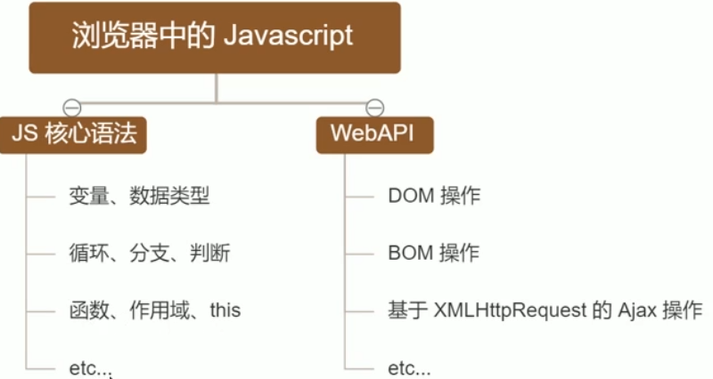
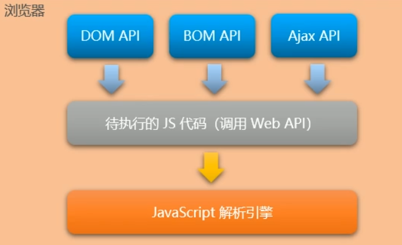
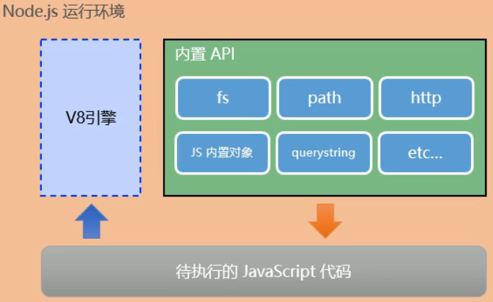

# 1. 初识Node.js
## 1.1. 回顾与思考
### 1. 已经掌握了哪些技术
- HTML
- CSS
- JavaScript

### 2. 浏览器中JavaScript的组成部分


### 3. 思考：为什么JavaScript可以在浏览器中被执行
待执行的JavaScript代码会通过JavaScript`解析引擎`解析后被浏览器执行

不同的浏览器使用不同的JavaScript解析引擎：
- Chrome=>V8
- Firefox=>OdinMonkey
- Safri=>JSCore
- IE=>Chakra
- etc...
### 4. 为什么JavaScript可以操作DOM和BOM
每个浏览器都内置了DOM，BOM这样的API函数，因此，浏览器中的JavaScript才可以调用他们


### 5. 浏览器中的JavaScript运行环境
    运行环境是指代码正常运行所需的必要环境


总结：
- V8引擎负责解析和执行JavaScript代码
- 内置API是由运行环境提供的特殊接口，只能在所属的运行环境中被调用

### 6. 思考：JavaScript能否做后端开发
可以
使用 `Node.js`
`Node.js`也是一个运行环境

## 1.2. Node.js简介
### 1. 什么是Node.js
Node.js是一个基于Chrome V8引擎的**JavaScript运行环境**

### 2. Node.js中的JavaScript运行环境



注意：
- 浏览器是JavaScript的前端运行环境
- Node.js是JavaScript的后端运行环境
- Node.js中无法调用DOM BOM等浏览器内置API

### 3. Node.js可以做什么
- 基于EXpress框架，可以快速构建Web应用
- 基于Electron框架可以构建跨平台的桌面应用
- 基于restify框架可以快速构建API接口项目
- 读写和操作数据库、创建实用的命令行工具辅助前端开发、etc

### 4.Node.js怎么学
JavaScript基础语法+**Node.js内置API模块**（fs path http等）+**第三方API模**块（express mysql等）


## 1.3. Node.js环境的安装
### 1. 安装
官网下载，直接安装即可
### 2. 查看已安装的Node.js的版本号
打开终端，在 终端输入命令 `node -v` 后，按下回车键，即可查看已安装的 Node.js的版本号

打开终端：
使用快捷键 Win+R 打开运行面板，输入cmd后直接回车，即可打开终端

### 3. 什么是终端
终端（Terminal）是专门为开发人员设计的，用于**实现人机交互**的一种方式

## 1.4. 在Node.js环境中执行JavaScript代码
- 打开终端
- 输入node要执行的js文件的路径

### 1. 终端里的快捷键
- 使用**↑**键，可以快速定位到上一次执行的命令
- 使用**tab**键，可以快速补全文件的路径
- 使用**Esc**键，可以快速清空当前已输入的命令
- 输入**cls**命令，可以清空终端

# 2. fs文件系统模块
## 2.1. 什么是fs文件系统模块
fs模块是Node.js官方提供的，用来操作文件的模块，它提供了一系列的方法和属性，用来满足用户对文件的操作需求

例如：
- `fs.readFile()`方法，用来 **读取**指定的文件中的内容
- `fs.whiteFile()`方法，用来向指定的文件中 **写入**内容
  
如果 要在JavaScript代码中，使用fs模块来操作文件，则需要使用如下的方式先导入它：
```
const fs=require('fs')
```
## 2.2. 读取指定文件中的内容
### 1. fs.readFile()的语法格式
```node
fs.readfile(path[,options],callback)
```
参数解读：
- 参数1：必选参数，字符串，表示文件的路径
- 参数2：可选参数，表示以什么编码格式来读取文件
- 参数3：必选参数，文件读取完成后，通过回调函数拿到读取的结果

### 2. fs.readFile()的示例代码
以utf8的编码格式，读取指定文件的内容，并打印err和dataStr的值
```node
const fs=require('fs')
fs.readFile('./files/11.txt','utf8',function(err,dataStr){
    console.log(err)
    console.log(dataStr)
})
```
### 3. 判断文件是否读取成功
可以判断err对象是否为`null`，从而知晓文件读取的结果
```node
const fs=require('fs')

fs.readFile('files/1.txt','utf8',function(err,dataStr){
    if (err){
        return console.log('读取文件失败！'+err.message);
    }
    console.log('读取文件成功!'+dataStr);
})
```
## 2.3. 向指定的文件中写入内容
### 1. fs.writeFile()语法格式
```node
fs.writeFile(file,data[,options],callback)
```
参数解读：
- 参数1：必选参数，字符串，表示文件的路径
- 参数2：必选参数，表示要写入的内容
- 参数3：可选参数，表示以什么编码格式来读取文件
- 参数4：必选参数，文件读取完成后，通过回调函数拿到读取的结果

### 2. fs.writeFile()的示例代码
```node
// 1. 导入fs文件系统模块
const fs=require('fs')

// 2.调用fs.writeFile()方法 写入文件的内容

// - 参数1：必选参数，字符串，表示文件的路径
// - 参数2：必选参数，表示要写入的内容
// - 参数3：可选参数，表示以什么编码格式来读取文件
// - 参数4：必选参数，文件读取完成后，通过回调函数拿到读取的结
fs.writeFile('files/2.txt','abcd',function(err){
    // 如果文件写入成功，则err的值为null
    // 如果文件写入失败，则err的值为写入对象
    console.log(err);
})
```


### 3. 判断文件是否写入成功
可以判断err对象是否为`null`，从而知晓文件写入的结果
```node
if (err){
    return console.log('文件写入失败！'+err.message);
}
console.log('文件写入成功!');
```
## 2.5. 练习-考试成绩整理
使用fs文件系统模块，将素材目录下的 *成绩.txt* 中的考试数据，整理到 *成绩-ok.txt* 中

### 核心实现步骤
- 导入需要的fs文件系统模块
- 使用`fs.readFile()`方法，读取素材目录下的 *成绩.txt* 文件
- 判断文件是否读取失败
- 文件读取成功后，处理成绩数据
- 将处理完的成绩数据，调用 `fs.writeFile()` 方法，写入到新文件 成绩-ok.txt 中

```node
// 1. 导入fs文件系统模块
const fs = require('fs')

// 2. 调用fs.readFile()读取文件的内容
fs.readFile('成绩.txt', 'utf8', function (err, dataStr) {

    // 3. 判断是否读取成功
    if (err) {
        return console.log('读取文件失败' + err.message);
    }

    console.log('读取文件成功' + dataStr);

    // 4.1 先把成绩的数据，按照空格进行分割
    const arrOld = dataStr.split(' ')
    console.log(arrOld);
    // 4.2 循环分割后的数组，对每一项数据，进行字符串的替换操作

    const arrNew = []
    arrOld.forEach(item => {
        arrNew.push(item.replace('=', ':'))
    })
    console.log(arrNew);
    // 4.3 把新数组中的每一项进行合并，得到一个新的字符串
    const newStr = arrNew.join('\r\n')
    console.log(newStr);

    // 5. 调用fs.writeFile()方法，把处理完毕的成绩，写入到新文件中

    fs.writeFile('files/成绩-ok.txt',newStr,function(err){
        if (err){
            return console.log('写入文件失败');
        }
        console.log('成绩写入成功');
    })
})
```
## 2.6. fs模块-路径动态拼接的问题
在使用fs模块操作文件时，如果提供的操作路径是以./或者../开头的相对路径时，很容易出现路径动态拼接错误的问题

原因：代码在执行的时候，会以执行node命令时所处的目录，动态拼接出被操作文件的完整路径

出现路径拼接错误问题是因为提供了./或者../开头的相对路径
如果要解决这个问题，可以提供一个完整的文件存放路径就行了

`__dirname`表示当前文件的路径
```node
fs.readFile(__dirname+'/files/1.txt','utf8',function(err,dataStr){
    if (err){
        return console.log('读取文件失败'+err.message);
    }
    console.log('读取文件成功'+dataStr);
})
```

# 3. path 路径模块
## 3.1. 什么是path路径模块
`path`模块是`Node.js`官方提供的，用来处理路径的模块。它提供了一系列的方法和属性，用来满足用户对路径的处理需求

例如：
- `path.join()`方法，用来将多个路径片段拼接成一个完整的路径字符串
- `path.basename()`方法，用来从路径字符串中，将文件名解析出来

如果要在JavaScript代码中，使用`path`模块来处理路径，则需要使用如下的方式先导入它：
```javascript
const path=require('path')
```
## 3.2. 路径拼接
### 1. path.join()的语法格式
使用`path.join()`方法，可以把多个路径片段拼接为完整的路径字符串，语法格式如下：
```
path.join([...paths])
```
参数解读：
- ...path&lt;string&gt;路径片段的序列
- 返回值：&lt;string&gt;

```js
const path=require('path')

// 注意：../会抵消前面的路径
const pathStr=path.join('/a','/b/c','../','./d','e')
console.log(pathStr);
```

    注意：凡是涉及到路径拼接的操作，都要使用path.join()方法进行处理。不要直接使用+字符串的拼接

## 3.3. 获取路径中的文件名
### 1. path.basement()的语法格式
使用 `path.basement()`方法，可以获取路径中的最后一部分，经常通过这个方法获取路径中的文件名，语法格式如下：
```
path.basement(path[,ext])
```
参数解读：
- path &lt;string&gt; 必选参数，表示一个路径的字符串
- ext &lt;string&gt; 可选参数，表示文件扩展名
- 返回： &lt;string&gt; 表示路径中的最后一部分

```js
const path=require('path')


// 定义文件的存放路径
const fpath='a/b/c/index.html'

const fullName=path.basename(fpath)
// console.log(fullName);

const nameWithoutExt=path.basename(fpath,'.html')
console.log(nameWithoutExt);
```
## 3.4. 获取路径中的文件扩展名
### 1. path().extname()的语法格式
```js
path.extname(path)
```
参数解读：
- path &lt;string&gt;  必选参数，表示一个路径的字符串

```js
const path=require('path')

const fpath='a/b/c/index.html'

const fext=path.extname(fpath)
console.log(fext);  //输出.html
```
## 3.5. 综合案例-时钟案例
### 1. 案例要实现的功能
将素材目录下的`index.html`页面，拆分成三个文件，分别是：
- index.css
- index.js
- index.html
  
并且将拆分出来的3个文件，存放到clock目录中

### 2. 案例的实现步骤
- 创建两个正则表达式，分别用来匹配&lt;style&gt;和&lt;sccript&gt;标签
- 使用fs模块，读取要处理的HTML文件
- 自定义resolveCSS文件，来写入index.css样式文件
- 自定义resolveJs文件，来写入index.js脚本文件
- 自定义resolveHTML文件，来写入index.html文件

```js
// 1.1 导入fs模块
const fs = require('fs')
// 1.2 导入path模块
const path = require('path')

// 1.3 定义正则表达式，分别匹配<style>和<script>标签
const regStyle = /<style>[\s\S]*<\/style>/
const regScript = /<script>[\s\S]*<\/script>/

// 2.1 调用fs.readFile()方法读取文件
fs.readFile(path.join(__dirname, '/index.html'), 'utf8', function (err, dataStr) {
    // 2.2 读取HTML文件失败
    if (err) return console.log('读取HTML文件失败' + err.message);

    // 2.3 读取文件成功后，需要调用对应的三个方法，分别拆解出css,js,html 文件
    resolveCSS(dataStr)
    resolveJS(dataStr)
    resolveHTML(dataStr)
})


// 3.1 定义处理css样式的方法
function resolveCSS(htmlStr) {
    // 3.2 使用正则提取需要的内容
    const r1 = regStyle.exec(htmlStr)
    // console.log(r1);

    // 3.3 将提取出来的样式字符串，进行字符串的replace替换操作
    const newCSS = r1[0].replace('<style>', '').replace('</style>', '')
    // console.log(newCSS);

    // 3.4 调用fs.writeFile()方法，将提取的样式写入到clock目录中index.css的文件里面
    fs.writeFile(path.join(__dirname, './clock/index.css'), newCSS, function (err) {
        if (err) return console.log('写入css样式失败' + err.message);
        console.log('写入css样式成功');
    })
}


// 4.1 定义处理js脚本的方法
function resolveJS(htmlStr) {
    // 4.2 通过正则，提取对应的<script></script>标签内容
    const r2 = regScript.exec(htmlStr)

    // 3.3 将提取出来的样式字符串，进行字符串的replace替换操作
    const newJS = r2[0].replace('<script>', '').replace('</script>', '')

    // 3.4 调用fs.writeFile()方法，将提取的样式写入到clock目录中index.js的文件里面
    fs.writeFile(path.join(__dirname, './clock/index.js'), newJS, function (err) {
        if (err) return console.log('写入js脚本失败' + err.message);
        console.log('写入js脚本成功');
    })
}

// 5.1 定义处理HTML结构的方法
function resolveHTML(htmlStr) {
    //5.2 将字符串调用replace方法，把内嵌的style和script标签替换为外联的link和script标签

    const newHTML = htmlStr.replace(regStyle, '<link rel="stylesheet" href="./index.css" />').replace(regScript, '<script src="./index.js"></script>')

    // 5.3 写入index.html 这个文件
    fs.writeFile(path.join(__dirname,'./clock/index.html'),newHTML,function(err){
        if (err) return console.log('写入HTML文件失败'+err.message);

        console.log('写入HTML页面成功');
    })

}
```

### 4. 案例的两个注意点
- fs.writeFile()方法只能用来创建文件，不能用来创建路径
- 重复调用fs.writeFile()写入同一个文件，新写入的内容会覆盖之前的旧内容


