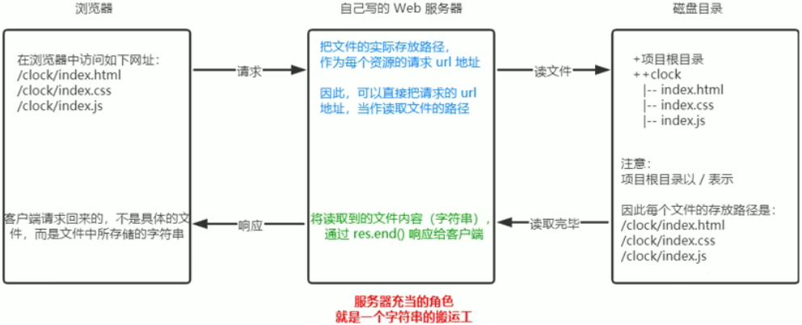
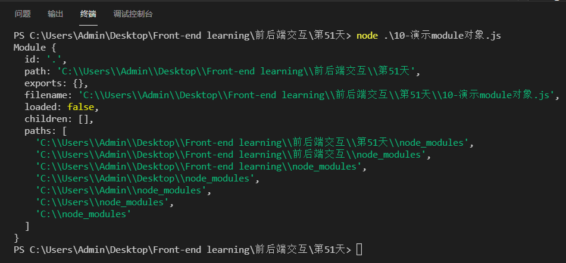
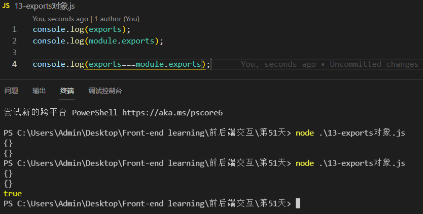

# 4. http模块
## 4.1. 什么是http模块
http模块是`Node.js`官方提供的、用来**创建web服务器**的模块，通过http模块提供的`http.createServer()`方法，就能方便的把一台电脑变成一台web服务器，从而对外提供web资源服务

如果要希望使用http模块创建web服务器，则需要先导入它：
```js
const http=require('http')
```
## 4.2.进一步理解http模块的作用
服务器和普通电脑的区别在于，服务器上安装了web服务器软件，例如：`IIS` 、`Apache`等。通过安装这些服务器软件，就能把一台普通的电脑，变成一台web服务器

在Node.js中，我们不需要使用`IIS` 、`Apache`等这些第三方web服务器软件。因为我们可以基于Node.js提供的`http`模块，通过几行代码，就能简单地手写一个服务器软件，从而对外提供web服务

## 4.3. 服务器相关的概念
### 1. IP地址
IP地址就是互联网上**每台计算机的唯一地址**，因此IP地址具有唯一性，如果把“个人电脑”比作一台电话，那么IP地址就相当于“电话号码”，只有在知道对方IP地址的前提下，才能与对应的电脑之间进行数据通信

ip地址的格式：通常用“点分十进制”表示成`(a.b.c.d)`的形式，其中,a,b,c,d都是0~255之间的十进制整数。

注意：
- 互联网中每台web服务器，都有自己的ip地址，例如：可以在Windows的终端中运行 `ping www.baidu.com`命令，即可查看到百度服务器的ip地址
- 在开发期间，自己的电脑即是一台服务器，也是一个客户端，为了测试方便，可以在自己的浏览器中输入`127.0.0.1`这个ip地址，就能把自己的电脑当做一台服务器进行访问了

### 2. 域名和域名服务器
尽管IP地址能够唯一地标记网络上的计算机，但是IP地址是一长串数字，不直观，而且不便于记忆，于是人们又发明了另一套**字符型**的地址方案，即所谓的**域名(Domain Name)地址**

IP地址和域名是一一对应的关系，这份对应关系放在一种叫做**域名服务器**（DNS，Domain name server）的电脑中，使用者只需要通过好记的域名访问对应的服务器即可，对应的转换工作由域名服务器实现。因此，**域名服务器就是提供IP地址和域名之间的转换服务的服务器**

注意：
- 在开发测试期间，`127.0.0.1`对应的域名是`localhost`，他们都代表我们自己的这台电脑，在使用效果上没有任何区别
### 3. 端口号
计算机中的端口号，就好像是现实生活中的门牌号一样。
在一台电脑里，可以运行成百上千个web服务，每个web服务都对应一个唯一的端口号，客户端发来的网络请求，通过端口号，可以被准确的交给对应的web服务进行处理

注意：
- 每个端口号不能同时被多个web服务占用
- 在实际应用中，URL中的**80端口可以被省略**


## 4.4. 创建最基本的web服务器

### 1. 创建web服务器的基本步骤
- 导入http模块
- 创建web服务器实例
- 为服务器绑定`requset`事件，监听客户端的请求
- 启动服务器


### 2. 步骤1-导入http模块
如果希望在自己的电脑上创建一个web服务器，从而对外提供web服务，则需要导入http模块

```js
const http=require('http')
```
### 2. 步骤2-创建web服务器实例
调用`http.createServer()`方法，即可快速创建一个web服务器实例

```js
const server=http.createServer()
```
### 3. 步骤3-为服务器实例绑定request事件
```js
// 使用服务器实例的.on()方法，为服务器绑定一个request事件
server.on('request',(req,res)=>{
    //只要有客户端来请求我们自己的服务器，就会触发request事件，从而调用这个事件处理函数
    console.log('someone visit our web server')
})
```
### 4. 步骤4-启动服务器
调用服务器实例的.listen()方法，即可启动当前的web服务器实例：
```js
//调用 server.listen(端口号，cb回调)方法，即可启动web服务器
server.listen(80,()=>{
    console.log('http server running at http://127.0.0.1')
})
```
### 3. req请求对象
只要服务器接收到了客户端的请求，就会调用通过`server.on()`为服务器绑定的request事件处理函数。
如果想要在事件处理函数中，访问与客户端相关的数据或属性，可以使用如下的方式：
```js
const http = require('http')
const server = http.createServer()

// req是请求对象，包含了与客户端相关的数据和属性
server.on('request', (req) => {
    // req.url是客户端请求的URL地址
    const url = req.url

    // req.method是客户端请求的method类型
    const method = req.method

    const str='Your request url is ${url} ,and request method is ${method}'

    console.log(str);
})
server.listen(80, () => {
    console.log('server running at http://127.0.0.1');
})
```
### 4. res响应对象
在服务器的request事件处理函数中，如果想要访问与服务器相关的数据或者属性，可以使用如下的方式：
```js
 // 调用res.end()方法向客户端响应一些内容
res.end(str)
```
### 5. 解决中文乱码的问题
当调用res.end()方法，向客户端发送中文内容时，会出现乱码的问题，此时，需要手动设置内容的编码格式
```js
const http = require('http')
const server = http.createServer()
server.on('request', (req, res) => {
    // 定义一个字符串，包含中文的内容
    const str = `您请求的URL地址是${req.url}，请求的method类型为${req.method}`

    // 调用res.setHeader()方法，设置Content-Type响应头，解决中文乱码的问题
    res.setHeader('Content-Type', 'text/html;charset=utf-8')

    // res.end()将内容响应给客户端
    res.end(str)
})

server.listen(80, () => {
    console.log('server running at http://127.0.0.1');
})
```

## 4.5.根据不同的URL响应不同的HTML内容
### 1. 核心实现步骤
- 请求的URL地址
- 设置默认的响应内容为404 Not found
- 判断用户请求的是否为/或者、index.html首页
- 判断用户请求的是否为/about.html关于页面
- 设置Content-Type响应头，防止中文乱码
- 使用res.end()把内容响应给客户端

### 2. 动态响应内容
```js
const http = require('http')
const server = http.createServer()
server.on('request', (req, res) => {
    // - 请求的URL地址
    const url = req.url

    // - 设置默认的响应内容为404 Not found
    let content = '<h1>404 Not found</h1>'

    // - 判断用户请求的是否为/或者、index.html首页
    // - 判断用户请求的是否为/about.html关于页面
    if (url === '/' || url === '/index.html') {
        content = '<h1>首页</h1>'
    } else if (url === '/about.html') {
        content = '<h1>关于页面</h1>'
    }

    // - 设置Content-Type响应头，防止中文乱码
    res.setHeader('Content-Type', 'text/html;charset=utf-8')


    // - 使用res.end()把内容响应给客户端
    res.end(content)
})
server.listen(80, () => {
    console.log('server running at http://127.0.0.1');
})
```
## 4.6. 案例-实现clock时钟的web服务器
### 1. 核心思路
把文件的实际存放路径，作为每个资源请求的URL地址


### 2. 实现步骤
- 导入需要的模块
- 创建基本的web服务器
- 将资源请求的URL地址映射为文件的存放路径
- 读取文件的内容并响应给客户端
- 优化资源的请求路径

### 3. 步骤1-导入需要的模块

# 5. 模块化的基本概念
## 5.1. 什么是模块化
> 模块化是指解决一个复杂问题时，自顶向下逐层把系统划分成若干模块的过程，对于整个系统来说，模块是可组合分解和更换的单元

### 1. 编程领域的模块化
> 编程领域的模块化，就是遵守固定的规则，把一个大文件拆分成独立并相互依赖的多个小模块


把代码进行模块化拆分的好处：
- 提高了代码的复用性
- 提高了代码的可维护性
- 可以实现按需加载
## 5.2. 模块化规范
> 模块化规范就是对代码进行模块化的拆分与组合时，需要遵守的那些规则

例如：
- 使用什么样的语法格式来引用模块
- 在模块中使用什么样的语法格式来暴露成员

# 6. NOde.js中的模块化
## 6.1. NOde.js中模块的分类
NOde.js中根据模块来源的不同，将模块分为3大类，分别是：
- 内置模块（内置模块是由NOde.js官方提供的，例如：fs path  http 等）
- 自定义模块（用户创建的每个.js文件，都是自定义模块）
- 第三方模块（由第三方开发出来的模块，并非官方提供的内置模块，也不是用户创建的自定义模块，使用前需要先下载）

## 6.2. 加载模块
使用强大的`require()`方法，可以加载需要的模块进行使用

加载内置的fs模块
```js
const fs=require('fs')
```

加载用户自定义模块
```js
const custom=require('./custom.js')
```

加载第三方模块
```js
const moment =require('moment')
```

注意：使用`require()`方法加载其他模块时，会执行被加载模块中的代码

## 6.3. Node.js中的模块作用域
### 1. 什么是模块作用域
> 和函数作用域类似，在自定义模块中定义的变量、方法等成员，只能在当前模块内被访问，这种模块级别的访问限制，叫做模块作用域

### 2. 模块作用域的好处
防止了全局变量污染的问题

## 6.4. 向外共享模块作用域的成员
### 1. module对象
> 在每个.js自定义模块中都有一个module对象，它里面存储了和当前模块有关的信息



### 2. module.exports对象
> 在自定义模块中，可以使用`module.exports`对象，将模块内的成员共享出去，供外界使用
> 外界使用`require()`方法导入自定义模块时，得到的就是`module.exports`所指向的对象

```js
// 在一个自定义模块中，默认情况下，module.exports={}

// 向module.exports对象上挂载一个username属性
module.exports.username='海绵宝宝'


// 向module.exports对象上挂载一个sayHello方法
module.exports.sayHello=function(){
    console.log('Hello');
}
```
### 3. 共享成员时的注意点
使用`require()`方法导入模块时，**导入的结果，永远以`module.exports`指向的对象为准**

```js
// 让module.exports指向一个全新的对象
module.exports={
    nickname:'派大星',
    sayHi(){
        console.log('Hi');
    }
}
```
结果：


### 4. exports对象
> 由于`module.exports`单词写起来比较复杂，为了简化向外共享成员的代码，NOde提供了`exports`对象。
默认情况下，`exports`和`module.exports`指向同一个对象。最终共享的结果，还是以`module.exports`指向的对象为准




### 4. exports和module.exports的使用误区
> 时刻谨记，`require()`模块时，得到的永远是`module.exports`指向的对象

```js
exports.username='海绵宝宝'
module.exports={
    gender:'male',
    age:3
}
```
结果：{gender:'male',age:3}

注意：为了防止混乱，建议大家不要再同一个模块中同时使用`exports`和`module.exports`
## 6.5. Node.js中的模块化规范
> NOde.js遵循了CommonJS模块化规范，CommonJS规定了**模块的特性**和**各模块之间如何相互依赖**


CommonJS规定：
- 每个模块内部，module变量代表当前模块
- module变量是一个对象，它的exports属性（即module.exports）是对外的接口
- 加载某个模块，其实是加载该模块的module.exports属性。require()方法用于加载模块


# 7. npm与包
## 7.1. 包
### 1. 什么是包
> Node.js中的第三方模块又叫做包

### 2. 包的来源
> 不同于Node.js中的内置模块与自定义模块，包是由第三方个人或者团队开发出来的，免费供所有人进行使用

### 3. 为什么需要包
由于Node.js的内置模块仅提供了一些底层的API，导致在基于内置模块进行项目开发时，效率很低
> 包是基于内置模块封装出来的，提供了更高级，更方便的API，极大地提高了开发效率

包和内置模块之间的关系，类似于`JQuery`和`浏览器内置API`之间的关系

### 4. 从哪里下载包
[npm](https://www.npmjs.com/)，全球最大的包共享平台，可以从网站下载

npm提供了一个[服务器](https://registry.npmjs.org/)，来对外共享所有的包

## 7.2. npm初体验
### 1. 格式化时间的传统做法
- 创建格式化时间的自定义模块
- 定义格式化时间的方法
- 创建补零函数
- 从自定义模块中导出格式化时间的函数
- 导入格式化时间的自定义模块
- 调用格式化时间的函数
  
```js
// 1. 定义格式化时间的方法
function dateFormat(dtStr) {
    const dt = new Date(dtStr)

    const y = padZero(dt.getFullYear())
    const m = padZero(dt.getMonth() + 1)
    const d = padZero(dt.getDate())

    const hh = padZero(dt.getHours())
    const mm = padZero(dt.getMinutes())
    const ss = padZero(dt.getSeconds())

    return `${y}-${m}-${d} ${hh}:${mm}:${ss}`

}


// 定义补零的函数
function padZero(n) {
    return n > 9 ? n : '0' + n
}

module.exports={
    dateFormat
}
```
在其他js文件中导入自定义模块
```js
// 导入自定义格式化时间的模块
const TIME=require('./15-dateFormat')

// 调用方法，进行时间的格式化
const dt=new Date()
// console.log(dt);
const newDT=TIME.dateFormat(dt)
console.log(newDT);
```
### 2. 格式化时间的高级做法
- 使用npm包管理工具，在项目中安装格式化时间的包`moment`
- 使用`require()`导入格式化时间的包
- 参考`moment`的官方API文档对时间进行格式化

### 3. 在项目中安装包的命令
```js
npm install 包的完整名称
```

上述的装包命令，可以简写成如下格式：
```js
npm i 完整的包名称
```

```js
// 1. 导入需要的包
// 注意：导入的名称，就是装包时候的名称
const moment=require('moment')

const dt=moment().format('YYYY-MM-DD HH:mm:ss')

console.log(dt);
```
### 4. 初次装包后多了哪些文件
初次装包完成后，在项目文件夹下多了一个叫做`node_moudles`的文件夹和`package-lock.json`的配置文件

其中：
`node_moudles`文件夹用来存放所有已安装的包。`require()`导入第三方的包时，就是从这个目录中查找并且加载包
`package-lock.json`配置文件用来记录目录下每个包的下载信息，例如包的名字，版本号，下载地址等

注意：程序员不要手动更改`node_moudles`和`package-lock.json`文件中的任何代码，npm包管理工具会自动维护它们

### 5. 安装指定版本的包
默认情况下，使用 npm install命令安装包的时候，会自动安装最新版本的包，如果需要安装指定版本的包，可以在包名之后，通过`@`符号指定具体的版本

```
npm i moment@2.22.2
```
### 6. 包的语义化版本规范
包的版本号是以“点分十进制”形式进行定义的，总共有三位数字，例如：2.24.0


其中每位数字的含义如下：
- 第1位数字：大版本
- 第2位数字：功能版本
- 第3位数字：bug修复版本

版本号提升的规则：只要前面的版本号增长了，则后面的版本号归零


