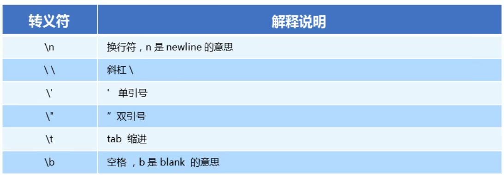

# 1. 编程语言
## 1.1. 编程
编程：就是让计算机为解决某个问题而使用某种程序设计语言编写程序代码，并最终得到结果的过程

计算机程序：就是计算机所执行的一系列的指令集合，而程序全部都是用我们所掌握的语言来编写的，所以人们要控制计算机一定要通过计算机语言向计算机发出命令


## 1.2. 计算机语言
计算机语言指用于人与计算机通讯的语言，它是人与计算机之间传递信息的媒介

计算机语言种类非常多，总体可以分为三大类：机器语言，汇编语言和高级语言

实际上计算机最终所执行的都是机器语言，它是由0和1组成的二进制数，二进制是计算机语言的基础


## 1.3. 编程语言
可以通过类似于人类语言的“语言”来控制计算机，让计算机为我们做事情，这样的语言叫做**编程语言**（programming language)
编程语言是用来控制计算机的一系列指令，他有固定的格式和词汇，必须遵守

如今通用的编程语言有两种：汇编语言和高级语言

汇编语言和机器语言实质是相同的，都是直接对硬件进行操作，只不过指令采用了英文缩写的标识符，容易记忆和识别


## 1.4. 翻译器
高级语言所编写的程序不能直接被计算机识别，必须经过转换才能被执行，为此，我们需要一个翻译器。

翻译器可以将我们所编写的源代码转换为机器语言，这也被称为二进制化，记住0和1


## 1.5. 编程语言和标记语言的区别
编程语言有很强的逻辑和行为能力，在编程语言里，你会看到很多if else for while 等具有逻辑性和行为你跟他管理的指令，这是主动的

标记语言不用向计算机发出指令，常用于格式化和链接。标记语言的存在是用来被读取的，它是被动的


# 2. 计算机基础

## 2.1. 计算机组成
硬件、软件
硬件组成：输入、输出、CPU、硬盘、内存


## 2.2. 数据存储
0和1表示数据


## 2.3. 数据存储单位

bit<byte<kb<gb<tb


# 3. 初识JavaScript
## 3.1. JavaScript是什么
JavaScript是世界上最流行的语言之一，是一种运行在客户端的脚本语言

脚本语言：不需要编译，运行过程中由js解释器逐行来进行解释并执行

现在也可以基于Node.js技术进行服务器端编程


## 3.3. JavaScript的作用
- 表单动态校验（密码强度检测）（js最初的目的）
- 网页特效
- 服务端开发（Node.js)
- 桌面程序（Electron）
- APP（Cordova)
- 控制硬件-物联网（Ruff）
- 游戏开发（cocos2d-js)


## 3.4. html/css/js的关系
html/css标记语言——描述类的语言

js脚本语言——编程类语言


## 3.5. 浏览器执行js简介
浏览器分成两个部分：渲染引擎和JS引擎

渲染引擎：用来解析HTML和css，俗称内核，比如Chrome的blink，老版本的webkit

js引擎：也称为js解释器，用来读取js代码，对其处理后执行，比如Chrome的v8

浏览器本身并不会执行js代码，二货思通过内置的javaScript引擎（解释器）来执行js代码，js引擎执行代码时逐行解释每一句源码（转换为机器语言），然后通过计算机去执行，所以JavaScript语言归为脚本语言，会逐行执行解释


## 3.6. js的组成
- JavaScript语法：ECMAScript
- 页面文档对象模型：DOM
- 浏览器对象模型：BOM

### ECMAScript
ECMAScript是由ECMA国际（原欧洲计算机制造商协会）进行标准化的一门编程语言，这种语言在万维网上应用广泛，它往往被称为JavaScript或JScript，但实际上后两者是ECMAScript语言的实现和拓展

ECMAScript规定了js编程语言的基础知识核心，是所有浏览器厂商共同遵守的一套js语法工业标准

### DOM文档对象模型
文档对象模型（Document Object Model）是W3C组织推荐的处理可扩展标记语言的标准编程接口。通过DOM提供的接口可以对页面上的各种元素进行操作（大小，、位置、颜色等）

### BOM浏览器对象模型
BOM（Browser Object Model）是指浏览器对象模型，它提供了独立于内容的、可以与浏览区窗口进行互动的对象结构。通过BOM可以操作浏览器窗口，比如弹出框、控制浏览器跳转、获取分辨率等


## 3.7. JS初体验
JS有三种书写位置，分别为行内，内嵌和外部

### 行内式：
```javascript
<input type="button" value="click me" onclick="alert('hello world')"/>
```
- 可以将单行或少量的js代码写在HTML标签的事件属性中（以on开头的属性），如：onclick
- 注意单双引号的使用：在HTML中我们推荐使用双引号，js中我们推荐使用单引号
- 可读性差，在HTML中编写大量js代码不容易阅读
- 引号易错，引号多层嵌套匹配时，非常容易出错
- 特殊情况下使用

### 内嵌式
```javascript
<script>
    alert('hello world');
</script>
```
- 可以将多行代码写到&lt;script&gt;中
- 学习时常用的方式

### 外部式
```javascript
<script src="my.js"></script>
```
- 引用外部js文件的script标签中间不可以写代码

**js注释**
单行注释 Ctrl+/
多行注释shift+alt+a


# 4. javascript输入输出语句
为了方便信息的输入和输出，js中提供了一些输入输出语句，其常用的语句如下：

(图：输入输出语句)


# 1. 变量概述
## 5.1. 什么是变量
变量就是一个装东西的盒子

变量是用于存放数据的容器，我们通过变量名获取数据，甚至数据可以修改

本质：变量是程序在内存中申请的一块用来存放数据的空间


## 5.2. 变量的使用
变量在使用时分为两步：1、声明变量 2、赋值

### 声明变量：
```javascript
var age; //声明一个名称为age的变量
```
- var是一个关键字，用来声明变量（variable变量的意思）。使用该关键字声明变量之后，计算机会自动为变量分配内存空间
- age是程序员定义的变量名，我们需要通过变量名来访问内存中分配的空间

### 赋值
```javascript
age=10; //给age这个变量赋值为10
```
- 变量值是程序员保存到变量空间里的值


## 5.3. 变量的初始化
```java
var age =10;//声明变量同时赋值为10
```
- 声明一个变量并赋值，我们称之为变量的初始化


## 5.4. 变量语法扩展
### 更新变量
一个变量被重新赋值之后，它原有的值就会被覆盖掉，变量值将以最后一次赋的值为准

### 同时声明多个变量
同时声明多个变量时，只需要写一个var，多个变量名之间使用英文逗号隔开
```java
var age=10,name='zs' ,sex=2;
```

### 声明变量的特殊情况
（图：声明变量的特殊情况）


## 5.5. 变量命名规范
- 由字母（A-Z,a-z）、数字（0-9）、下划线（_）、美元符号组成，如userAge，num01,_name
- 严格区分大小写
- 不能以数字开头
- 不能是关键字、保留字。例如var while for 
- 变量名必须有意义
- 遵循驼峰命名法。首字母小写，后面单词的首字母需要大写
- 尽量不要使用name作为变量名


# 6. 数据类型简介
## 6.1. 为什么需要数据类型
在计算机中，不同的数据所需占用的空间时不同的，为了便于把数据分成所需内存大小不同的数据，充分利用存储空间，于是定义了不同的数据类型


## 6.2. 变量的数据类型
变量是用来存储值的所在处，他们有名字和数据类型，变量的数据类型决定了如何将代表这些值的为存储到计算机的内存中，

JavaScript是一种弱类型或者说动态语言。这意味着不用提前声明变量的类型，在程序运行过程中，类型会自动被确定

在代码运行时，变量的数据类型是由js引擎根据=右边变量值的数据类型来判断的，运行完毕之后，变量就确定了数据类型

JavaScript拥有动态类型，同时也意味着相同的变量可用作不同的类型
```java
var x=6; //x为数字
var x='bill'; //x 为字符串
```


# 7. 简单数据类型
## 7.1. 简单数据类型（基本数据类型）
JavaScript中的简单数据类型及其说明如下：


## 7.2. 数字型
JavaScript数字类型既可以用来保存整数值，也可以保存小数（浮点数）
```java
var age =21;
var Age=21.33343 
```

### 数字型进制
- 最常见的进制有二进制、八进制、十进制、十六进制
- 程序里面数字前面加0表示8进制
- 程序里面数字前面加0x表示16进制

### 数字型范围
JavaScript中数值最大和最小值
```javascript
alert(Number.MAX_VALUE); 
alert(Number.MIN_VALUE); 
```
- Infinity 表示无穷大，大于任何值
- -Infinity 表示无穷小，小于任何值
- NaN,Not a number:表示一个非数值

isNaN()用来判断一个变量是否为非数字的类型，返回TRUE或者FALSE


## 7.3. 字符串型string
字符串型可以是引号中的任意文本，其语法为双引号核 单引号

因为HTML标签里面的属性使用的是双引号，js我们这里更推荐单引号

### 字符串引号嵌套
js可以用单引号嵌套双引号，或者用双引号嵌套单引号（外双内单，外单内双）

引号的匹配使用就近原则

### 字符串转义符
类似HTML里面的特殊字符，字符串中也有特殊字符，我称之为转义符

转义符都是以\开头的，常用的转义符及其说明如下：

（图：字符串转义符）


### 字符串长度
字符串是由若干字符组成的，这些字符的数量就是字符的长度，通过字符串的长度的length属性值就可以获取整个字符串的长度

### 字符串拼接
多个字符串之间可以使用+进行拼接，其拼接方式为字符串+任何类型=拼接后的新字符串

拼接之前会把与字符串相加的任何类型转成字符串，再拼接成一个新的字符串

变量是不能添加引号的，因为加引号的变量会变成字符串


## 7.4. 布尔型
布尔类型有两个值，TRUE和FALSE，其中TRUE表示对真，而FALSE表示假

布尔型和数字型相加时，TRUE的值为1，FALSE的值为0

undefined和数字相加，最后的结果是NaN


## 7.5. Undefined和Null
一个声明后没有被赋值的变量会有一个默认undefined(如果进行相连或者相加时，注意结果)
```javascript
var variable;
console.log(variable);  //underfined
console.log('你好'+variable);  //你好undefined
console.log(11+variable);  //NaN
console.log(true+variable)   NaN
一个声明变量给null值，里面存的值为空
var vari=null;
console.log('你好'+vari);    你好null
console.log(11+vari);    //11
console.log(true+vari);    //1
```
 

# 8. 获取变量数据类型
## 8.1. 获取检测变量的数据类型
typeof可用来获取检测变量的数据类型

## 8.2. 字面量
字面量是在源代码中的一个固定值的表示法，通俗来说，就是字面量表示如何表达这个值

- 数字字面量：5,4,4
- 字符串字面量：'海绵宝宝'
- 布尔字面量：ture false 


# 9. 数据类型转换
## 9.1. 什么是数据类型转换
使用表单、prompt获取过来的数据默认是字符串类型的，此时就不能直接简单的进行加法运算，而需要转换变量的数据类型，通俗来说，就是把一种数据类型的变量转换成另一种类型的

我们通常会实现3种数据类型的转换：
- 转换为字符串类型
- 转换为数字型
- 转换为布尔型


## 9.2. 转换为字符串类型
（图：转换为字符串）


toString()和String()使用方式不一样

三种转换方式，我们更喜欢用第三种加号拼接字符串转换方式，这一种方式也称之为隐式转换


## 9.3. 转换为数字型（重点）
（图转换为数字型）


parseInt()和parseFloat()注意大小写


## 9.4. 转换为布尔型
Boolean()

代表空、否定的值会被转换为FALSE，如：'',0,NaN,null,underfined

其余值都会被转换为TRUE


# 10. 解释型语言和编译型语言
## 10.1. 概述
计算机不能直接理解任何除机器语言以外的语言，所以必须要把程序员所写的程序语言翻译为机器语言才能执行程序。程序语言翻译成机器语言的工具，称为翻译器。

翻译器翻译的方式有两种：一个是编译，另一个是解释。两种方式之间的区别在于翻译的时间点不同

编译器是在代码执行之前进行编译，生成中间代码文件

解释器是在运行时进行及时翻译，并立即执行（当编译器以解释方式执行的时候，也称之为解释器）


# 11. 标识符、关键字、保留字
## 11.1. 标识符
标识符：就是指开发人员为变量、属性、函数、参数取的名字

标识符不能是关键字或者保留字


## 11.2. 关键字
关键字：是指js本身已经使用了的字，不能再用它们充当变量名、方法名

（图：关键字）


## 11.3.保留字
保留字：实际上就是预留的关键字，意思是现在虽然还不是关键字，但是未来可能会称为关键字，同样不能使用他们充当变量名或者方法名

（图：保留字）


 
