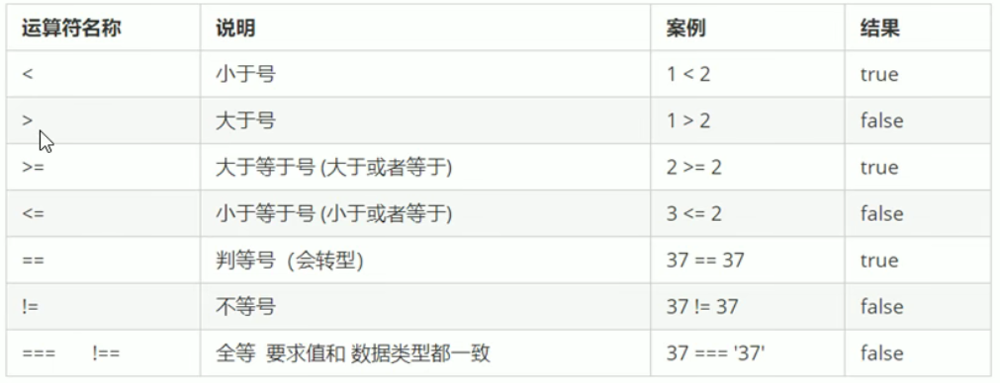

# 1. 运算符
运算符（operator）也被称为操作符，是用于实现赋值、比较和执行算数运算等功能的符号。

JavaScrpit中常用的运算符有：
- 算数运算符
- 递增和递减运算符
- 比较运算符
- 逻辑运算符
- 赋值运算符


# 2. 算数运算符
# 2.1. 算数运算符概述
(图：算数运算符)


浮点数，算数运算里会有问题，例如：
```javascript
console.log(0.1+0.2);  //0.30000000000000004
console.log(0.07*100);  //7.000000000000001
我们不能直接拿着浮点数相比较是否相等
var num=0.1+0.2;
console.log(num==0.3); //false
```

## 2.2. 表达式和返回值
表达式：是由数字、运算符、变量等以能求得数值的有意义排列方法所得的组合

简单理解：是由数字、运算符、变量组成的式子

所有的表达式最终都会有一个结果返回给我们，我们称为返回值


# 3. 递增和递减运算符
## 3.1. 递增和递减运算符概述
如果需要反复给数字变量添加或减去1，可以使用递增（++）和递减（--）运算符来完成

在js中递增和递减既可以放在变量前面，也可以放在变量后面。放在变量前面时，我们称为前置递增（递减）运算符，放在变量后面时，我们可以称之为后置递增（递减）运算符

注意：递增和递减运算符必须和变量配合使用

## 前置递增运算符
++num前置递增，就是自加1
先自加1，后返回值

## 后置自增运算符
num++后置递增，就是自加一，
先返回值，后自加1
```javascript
var age=10;
console.log(age++ +10); //20
console.log(age);    //11
```

## 3.2. 前置递增和后置递增小结
- 前置递增和后置递增运算符可以简化代码的编写，让变量的值+1比以前的写法更简单
- 单独使用时，运行结果相同
- 与其他代码联用时，执行结果会不同
- 后置：先原值运算后自加（先人后己）
- 前置：先自加后运算（先己后人）
- 开发时，多采用后置递增/减，并且代码独占一行，例如：num++


# 4. 比较运算符
## 4.1. 比较运算符概述
概念：比较运算符（关系运算符）是两个数据进行比较时所使用的运算符，比较运算后，会返回一个布尔值作为比较的结果

(图：比较运算符)


==判断 判断两边的值是否相等（注意此时有隐式转换）

判断==时会默认转换数据类型  会把字符串型的数据转换为数字型


# 5. 逻辑运算符
## 5.1. 逻辑运算符概述
概念：逻辑运算符是用来进行布尔运算的运算符，其返回值是布尔值，后面开发中经常用多个条件的判断

（图：逻辑运算符）


## 5.2. 短路运算（逻辑中断）
短路运算的原理：当有多个表达式（值）时 ，左边的表达式值可以确定结果时，就不再继续运算右边的表达式的值

### 逻辑与
语法：
```java
表达式1&&表达式2
```
- 如果第一个表达式的值为真，则返回表达式2
- 如果第一个表达式的值为假，则返回表达式1

### 逻辑或
语法：
```java
表达式1||表达式2
```
- 如果表达式1结果为真，则返回表达式1
- 如果表达式1结果为假，则返回表达式2

逻辑中断很重要，它会影响我们程序的运行结果              
```java
var num=0;
console.log(123||num++);
console.log(num);             //0
```


# 6. 赋值运算符
概念：用来把数据赋值给变量的运算符

（图:赋值运算符）


# 7. 运算符优先级
一元运算符里面的逻辑非优先级很高

逻辑与要比逻辑或优先级高


# 8. 流程控制
在一个程序执行的过程中，各条代码的执行顺序对程序的结果是有直接影响的，很多时候我们要通过控制代码的执行顺序来实现我们要完成的功能

简单理解：流程控制就是来控制我们的代码按照什么结构顺序来执行

流程控制主要有三种结构，分别是**顺序结构，分支结构和循环结构**，这三种结构代表三种代码执行的顺序


# 9. 顺序流程控制
顺序结构是程序最简单最基本的流程控制，他没有特定的语法结构，程序会按照代码的先后顺序，依次执行，程序中大多数代码都是这样执行的


# 10. 分支流程控制 if语句
## 10.1. 分支结构
由上到下执行代码过程中，根据不同的条件，执行不同路径代码（执行代码多选一的过程），从而得到不同的结果


## 10.2. if 语句
语法结构
```java
        //1、 if 的语法结构
        if (条件表达式) {
            //执行语句
        }
        // 2、执行思路 如果if 里面的表达式结果为真，则执行大括号里面的执行语句
        // 如果if条件表达式结果为假，则不执行大括号里面的语句 执行if语句后面的代码
```

## 10.3. if else语句（双分支语句）
语法结构
```java
if(条件表达式){
    //[如果]条件成立执行的代码
}
else{
    //[否则]执行的代码
}
```

## 10.4. if else if 语句（多分支语句）
语法规范：
```java
if (条件表达式1){
    //语句1;
}else if(条件表达式2){
    //语句2;
}else if(条件表达式3){
    //语句3;
}else{
    //最后的语句;
}
```
注意： 
- 多分支语句还是多选一，最后只能有一个语句执行
- elseif 里面的条件理论上是可以任意多个的
- else if 中间有个空格


# 11. 三元表达式
三元表达式也能做一些简单的条件选择，由三元运算符组成的式子称为三元表达式

语法结构：
```java
条件表达式? 表达式1:表达式2;
```
如果条件表达式的结果为真，则返回表达式1的值，如果条件表达式结果为假，则返回表达式2的值


# 12. 分支流程控制 Switch语句
# 12.1. 语法结构
Switch也是多分支语句，它用于基于不同的条件来执行不同的代码，当要针对变量设置一系列的特定值的选项时，就可以使用Switch

语法结构：
```java
switch(表达式){
    case value1:
        执行语句1;
        break;
    case value2:
        执行语句2;
        break;
    ...
    default:
        最后的执行语句;
}
```
执行思路：利用我们表达式的值 和case的后面选项值相匹配 如果匹配上，就执行该case里面的语句，如果啊都没有匹配上，那么就执行default里面的语句

switch注意事项
```java
var num=3;
switch (num){
    case 1:
    console.log(1);
    break;
    case 2:
    console.log(2);
    break;
}
```
我们开发里面表达式我们经常写成变量
我们num的值和case里面的值相匹配的时候是全等 必须是值和数据类型一致才可以 num===1


## 12.2. switch语句和if else if 语句的区别
一般情况下，他们两个语句可以相互替换

Switch case 语句通常处理case为比较确定值的情况，而if else 语句更加灵活，常用于判断（大于、等于某个范围）

switch语句进行条件判断后直接执行到程序的条件语句，效率更高，而if else语句有几种条件，就得判断多少次。

分支比较少，if else语句的执行效率比Switch语句高

当分支比较多时，Switch语句的执行效率比较高，而且结构更清晰


