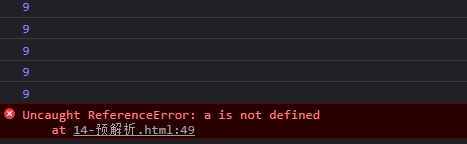

# 1. arguments的使用
当我们不确定有多少个参数传递的时候，可以用arguements来获取，在JavaScript中，arguments实际上它是当前函数的一个内置对象。所有函数都内置了一个arguments对象，arguments对象中存储了传递函数的所有实参

arguments展示形式是一个伪数组，因此可以进行遍历。伪数组不是真正意义上的数组，有以下特点：
- 具有length属性
- 按索引方式存储数据
- 不具有数组的push,pop等方法


# 2. 函数案例
函数可以调用另外一个函数

因为函数都是独立的代码块，用于完成特殊任务，因此经常会用到函数相互调用的情况
```javascript
function fn1() {
            console.log(11);
            fn2(); //在fn1()函数里面调用了fn2()函数
        }
        fn1();

        function fn2() {
            console.log(22);
        }
```
结果：11 22


# 3. 作用域
## 3.1. 作用域概述
通常来说，一段代码中所用到的名字不总是有效和可用的，而限定这个名字的可用性的代码范围就是这个名字的作用域。作用域的使用提高了程序逻辑的局部性，增强了程序的可靠性，减少了名字的冲突


## 3.2. 全局变量
在全局作用域下声明的变量叫做全局变量（在函数外部定义的变量）

全局变量在代码的任意位置都可以使用

在全局作用下var 声明的变量是全局变量

注意：在特殊情况下，在函数内不使用var声明的变量也是全局变量（不建议使用）


## 3.3. 局部变量
在局部作用域下声明的变量叫做局部变量（在函数内部定义的变量）

局部变量只能在该函数内部使用

在函数内部var声明的变量是局部变量

函数的形参实际上就是局部变量


## 3.4. 全局变量和局部变量的区别
全局变量：在任何一个地方都可以使用，只有在浏览器关闭时才会被销毁，因此比较占内存

局部变量：只在函数内部使用，当其所在的代码块被执行时，会被初始化；当代码运行结束后，就会被销毁，因此更节省内存空间


## 3.5. js没有块级作用域


## 4. 作用域链
只要是代码，就至少有一个作用域

写在函数内部的就是局部作用域

如果函数中还有函数，那么在这个作用域中就又可以诞生一个作用域

根据在内部函数可以访问外部函数变量的这种机制，用链式查找决定哪些数据能被内部函数访问，就称为**作用域链**


# 5. 预解析
JavaScript代码是由浏览器中的JavaScript解析器来执行的。

JavaScript解析器在运行JavaScript代码的时候分为两步：预解析和代码执行
```javascript
//  js引擎运行分为两步：预解析和代码执行
//         预解析：js引擎会把js里面所有的var还有function提升到当前作用域最前面
//         代码执行：按照代码的顺序从上往下执行
//         预解析分为变量预解析（变量提升）和函数预解析（函数提升）
//         变量提升就是把所用的变量声明提升到当前的作用域最前面 只提升变量声明不提升赋值操作
        fun();
        var fun=function(){
            console.log(22);
        }             //报错
        // 相当于执行了以下代码：
        var fun;
        fun();
        fun=funciton(){
            console.log(22);
        }

        console.log(num);   //undefined
        var num=10;
        // 相当于执行了一下代码
        var num;
        console.log(num);
        num=10;

        // 函数提升就是把所有的函数声明提升到当前作用域的最前面 不调用函数
        // 函数表达式调用必须写在函数表达式的下面
        fn();
        function fn(){
            console.log(11);
        }
        // 相当于一下代码：
        function fn(){
            console.log(11);
        }
        fn();
```
var a=b=c=9 相当于var a=9;b=9;c=9;
集体声明： var a=9;b=9;c=9;
两者不同


// 案例：
```javascript
        f1();
        console.log(c);
        console.log(b);
        console.log(a);
        function f1(){
            var a=b=c=9;
            console.log(a);
            console.log(b);
            console.log(c);
        }   // 9 9 9 9 9 报错
        // // 相当于以下代码：
        function f1(){
            var a;
            a=b=c=9;
            // var a=b=c=9;
            //相当于 var a=9;b=9;c=9;   b 和c直接赋值没有var声明 相当于全局变量
            // 集体声明： var a=9;b=9;c=9;
            // 两者不同

            console.log(a);
            console.log(b);
            console.log(c);
        }
        f1();
        console.log(c);
        console.log(b);
        console.log(a);
```

（图：预解析案例）



# 6.对象
## 6.1. 什么是对象
现实生活中，万物皆对象，对象是指一个具体的事物，看得见摸得着的实物，例如一本书，一辆车可以是对象，一个数据库一张网页一个与远程服务器的连接也可以是对象

在JavaScript中，对象是一组无序的相关属性和方法的集合，所有的事物都是对象，例如字符串、数值、数组、函数等

对象是由属性和方法组成的

属性：事物的特征，在对象中用属性来表示（常用名词）
方法：事物的行为，在对象中用方法来表示（常用动词）


## 6.2. 为什么需要对象
保存一个值时，可以使用变量，保存多个值（一组值）时，可以使用数组，如果要保存一个人的完整信息呢？

js中的对象表达结构更清晰更强大


# 7. 创建对象的三种方式
在JavaScript中，现阶段我们可以采用三种方式创建对象
- 利用字面量创建对象
- 利用new Object创建对象
- 利用构造函数创建对象


## 7.2. 利用字面量创建对象
对象字面量：就是花括号{}里面包含了表达这个事物（对象）的属性和方法
```javascript
  // 利用对象字面量来创建对象
        var obj={};  //创建了一个空的对象
        var obj={
            uname:'zhangsanfeng',
            age:18,
            sex:'男',
            sayHi:function(){
                console.log('hi');
            }
        }
        // 注意：
        // 里面的属性或者方法我们采取键值对的方法 键 属性名 : 值 属性值
        // 多个属性或者方法用逗号隔开
        // 方法冒号后面跟的是一个匿名函数

        // 使用对象
        // 调用对象的属性 我们采取对象名.属性名     .理解为“的”
        console.log(obj.uname);
        // 调用属性还有一种方法： 对象名['属性名']
        console.log(obj['age']);

        // 调用对象的方法  对象名.方法名()  千万别忘记添加小括号
        obj.sayHi();
```

## 7.3.  变量、属性、方法、函数总结
```javascript
  // 变量和属性的相同点 都是用来存储数据的
        var num=10;
        var obj={
            age:18,
            fn:function(){

            }
        }
        function fn(){

        }
        // 变量单独声明并赋值使用的时候直接写变量名
        // 属性 在对象里面的 不需要声明 使用到时候必须是 对象.属性

        // 函数和方法的相同点：都是实现某种功能 做某件事
        // 函数是单独声明并且调用的  函数名()      单独存在的
        // 方法在对象里面，调用的时候必须是 对象.方法()
```

## 7.4. 利用new Object创建对象
和之前学的 new Array()原理一致
```javascript
 var obj=new Object(); //创建了一个空的对象
        obj.uname='zhangsanfeng';
        obj.age=18;
        obj.sex='男';
        obj.sayHi=function(){
            console.log('hi');
        }

        // 注意：
        // 我们是利用等号赋值的方法添加对象的属性和方法
        // 每个属性和方法之间用分号结束
        console.log(obj.uname);
        console.log(obj['sex']);
        obj.sayHi();
```

## 7.5. 利用构造函数创建对象
构造函数：是一种特殊的函数，主要用来初始化对象，即为对象成员变量赋初始值，它总与new运算符一起使用。我们可以把对象中一些公共的方法和属性抽取出来，然后封装到这个函数里面
```javascript
 // 利用构造函数创建对象
        // 我们需要创建四大天王的对象 相同的属性：名字 年龄 性别 相同的方法：唱歌
        // // 构造函数的语法格式：
        // function 构造函数名(){
        //     this.属性=值;
        //     this.方法=funciton(){}
        // }
        // // 调用构造函数：
        // new 构造函数名();
        function Star(uname,age,sex) {
            this.name=uname;
            this.age=age;
            this.sex=sex;
            this.sing=function(sang){
                console.log(sang);
            }
        }
         var ldh=new Star('刘德华',18,'男');    //调用函数返回的是一个对象
         console.log(typeof ldh);
         console.log(ldh.name);
         console.log(ldh['sex']);
         ldh.sing('冰雨');

         var zxy=new Star('张学友',15,'男');
         console.log(zxy.name);
         console.log(zxy['age']);
         zxy.sing('吻别');

        // 构造函数的首字母大写
        // 构造函数不需要return就可以返回结果
        // 我们调用函数必须使用new
        // 我们只要new Star() 调用函数就创建一个对象
        // 我们的方法和属性前面必须添加this
```        

## 7.6. 构造函数和对象
构造函数，如Star()，抽象了对象的公共部分，封装到了函数里面，它泛指某一大类（class）

创建对象，如new Stars() ，特制某一个通过new关键字创建对象的过程我们也成为对象实例化


# 8. new关键字
new 关键字执行过程：
- new构造函数可以在内存中创建一个空的对象
- this就会指向刚才创建的空对象
- 执行构造函数里面的代码 给这个空对象添加属性和方法
- 返回这个对象


# 9. 遍历对象属性
for...in语句英语对数组或者对象的属性进行循环操作

语法格式：
```javascript
for (变量 in 对象){
    
}
```