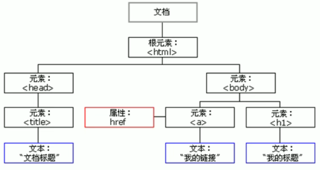
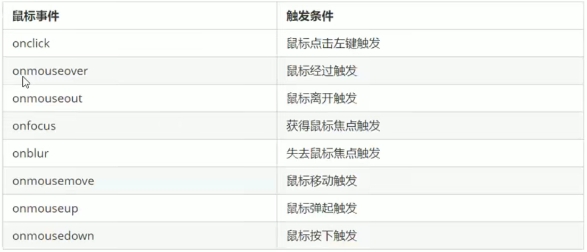

# 1. WebAPIs 和JS基础关联性
## 1.1. Js组成
JavaScript基础：JavaScript语法（ECMAScript）
WebAPIs：页面文档对象模型（DOM）、浏览器对象模型（BOM）


## 1.2. js基础阶段以及WebAPIs阶段
### js基础阶段：
我们学习的是ECMAScript标准规定的基本语法
要求同学们掌握js基本语法
只学习基本语法，做不了常用的网页交互效果
目的是为了js后面的课程打基础、做铺垫

### WebAPIs阶段：
WebAPIs是W3C组织的标准
WebAPIs我们主要学习的DOM和BOM
WebAPIs是我们js独有的部分
我们主要学习页面交互功能
需要使用js基础的课程内容做基础


# 2. API和WebAPI
## 2.1. API
API(Application Programming Interface,应用程序编程接口)是一些预先定义的函数，目的就是提供应用程序与发开人员基于某软件或硬件得以访问一组例程的能力，而又无需访问源码，或理解内部工作机制的细节

简单理解：API是给程序员提供的一种工具，以便能够更轻松的实现想要完成的基础


## 2.2. WebAPI
WebAPI 是浏览器提供的一套操作浏览器功能和页面元素的API（BOM和DOM）

现阶段我们主要针对于浏览器讲解常用的API，主要针对浏览器做交互效果

因为WebAPI很多，所以我们将这个阶段称为WebAPIs


## 2.3. API和WebAPI总结
API是为我们程序员提供的一个接口，帮助我们实现某种功能，我们学会使用就可以了，不必纠结内部如何实现

WebAPI是主要针对浏览器提供的接口，主要针对于浏览器做交互效果

WebAPI一般都有输入和输出（函数传参和返回值），WebAPI很多都是方法（函数）

学习WebAPI可以结合前面学习内置对象方法的思路学习


# 3. DOM简介
## 3.1. 什么是DOM
文档对象模型（Document Object Model,简称DOM），是W3C组织推荐的处理可扩展标记语言（HTML或者XML）的标准编程接口

W3C已经定义了一系列DOM接口，通过这些DOM接口可以改变网页的内容、结构和样式
  

## 3.2. DOM树
（图：DOM树）

- 文档：一个页面就是一个文档，DOM中使用document表示
- 元素：页面中所有标签都是元素，DOM中使用element表示
- 节点：网页中所有内容都是节点（标签、属性、文本、注释等），DOM中使用node表示
- DOM对以上内容都看做是对象


# 4. 获取元素
## 4.1. 如何获取网页元素
DOM在我们实际开发中主要用来操作元素

如何获取页面中的元素？通过一下方式：
- 根据ID获取
- 根据标签名获取
- 通过HTML5新增的方法获取
- 特殊元素获取


## 4.2. 根据ID获取
使用getElementById()方法获取带有ID的元素对象
```javascript
 <div id="time">2021-11-6</div>
    <script>
        // 因为我们文档页面从上往下加载，所以先得有标签，所以我们script写到标签的下面
        // 参数id是大小写敏感的字符串
        // 返回的是一个元素对象

        var timer=document.getElementById('time');
        console.log(timer);
        console.log(typeof timer);
        // console.dir 可以打印我们返回的元素对象，更好的查看里面的属性和方法
        console.dir(timer)
    </script>
```

## 4.3. 根据标签名获取
使用getElementByTagName()方法可以返回带有指定标签名的对象的集合
```javascript
document.getElementsByTagName('标签名);
```
注意：
因为得到的是一个对象的集合，所以我们想要操作里面的元素需要遍历
得到的元素对象是动态的

还可以获取某个元素（父元素）内部的所有指定标签名的子元素
```javascript
element.getElementsByTagName('标签名');
```
注意：父元素必须是单个对象（必须指明是哪一个元素对象）。获取的时候不包括父元素自己
```html
<ol id='ol'>
        <li>这是ol中li里面的内容</li>
        <li>这是ol中li里面的内容</li>
        <li>这是ol中li里面的内容</li>
        <li>这是ol中li里面的内容</li>
        <li>这是ol中li里面的内容</li>

    </ol>
     <script>
        var ol=document.getElementById('ol');
        console.log(ol.getElementsByTagName('li'));
    </script>
```

## 4.4. 通过HTML5新增的方法获取
```html
document.getElementByClassName('类名');      //根据类名返回元素对象集合
 <div class="box">box</div>
    <div class="box">box</div>
    <div id='nav'>
        <ul>
            <li>首页</li>
            <li>产品</li>
        </ul>
    </div>
    <script>
        var boxes=document.getElementsByClassName('box');
        console.log(boxes);
    </script>

document.querySelector('选择器');    //根据指定选择器返回第一个元素对象
<div class="box">box1</div>
    <div class="box">box2</div>
    <div id='nav'>
        <ul>
            <li>首页</li>
            <li>产品</li>
        </ul>
    </div>
    <script>
        var boxes = document.getElementsByClassName('box');
        console.log(boxes);

        // document.querySelector('选择器');    //根据指定选择器返回第一个元素对象  切记里面的选择器需要加符号 .box #nav 

        var firstBox = document.querySelector('.box');
        console.log(firstBox);
        var nav=document.querySelector('#nav');
        console.log(nav);
        var li=document.querySelector('li');
        console.log(li);
    </script>

document.querySelectorAll('选择器');       //根据指定选择器返回所有元素对象
```


# 5. 获取特殊元素（body、HTML）
```html
<script>
        // 获取body元素
        var bodyEle=document.body;
        console.log(bodyEle);
        console.dir(bodyEle);

        // 获取HTML元素
        var htmlEle=document.documentElement;
        console.log(htmlEle);
    </script>
```


# 6. 事件基础
## 6.1. 事件概述
JavaScript使我们有能力创建动态页面，而事件是可以被JavaScript侦测到的行为

简单理解：触发---响应机制

网页中的每个元素都可以产生某些可以触发JavaScript的事件
```html
 <button id='btn'>button</button>
    <script>
        // 点击一个按钮弹出对话框
        // 事件是由三部分组成：事件源 事件类型 事件处理程序  我们也称事件三要素
        // (1)事件源   事件被触发的对象   谁  按钮
        var btn=document.getElementById('btn');
        // (2)事件类型 如何触发 什么事件 比如鼠标点击（onclick)  还是鼠标经过 还是键盘按下
        // (3)事件处理程序   通过一个函数赋值的方式 完成
        btn.onclick=function(){
            alert('弹出对话框');
        }
    </script>
```

## 6.3. 执行事件的步骤
- 获取事件源
- 注册事件（绑定事件）
- 添加事件处理程序（采取函数赋值形式）
```html
 <div>123</div>
    <script>
        // (1)获取事件源
        var div=document.querySelector('div');
        // (2)绑定事件
        div.onclick
        // (3)添加事件处理程序
        div.onclick=function(){
            console.log('我被选中了');
        }
    </script>
```

## 6.4. 常见的鼠标事件
（图：常见的鼠标事件）



# 7. 操作元素
JavaScript的DOM操作可以改变网页内容、结构和样式，我们可以利用DOM操作元素来改变元素里面的内容、属性等。注意以下都是属性
## 7.1.  改变元素内容
### element.innerText

从起始位置到终止位置的内容，但它去除HTML标签，同时空格和换行也会去掉
```html
<button>显示当前系统时间</button>
    <div>某个时间</div>
    <p>123</p>
    <script>
        // 当我们点击了按钮 div里面的文字会发生变化
        // (1)获取元素
        var btn = document.querySelector('button');
        var div = document.querySelector('div');
        // (2)注册事件
        btn.onclick = function () {
            div.innerText = getDate();
        }

        function getDate() {
            var date = new Date();
            var year = date.getFullYear();
            var month = date.getMonth() + 1;
            var dates = date.getDate();
            var arr = ['星期日', '星期一', '星期二', '星期三', '星期四', '星期五', '星期六'];
            var day = date.getDay();
            return '今天是' + year + '年' + month + '月' + dates + '日' + arr[day];
        }


        // 我们元素可以不用添加事件
        var p=document.querySelector('p');
        p.innerText=getDate();
    </script>
```
### element.innerHTML
起始位置到终止位置的全部内容，包括HTML标签，同时保留空格和换行
```html
   <p>我是文字
        <span>123</span>
    </p>
    <script>
        // innerText不识别HTML标签  非标准   去除空格和换行
        var div =document.querySelector('div');
        div.innerText='<strong>今天是：</strong>2021';

        // innerHTML  识别HTML标签  W3C标准
        div.innerHTML='<strong>今天是：</strong>2021';
        // 这两个属性是可读写的 可以获取元素里面的内容 保留空格和换行
        var p=document.querySelector('p');
        console.log(p.innerText);
        console.log(p.innerHTML);
    </script>
```

## 7.2. 常用元素的属性操作
```html
 <button id="ldh">刘德华</button>
    <button id="zxy">张学友</button>
    
    <script>
        // 修改元素属性 src
        // 获取元素
        var ldh=document.getElementById('ldh');
        var zxy=document.getElementById('zxy');
        var img=document.querySelector('img');

        // 注册事件
        zxy.onclick=function(){
            img.src='images/zxy.jpg';
            img.title='张学友';
        }
        ldh.onclick=function(){
            img.src='images/ldh.jpg';
            img.title='刘德华';
        }

    </script>
```

## 7.3. 表单元素的属性操作
利用DOM可以操作如下表单元素的属性：
**type value checked selected disabled**
```html
 <button>按钮</button>
    <input type="text" value="输入内容">
    <script>
        // (1)获取元素
        var btn = document.querySelector('button');
        var input = document.querySelector('input');
        // (2)注册事件 处理程序
        btn.onclick = function () {
            // input.innerHTML='点击了';     这个是 普通盒子比如div标签里面的内容
            // 表单里面的值 文字内容是通过value来修改的
            input.value = '被点击了';
            // 如果想要某个表单被禁用，不能再被点击  disabled    我们想要这个按钮button禁用
            // btn.disabled=true;
            this.disabled = true;        //this 指向的是事件函数的调用者 btn
        }
    </script>
```

## 7.4. 样式属性操作
我们可以通过js修改元素的大小、颜色、位置等样式

### element.style   行内样式操作
```javascript
  <style>
        div {
            width: 200px;
            height: 200px;
            background-color: pink;
        }
    </style>
</head>

<body>
    <div></div>
    <script>
        //(1)获取元素
        var div=document.querySelector('div');
        // (2)注册事件 处理程序
        div.onclick=function(){
            // div.style 里面的属性采取驼峰命名法
            this.style.backgroundColor='yellow';
            this.style.width='540px';
        }
    </script>
</body>
```
注意：
js里面的**样式采取驼峰命名法** 比如：fontsize backgroundColor
js修改style样式操作，产生的是**行内样式**，css权重比较高

### element.className   类名样式操作
```html
  <style>
        div {
            width: 200px;
            height: 200px;
            background-color: yellow;
        }

        .change {
            background-color: purple;
            color: #fff;
            font-size: 25px;
            margin-top: 100px;


        }
    </style>
</head>

<body>
    <div>文本</div>
    <script>
        var test = document.querySelector('div');
        text.onclick = function () {
            // this.style.backgroundColor='yellow';
            // this.style.color='#fff';
            // 让我们当前元素的类名改为了change

            // 我们可以通过修改元素的className更改元素的样式，适合于样式较多或者功能复杂的情况
            this.className = 'change';
        }
    </script>
</body>
```
注意：
- 如果样式修改较多，可以采取操作类名方式更改元素样式
- class因为是个保留字，因此使用className来操作元素类名属性
- className会直接更改元素的类名，会覆盖原先的类名
- 如果想要保留原先的类名，我们可以这么做 多类名选择器 
- this.className='first change';


