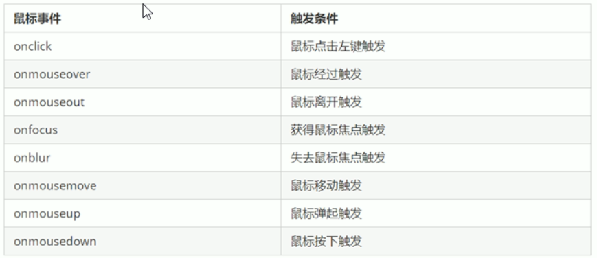
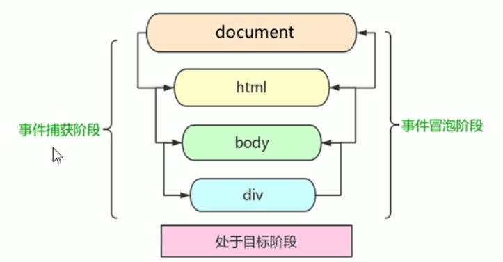
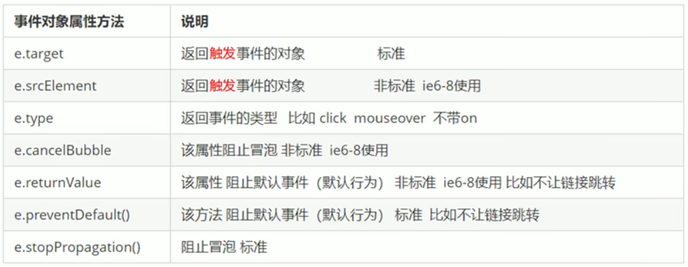
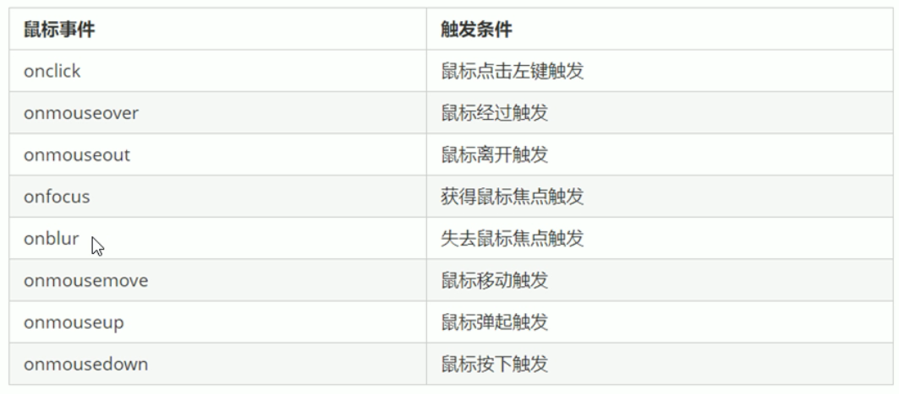
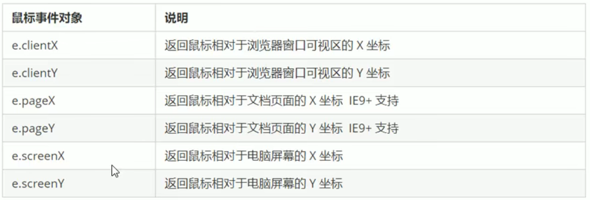

(接notes26)
# 8. 节点操作
## 8.5. 删除节点
```javascript
node.removeChild(child)
```
node.removeChild()  方法从DOM中删除 一个子节点，返回删除的节点
```html
    <button>删除</button>
    <ul>
        <li>熊大</li>
        <li>熊二</li>
        <li>光头强</li>
    </ul>
    <script>
        // (1)获取元素
        var ul = document.querySelector('ul');
        var btn = document.querySelector('button');
        // (2)删除元素 node.removeChild(child)
        // ul.removeChild(ul.children[0]);
        // (3) 点击按钮以此删除里面的孩子
        btn.onclick = function () {
            if (ul.children.length == 0) {
                this.disabled = true;
            } else {
                ul.removeChild(ul.children[0]);
            }
        }
    </script>
```
阻止链接跳转需要添加javascript(0);或者javascript:;

## 8.6. 复制节点（克隆节点）
```javascript
node.cloneNode()
```
node.cloneNode()方法返回调用该方法的节点的一个副本。也称为克隆节点/拷贝节点

注意：
如果括号参数为空或者为false，则是浅拷贝，即只克隆复制节点本身，不克隆里面的内容
```html
    <ul>
        <li>1</li>
        <li>2</li>
        <li>3</li>
    </ul>
    <script>
        var ul = document.querySelector('ul');

        // 克隆节点 node.cloneNode();  如果括号参数为空或者为false，则是浅拷贝，即只克隆复制节点本身，不克隆里面的内容 如果括号参数为true则是深拷贝，复制标签并且复制里面的内容
        var lili = ul.children[0].cloneNode(true);
        ul.appendChild(lili);
    </script>
```

## 8.7. 三种动态创建元素的区别
- document.write()
- element.innerHTML
- document.createElement()

区别：
(1)document.write 是直接将内容写入页面的内容流，但是文档流执行完毕，则它会导致页面全部重绘

(2)innerHTML是将内容写入某个DOM节点，不会导致页面全部重绘

(3)innerHTML创建多个元素效率更高（不要拼接字符串，采取数组形式拼接），结构稍微复杂

(4)createElement()创建多个元素效率会稍微低一点点，但是结构更清晰

总结：不同浏览器下，innerHTML（采取数组形式）效率要比creatElement高


# 9. DOM重点核心
文档对象模型（Document Object Model,简称DOM），是W3C组织推荐的处理可扩展标记语言（HTML或者XML）的标准编程接口

W3C已经定义了一系列的DOM接口，通过这些接口可以改变网页的内容，结构和样式

(1)对于JavaScript，为了能够使JavaScript操作HTML，JavaScript就有了一套自己的DOM编程接口

(2)对于HTML，DOM使得HTML形成一颗DOM树，包含文档、元素、节点
我们获取过来的DOM元素是一个对象（object），所以称为文档对象模型

对于DOM操作，我们主要针对于元素的操作，主要有创建、增删改查、属性操作、事件操作

## 9.1. 创建
(1)document.write
(2)innerHTML
(3)createElement


## 9.2. 增
(1)appendChild
(2)insertBefore


## 9.3. 删除
(1)removeChild


## 9.4. 改
主要修改DOM的元素属性，DOM元素的内容、属性、表单的值等
(1)修改元素属性：src href title等
(2)修改普通元素内容： innerHTML innerText
(3)修改表单元素： value type disabled
(4)修改元素样式： style className


## 9.5. 查
主要获取查询DOM的元素
(1)DOM提供的API方法：getElementById getElementByTagName 古老用法 不太推荐

(2)H5提供的新方法：querySelector querySelectorAll 提倡

(3)利用节点操作获取元素：父(parentNode)  子(children)  兄(previousElementSibling nextElementSlbling)提倡


## 9.6. 属性操作
主要针对自定义属性
(1)setAttribute:设置DOM的属性值
(2)getAttribute:得到DOM的属性值
(3)removeAttribute移除属性


## 9.7. 事件操作
给元素注册事件，采取    事件源.事件类型=事件处理程序

（图：事件操作）



# 事件高级


# 1. 注册事件（绑定事件）
## 1.1. 注册事件概述
给元素添加事件，称为注册事件或者绑定事件
注册事件有两种方式：传统方式和监听注册方式

### 传统注册方式：
利用on开头的事件 onclick 

特点：
注册事件的唯一性
同一个元素同一个事件只能设置一个处理函数，最后注册的处理函数将会覆盖前面注册的处理函数

### 方法监听注册方式
W3C标准 推荐方式

addEventListener()它是一个方法

IE9之前的IE不支持此方法，可使用attachEvent()代替

特点：同一个元素，同一个事件可以注册多个监听器
按注册顺序依次执行


## 1.2. addEventListener事件监听方式
```javascript
eventTarget.addEventListener(type,listener[,useCapture])
```
eventTarget.addEventListener()方法将指定的监听器注册到eventTarget(目标对象)上，当该对象触发指定的事件时，就会执行事件处理函数

该方法接收三个参数：
- type：事件类型字符串，比如click mouseover 注意这里不要带on
- listener：事件处理函数，当事件发生时，就会调用该监听函数
- useCapture：可选参数，是一个布尔值，默认是FALSE，学完DOM事件流之后再进一步学习
```html
    <button>传统注册事件</button>
    <button>方法监听注册事件</button>
    <script>
        // 传统方式注册事件
        var btns = document.querySelectorAll('button');
        btns[0].onclick = function () {
            alert('hi');
        }
        btns[0].onclick = function () {
            alert('How are you');
        }

        // 事件监听注册事件  addEventListener 里面的事件类型是字符串，必定加引号，而且不带on
        // 同一个元素，同一个事件可以添加多个监听器（事件处理程序）
        btns[1].addEventListener('click', function () {
            alert(22);
        })
        btns[1].addEventListener('click', function () {
            alert('海绵宝宝');
        })
    </script>
```

## 1.3. 注册事件兼容性解决方案
```javascript
function addEventListener(element,eventName,fn){
    //判断当前浏览器是否支持addEventListener 方法
    if (element.addEventListener){
        element.addEventListener(eventName,fn);   //第三个参数默认是FALSE
    }else if (element.attachEvent){
        element.attachEvent('on'+eventName,fn);
    }else{
        //相当于element.onclick=fn;
        element['on'+eventName]=fn;
    }
}
```
兼容性处理的原则：首先照顾大多数浏览器，再处理特殊浏览器


# 2. 删除事件
## 2.1. 删除事件的方式
### (1)传统注册方式
```javascript
eventtarget.onclick=null;
```
### (2)方法监听注册方式
```javascript
eventTarget.removeEventListener(type,listener[,useCapture]);
```
### (3)attachEvent
```javascript
divs[2].attachEvent('onclick',fn1);
        function fn1(){
            alert(33);
        }
```
## 2.2. 删除事件兼容性解决方案
```javascript
function removeEventListener(element,eventName,fn){
    //判断当前浏览器是否支持 removeEventListener方法
    if (element.removeEventListener){
        element.removeEventListener(eventName,fn);   //第三个参数默认是FALSE
    }else if(element.detachEvent){
        element.detachEvent('on'+eventName,fn);
    }else{
        element['on'+eventName]=null;
    }
}
```


# 3. DOM事件流
事件流描述的是从页面中接收事件的顺序

事件发生时会在元素节点之间按照特定的顺序传播，这个传播过程即DOM事件流

比如我们给一个div注册了点击事件

DOM事件流分为3个阶段：
- 捕获阶段
- 当前目标阶段
- 冒泡阶段

**事件冒泡**：IE最早提出，事件开始时由最具体的元素接收，然后逐级向上传播到DOM最顶层节点的过程

**事件捕获**：网景最早提出，由DOM最顶层节点开始，然后逐级向下传播到最具体的元素的接受过程

我们向水里扔一块石头，首先它会有一个下降的过程，这个过程就可以理解为从最顶端向事件发生的最具体元素（目标点）的捕获过程；之后会产生泡泡，会在最低点（最具体元素）之后漂浮到水面上，这个过程相当于事件冒泡

（图：DOM事件流）


注意：js代码中只能执行捕获或者冒泡的其中一个阶段

onclick和attachEvent只能得到冒泡阶段

addEventListener(type,listener[,useCapture])第三个参数如果是true，表示在事件捕获阶段调用事件处理程序；如果是FALSE（不写默认是FALSE）表示在事件冒泡阶段调用事件处理程序

实际开发中我们很少使用事件捕获，我们更关注事件冒泡

有些事件是没办法冒泡的，比如 onblur onfocus onmouseover onmouseleave

事件冒泡有时候会带来麻烦，有时候又会帮助很巧妙的做某些事件   
```html
 <style>
        .father {
            overflow: hidden;
            width: 300px;
            height: 300px;
            margin: 100px auto;
            background-color: pink;
            text-align: center;
        }
        
        .son {
            width: 200px;
            height: 200px;
            margin: 50px;
            background-color: purple;
            line-height: 200px;
            color: #fff;
        }
    </style>
</head>
<body>
    <div class="father">
        <div class="son">son盒子</div>
    </div>
    <script>
        // DOM事件流 三个阶段
        // js代码中只能执行捕获或者冒泡其中的一个阶段
        // onclick和attachEvent(ie)只能得到冒泡阶段
        // 捕获阶段 如果addEventListor 第三个参数是true那么则处于捕获阶段
        // document-->html-->body-->father-->son
        // var son=document.querySelector('.son');
        // son.addEventListener('click',function(){
        //     alert('son');
        // },true);
        // var father=document.querySelector('.father');
        // father.addEventListener('click',function(){
        //     alert('father');
        // },true);


        // 冒泡阶段 如果addEventListener 第三个参数是FALSE或者省略 那么则处于冒泡阶段 
        // son-->father-->body-->html-->document
        var son=document.querySelector('.son');
        son.addEventListener('click',function(){
            alert('son');
        },false);
        var father=document.querySelector('.father');
        father.addEventListener('click',function(){
            alert('father');
        },false);
        document.addEventListener('click',function(){
            alert('document');
        })

    </script>
```


# 4. 事件对象
## 4.1. 什么是事件对象
官方解释：event对象代表事件的状态，比如键盘按键的状态、鼠标的位置、鼠标按钮的状态

简单理解：事件发生后，跟事件相关的一系列信息数据的集合都放在这个对象里面，这个对象就是事件对象event，它有很多属性和方法

比如：
谁绑定了这个事件
鼠标触发事件的话，会得到鼠标的相关信息，比如鼠标位置
键盘触发事件的话，会得到键盘的相关信息，如按了哪个键


## 4.2. 事件对象的使用方法
event是一个形参，系统帮我们设定为事件对象，不需要传递实参过去

当我们注册事件时，event对象就会被系统自动创建，并依次传递给事件监听器（事件处理函数）
```javascript
eventTarget.onclick=function(event){}
eventTarget.addEventListener('click',function(event){})
//这个event就是事件对象，我们还喜欢写成e 或者evt
```

## 4.3. 事件对象的兼容性问题
事件对象本身的获取存在兼容问题：
标准浏览器中是浏览器给方法传递的参数，只需要定义形参e就可以获取到

在IE678中，浏览器不会给方法传递参数，如果需要的话，需要到window.event中获取查找

解决：
```javascript
e=e || window.event; 
```

## 4.4. 事件对象的常见属性和方法
（图：事件对象的常见属性和方法）



# 5. 阻止事件冒泡
## 5.1. 阻止事件冒泡的两种方式
事件冒泡：IE最早提出，事件开始时由最具体的元素接收，然后逐级向上传播到DOM最顶层节点

事件冒泡的本身的特性，会带来坏处，也会带来好处，需要我们灵活掌握

### 阻止事件冒泡
#### 标准写法：利用事件对象里面的stopPropagation()方法
```javascript
e.stopPropagation()
```
#### 非标准写法：IE678利用事件对象cancelBubble属性
```javascript
    <div class="father">
        <div class="son">son儿子</div>
    </div>

    <script>
        // 阻止冒泡 DOM推荐的标准 stopPropagation();
        var son = document.querySelector('.son');
        son.addEventListener('click', function (e) {
            alert('son');
            e.stopPropagation();
            e.cancelBubble=true;

        }, false);

        var father=document.querySelector('.father');
        father.addEventListener('click',function(){
            alert('father');
        },false);
        document.addEventListener('click',function(){
            alert('document');
        })
    </script>
```


# 6. 事件委托（代理、委派）
事件冒泡本身的特性，会带来坏处，也会带来好处，需要我们灵活掌握，程序中有如下场景：
```html
    <ul>
        <li>知否知否，应有弹框在手</li>
        <li>知否知否，应有弹框在手</li>
        <li>知否知否，应有弹框在手</li>
        <li>知否知否，应有弹框在手</li>
        <li>知否知否，应有弹框在手</li>
        <li>知否知否，应有弹框在手</li>
        <li>知否知否，应有弹框在手</li>
    </ul>
```
点击每个li都会弹出对话框，以前需要给每个li注册事件，是非常辛苦的，而且访问的DOM的次数越多，这就会延长整个页面的交互就绪时间

## 事件委托
事件委托也称为事件代理，在jQuery里面称为事件委派

事件委托的原理
不是给每个子节点单独设置事件监听器，而是事件监听器设置在其父节点上，然后利用冒泡原理影响设置每个子节点

以上案例：给ul注册点击事件，然后利用事件对象的target来找到当前点击的li，因为点击li，事件会冒泡到ul上，ul有注册事件，就会触发事件监听器

## 事件委托的作用：
我们只操作了一次DOM，提高了程序的性能
```javascript
    <script>  
        // 事件委托的核心原理：给父节点添加侦听器，利用事件冒泡影响每一个子节点
        var ul = document.querySelector('ul');
        ul.addEventListener('click', function (e) {
            // alert('知否知否，应有弹框在手');
            // e.target 这个可以得到我们点击的对象
            e.target.style.backgroundColor = 'pink';
        })
    </script>
```

# 7. 常用的鼠标事件
（图：常用的鼠标事件）


### 禁止鼠标右键菜单
contextmenu主要控制应该何时显示上下文菜单，主要用于程序员取消默认的上下文菜单
```javascript
document.addEventListener('contextmenu',function(e){
    e.preventDefault();
})
```
### 禁止鼠标选中（selectatart 开始选中）
```javascript
document.addEventListener('selectstart',function(e){
    e.preventDefault();
})
```

## 7.2 鼠标事件对象
(图：鼠标事件对象)


event对象代表事件的状态，跟事件相关的一系列信息的集合。现阶段我们主要是用鼠标事件对象MouseEvent和键盘事件对象
KeyboradEvent
```html
 <!-- 鼠标事件对象 MouseEvent -->
    <script>
        document.addEventListener('click', function (e) {
            // client 鼠标在可视区的x和y坐标
            console.log(e.clientX);
            console.log(e.clientY);
            console.log('-----------------------------------------------');

             // page 鼠标在页面文档的x和y坐标
             console.log(e.pageX);
            console.log(e.pageY);
        })
    </script>
```  