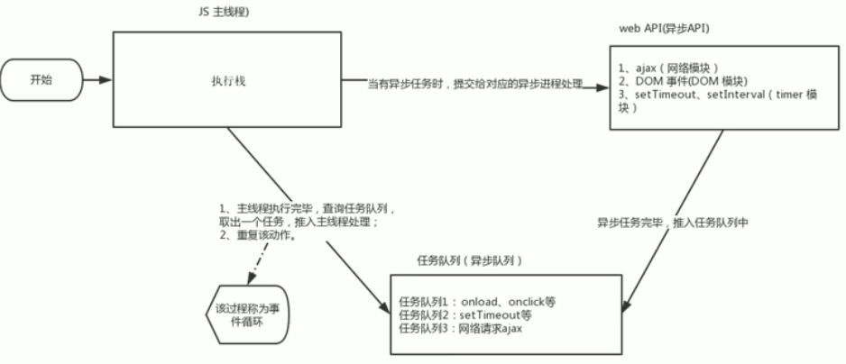

# 1. 常用键盘事件

## 1.1. 常用键盘事件
事件除了用鼠标触发，还可以使用键盘触发
（常用键盘事件）


注意：
如果使用addEventListener不需要加on
onkeypress和前面两个的区别是，他不识别功能键，比如左右箭头，shift等
三个事件的执行顺序是：keydown --> keypress --> keyup
```html
    <script>
        // 常用的键盘事件
        // keyup 按键弹起时触发
        // document.onkeyup=function(){
        //     console.log('我弹起了');
        // }
        // document.addEventListener('keyup',function(){
        //     console.log('我弹起了');
        // })

        // keydown 按键按下的时候触发
        document.addEventListener('keydown',function(){
            console.log('我按下了');
        })

        // keypress 按键按下的时候触发  不能识别功能键
        document.addEventListener('keypress',function(){
            console.log('我按下了keypress');
        })

        // 三个事件的执行顺序：keydown--> keypress-->keyup
    </script>
```

## 1.2. 键盘事件对象
keyCode   返回该键的ASCII值
注意：
- onkeydown 和onkeyup不区分字母大小写，onkeypress区分字母大小写
- 在我们实际开发中，我们更多的使用keydown 和keyup ，它能识别所有的键（包括功能键）
- keypress不识别功能键，但是keyCode属性能区分大小写，返回不同的ASCII值
- keydown 和keypress 在文本框里面的特点：他们两个事件触发的时候，文字还没有落入文本框中
- keyup事件触发的时候，文字已经落入文本框里了


# 2. BOM概述
## 2.1. 什么是BOM
BOM（Browser Object MOdel）即浏览器对象模型，它提供了独立于内容而与浏览器窗口进行交互的对象，其核心对象是window
BOM由一系列的对象构成，每个对象都提供了很多方法和属性

BOM缺乏标准，JavaScript语法标准组织是ECMA，DOM的标准化组织是W3C，BOM最初是Netscape浏览器标准的一部分

**DOM**：
文档对象模型
DOM就是把文档当做一个对象来看待
DOM的顶级对象是document
DOM主要学习的是操作页面元素
DOM是W3C标准规范

**BOM**：
浏览器对象模型
把浏览器当做一个对象来看待
BOM的顶级对象是window
BOM学习的是浏览器窗口交互的一些对象
BOM是浏览器厂商在各自浏览器上定义的，兼容性较差


## 2.2. BOM的构成 
BOM比DOM更大，它包含DOM
（图：BOM的构成）


window 对象是浏览器的顶级对象，它具有双重角色
它是js访问浏览器窗口的一个接口

它是一个全局对象，定义在全局作用域中的变量、函数都会变成window对象的属性和方法

在调用时可以省略window，前面学习的对话框都属于window对象方法，如alert() prompt()等

注意：window下的一个特殊属性window.name


# 3. window对象的常见事件
## 3.1. 窗口加载事件
window.onload=function(){}
或者
window.addEventListener('load',function(){});

window.onload是窗口（页面）加载事件，当文档内容完全加载完成会触发该事件（包括图像、脚本文件、css文件等），就调用的处理函数

注意：
- 有了window.onload就可以把js代码写到页面元素的上方，因为onload是等页面内容完全加载完毕，再去执行处理函数
- window.onload传统注册事件方式只能写一次，如果有多个，会以最后一个window.onload为准
- 如果使用addEventListener则没有限制

```html    
    <script>
        window.onload = function () {
            var btn = document.querySelector('button');
            btn.addEventListener('click', function () {
                alert('点我');
            })
        }
    </script>
    <button>点击</button>
```
document.addEventListener('DOMContentLoaded',function(){})
DOMContentLoaded事件触发时，仅当DOM加载完毕，不包括样式表，图片，flash等等

IE9以上才支持

如果页面的图片很多的话，从用户访问到onload触发可能需要较长的时间，交互效果就不能实现，必然影响用户的体验，此时用DOMContentLoaded时间2比较合适


## 3.2. 调整窗口大小事件
window.onresize=function(){}
window.addEventListener('resize',function(){});

window.onresize是调整窗口大小加载事件，当触发时就调用的处理函数

注意：
- 只要窗口大小发生像素变化，就会触发这个事件
- 我们经常利用这个事件完成响应式布局。window.innerWidth当前屏幕的宽度


# 4. 定时器
##  4.1. 两种定时器
window对象给我们提供了2个非常好用的方法：定时器
- setTimeout()
- setInterval()


## 4.2. setTimeout()定时器
window.setTimeout(调用函数,[延迟的毫秒数])；

setTimeout()方法用于设置一个定时器，该定时器在定时器到期后执行调用函数

setTimeout()这个调用函数我们也称为回调函数callback
普通函数是按照代码顺序直接调用，这个函数需要等待时间，时间到了才去调用这个函数，因此被称为回调函数

简单理解：回调，就是回头调用的意思，上一件事干完，再回头调用这个函数

我们以前的element.onclick=function(){}  或者 element.addEventListener('click',fn);里面的函数也是回调函数
```html
    <script>
        // setTimeout
        // 语法规范：window.setTimeout(调用函数,延迟时间);   这个window在调用的时候可以省略
        // 这个延时时间默认是毫秒 可以省略 如果省略默认是0
        // 这个调用函数可以直接写函数 还可以写函数名
        // 页面中可能有很多定时器，我们经常给定时器加标识符（名字）
        // setTimeout(function(){
        //     console.log('时间到了');
        // },2000);

        function callback(){
            console.log('爆炸了');
        }
        var timer1=setTimeout(callback,3000);
        var timer2=setTimeout(callback,5000);
    </script>
```

## 4.3. 停止setTimeout()定时器
window.clearTimeout(timeout ID)

clearTimeout()方法取消了之前通过调用setTimeout()建立的定时器

注意：window可以省略
里面的参数就是定时器的标识符


## 4.4. setInterval()定时器
window.setInterval(回调函数,[间隔的毫秒数]);

setInterval()方法重复调用一个函数，每隔这个时间，就去调用一次回调函数

注意：
- window可以省略
- 这个调用函数可以直接写函数，或者写函数名或者采取字符串'函数名()'三种方式
- 间隔的时间毫秒数默认是0，如果写，必须是毫秒，表示每隔多少毫秒就自动调用这个函数
- 因为定时器可能有很多，所以我们经常给定时器赋值一个标识符
```html
 <script>
        setInterval(function(){
            console.log('boom!!!');
        },1000);
    </script>
```

## 4.5. this
this的指向在函数定义的时候是确定不了的，只有函数执行的时候才能确定this到底指向谁，一般情况下this的最终指向的是那个调用他的对象
```html
    <button>click</button>
    <script>
        // this 指向问题 一般情况下this的最终指向的是那个调用它的对象

        // 1. 全局作用域或者普通函数中的this指向全局对象window（ 注意定时器里面的this指向window）
        console.log(this);

        function fn() {
            console.log(this);
        }
        fn();

        setTimeout(function () {
            console.log(this);
        })

        // 2.方法调用中谁调用this指向谁
        var o={
            sayHi:function(){
                console.log(this);    //this指向的是o这个对象
            }
        }
        o.sayHi();

        var btn=document.querySelector('button');
        // btn.onclick=function(){
        //     console.log(this);     //this 指向的是btn这个按钮对象
        // }
        btn.addEventListener('click',function(){
            console.log(this);
        })

        // 3.构造函数中this指向构造函数的实例
        function Fun(){
            console.log(this);    //this指向的是fun 实例对象
        }
        var fun=new Fun();
    </script>
```


# 5. js执行队列
## 5.1. js是单线程
JavaScript语言的一大特点就是单线程，也就是说，同一个时间只能做一件事。这是因为JavaScript这门脚本语言诞生的使命所致--JavaScript是为处理页面中的用户的交互，以及操作DOM诞生的，比如我们对某个DOM元素进行添加和删除操作，不能同时进行，应该先添加，之后再删除

单线程就意味着，所有任务需要排队，前一个任务结束，才会执行后一个任务。这样所导致的问题是：如果js执行的时间过长，这样就会造成页面的渲染不连贯，导致页面渲染加载阻塞的感觉

## 5.2. 同步和异步
为了解决这个问题，利用多核CPU的计算能力，HTML5提出web worker标准，允许JavaScript脚本创建多个进程。于是，js出现了同步和异步

**同步**：
前一个任务执行结束后再执行后一个任务，程序的执行顺序与任务的排列顺序是一致的，同步的。

**异步**：
你在做一件事情时，因为这件事情会花费很长时间，在做这件事情的同时，你还可以去处理其他的事情。

同步和异步的本质区别：这条流水线上各个流程的执行顺序不同

**同步任务**：
同步任务都在主线程上执行，形成一个执行栈

**异步任务**：
js的异步是通过回调函数实现的
一般而言，异步任务有以下三种类型：
- 普通事件，如click、resize等
- 资源加载，如load、error等
- 定时器，包括setInterval、setTimeout等

异步任务相关回调函数添加到任务队列中（任务队列也称为消息队列）。


## 5.3. js执行机制
(1)先执行执行栈中的同步任务

(2)遇到 v异步任务（回调函数）放入任务队列中

(3)一旦执行栈中的所有同步任务执行完毕，系统就会按次序读取任务队列中的异步任务，于是被读取的异步恩物结束等待状态，进入执行栈，开始执行。


由于主线程不断地重复获得任务、执行任务、再获取任务、再执行，所以这种机制被称为事件循环（event loop）

（图：事件循环）



# 6. location对象
## 6.1. 什么是location对象
window对象给我们提供了一个location属性用于获取或设置窗体的URL，并且可以用于解析URL。因为这个属性返回的是一个对象，所以我们将这个属性也称为location对象


## 6.2. URL 
同一资源定位符(Uniform Resource Locator,URL)是互联网上标准资源的地址，互联网上每个文件都有一个唯一的URL，它包含的信息指出文件的位置以及浏览器应该怎么处理它

URL的一般语法格式为：
```javascript
protocol://host[:port]/path/[?query]#fragment
http://www.itcast.cn/index.html?name=andy&age=18#link
```

(图：URL格式组成)


## 6.3. location对象的属性
（图：location对象属性）


## 6.4. location对象的方法
（location对象方法）


# 7. navigator对象
navigator对象包含有关浏览器的信息，他有很多属性，我们最常用的是userAgent，该属性可以返回由客户机发送服务器的user-agent头部的值

下面前端代码可以判断用户哪个终端打开页面，实现跳转


# 8. history对象
window对象给我们提供了一个history对象，与浏览器历史记录进行交互，该对象包含用户（在浏览器窗口中）访问过的URL

（图：history对象）


history对象一般在实际开发中比较少用，但是会在一些OA办公系统中见到


