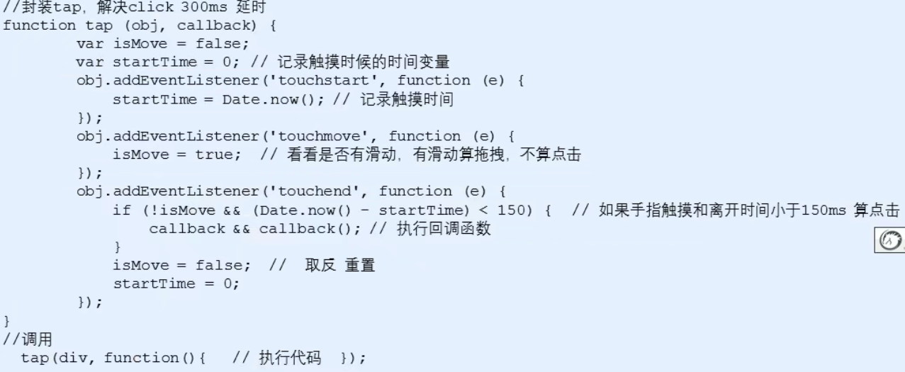

（接notes30）
# 2. 移动端常见特效
## 案例：移动端轮播图
- 移动端轮播图功能和PC端一致：
- 可以自动播放图片
- 手指可以拖动播放轮播图

### 自动播放功能：
开启定时器
移动端移动，可以使用translate移动

### 自动播放功能-无缝滚动
注意：我们判断条件是要等到图片滚动完毕后再去判断，就是过渡完成后判断
此时需要添加过渡完成事件transitionend
判断 条件：如果索引号等于3说明走到最后一张图片，此时索引号要复原为0
此时，去掉过渡效果，然后移动
如果索引号小于0，说明是倒着走，索引号等于2

小圆点跟随变化效果：把ol里面li带有current类名的选出来去掉类名remove
让当前索引号的li添加current add
但是，是等到过渡结束之后变化，所以这个要写到transitionend

### 手指滑动轮播图：
- 本质就是ul跟随手指移动，简单说就是移动端拖动元素
- 触摸元素touchstart：获取手指初始坐标
- 移动手指touchmove：计算手指的滑动距离，并且移动盒子
- 离开手指touchend:根据滑动的距离分不同的情况
- 如果移动距离小于某个像素，就回弹原来的位置
- 如果移动距离大于某个像素就上一张下一张滑动


## 案例：返回顶部
- 当页面滚动到某个地方，就显示，否则隐藏
- 点击可以返回顶部

### 滚动到某个地方显示：
事件：scroll页面滚动事件
如果被卷去的头部（window.pageYOffset）大于某个数值
点击，window.scroll(0,0) 返回顶部


### classList属性
classList属性是HTML5新增的一个属性，返回元素的类名，但是IE10以上版本支持

该属性用于在元素中添加，移除以及切换css类。有以下方法
```javascript
添加类：
element.classList.add('类名');

删除类：
element.classList.remove('类名');

切换类：
element.classList.toggle('类名');
```

## 2.2. click 延时解决方案
移动端click事件会有300ms的延时，原因是移动端屏幕双击会缩放（double tap to zoom)页面

### 解决方案：
**(1)禁用缩放。**
浏览器禁用默认的双击缩放行为并且去掉300ms的点击延迟
```html
<meta name="viewport"content="user-scalable=no">
```
**(2)利用touch事件自己封装这个事件解决300ms的延迟**

原理：
当我们手指触摸屏幕，记录当前触摸时间
当我们手指离开屏幕，用离开的时间减去触摸的时间
如果时间小于150ms，并且没有滑动屏幕，那么我们定义为点击

（图：click延时解决方案）


**(3)使用插件。**
fastclick插件解决300ms延迟


# 1. 移动端常用开发插件
## 3.1. 什么是插件

移动端要求的是快速开发，所以我们经常会借助一些插件来帮我们完成操作

js插件就是js文件，它遵循一定的规范编写，方便程序展示效果，拥有特定功能且方便调用。如轮播图和瀑布流插件。

特点：它一般是为了解决某个问题而专门存在，其功能单一，并且比较小

我们以前写的animate.js也算是一个简单的插件


## 3.2. 插件的使用
(1)引入js插件文件


## 3.3. Swiper 插件的使用
(1)引入插件相关文件
(2)按照规定语法使用


## 3.6. 移动端视频插件 zy.media.js 
H5给我们提供了video标签，但是浏览器支持的情况不同
不同的视频格式文件，我们可以通过source解决
但是外观样式，还有暂停，播放，全屏等功能我们只能自己写代码解决
这个时候我们可以使用插件方式制作


# 4. 移动端常用开发框架
## 4.1. 框架概述
框架，顾名思义就是一套架构，它会基于自身的特点向用户提供一套较为完整的解决方案。框架的控制权在框架本身，使用者要按照框架所规定的某种规范进行开发

插件一般是为了解决某个问题而单独存在，其功能单一，并且比较小

前端常用的框架有Bootstrap Vue Angular React等  既能开发PC端，也能开发移动端

移动端常用的插件有**swiper  superslide iscroll**等


## 4.2. Bootstrap
 - ootstrap是一个简介、直观、强悍的前端开发框架，它让web开发- 更简单，更迅速
 - 他能开发移动端，也能开发PC端
 - ootstrap  js插件使用步骤
 - 引入相关js插件
 - 复制HTML结构
 - 修改相应样式
 - 修改相应js参数


# 5. 本地存储
随着互联网的快速发展，基于网页的应用越来越普遍，同时也变得越来越复杂，为了满足各种各样的需求，会经常性在本地存储大量的数据，HTML5规范提出了相关解决方案

**本地存储特性**：
- 数据存储在用户浏览器中
- 设置读取方便，甚至页面刷新不丢失数据
- 容量较大，sessionStorage约5M，localStorage约20M
- 只能存储字符串，可以将对象JSON.stringify()编码后储存


## 5.1. window.sessionStorage
- 生命周期为关闭浏览器窗口
- 在同一个窗口（页面）下数据可以共享
- 以键值对的形式存储使用

```javascript
存储数据：
sessionStorage.setItem(key,value);

获取数据：
sessionStorage.getItem(key);

删除数据：
sessionStorage.removeItem(key);

删除所有数据
sessionStorage.clear();
```


## 5.2. window.localStorage
- 生命周期永久生效，除非手动删除否则关闭页面也会存在
- 可以多窗口（页面）共享（同一浏览器可以共享）
- 以键值对的形式存储使用

```javascript
存储数据：
localStorage.setItem(key,value);

获取数据：
localStorage.getItem(key);

删除数据：
localStorage.removeItem(key);

删除所有数据：
localStorage.clear();
```

## 记住用户名
### 案例分析：
- 把数据存储起来，用到本地存储
- 关闭页面，也可以显示用户名，localStorage
- 打开页面，先判断是否有这个用户名，如果有，就在表单里面显示- 用户名，并且勾选复选框
- 当复选框发生改变的时候change事件
- 如果勾选，就储存，否则就移除


