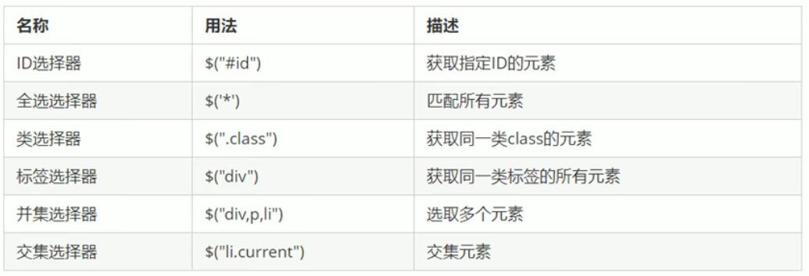
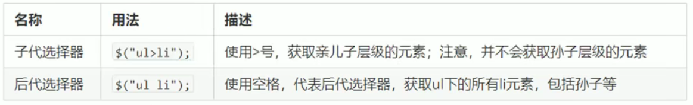
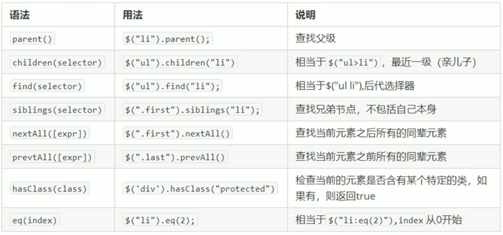

# 1. jQuery概述
## 1.1 JavaScript库
JavaScript库：即library，是封装好的特定的集合（方法和函数）。从封装一大堆函数的角度理解库，就是在这个库中，封装了很多预先定义好的的函数在里面，比如动画animate hide show 比如获取元素等

简单理解：就是一个js文件，里面对我们原生代码进行了封装，存放到里面，这样我们可以快速高效的使用这些封装好的功能了

比如jQuery，就是为了方便快速的操作DOM，里面基本上都是函数（方法）

常见的JavaScript库：
- jQuery
- Prototype
- YUI
- Dojo
- Ext JS 
- 移动端的zepto

这些库都是对原生JavaScript的封装，内部都是用JavaScript实现的，我们主要学习jQuery


## 1.2. jQuery概述
jQuery是一个快速简洁的JavaScript库，其设计的宗旨是“write Less,Do more” ,即倡导写更少的代码，做更多的事情

j是JavaScript；Query是查询，把js中的DOM做了封装，我们可以快速的查询使用里面的功能

jQuery封装了JavaScript常用的功能代码，优化了DOM操作、事件处理、动画设计和Ajax交互

学习jQuery的本质就是学习调用这些函数（方法）

**优点：**
- 轻量级。核心文件几十KB
- 跨浏览器兼容
- 链式编程、隐式迭代
- 对动画、样式、动画支持、大大简化了DOM操作
- 支持插件扩展开发。有着丰富的第三方的插件，例如：
- 树形菜单、日期控件、轮播图
- 免费开源


# 2. jQuery的基本使用
## 2.1. jQuery的下载
**版本：**
- 1x:兼容IE678浏览器，官网不再更新
- 2x:不兼容IE678浏览器，官网不再更新
- 3x：不兼容IE678低版本浏览器，是官方主要更新维护的版本


## 2.2. jQuery的使用步骤
- 引入jQuery文件
- 使用即可


## 2.3. jQuery的入口函数
```javascript
$(function(){
    ...  //此处是DOM加载完成的入口
});

$(document).ready(function(){
    ...  //此处是页面DOM加载完成的入口
});
```

- 等着DOM结构渲染完毕即可执行内部代码，不必等到所有外部资源加载完成，jQuery帮我们完成了封装
- 相当于原生js中的DOMContentLoaded
- 不同于原生js事件是等页面文档、外部的js文件、css文件、图片加载完毕后才执行内部代码


## 2.4. jQuery的顶级对象$
$是jQuery的别称，在代码中可以使用jQuery代替$，但是一般为了方便，通常直接使用$

$是jQuery的顶级对象，相当于原生JavaScript的window。把元素利用$包装成jQuery对象，就可以调用jQuery的方法


## 2.5. jQuery对象和DOM对象
用原生js获取过来的对象就是DOM对象

用jQuery方法获取过来的对象就是jQuery对象

jQuery对象的本质是利用$对DOM对象包装后产生的对象（伪数组形式存储）

DOM对象和jQuery对象是可以相互转换的

因为原生js比jQuery更大，原生的一些属性和方法jQuery没有给我们封装，想要使用这些属性和方法需要把jQuery对象转换为DOM对象才能使用

DOM对象转换为jQuery对象：
```javascript
$(DOM对象)
```
jQuery对象转换为DOM对象（两种方式）
```javascript
$('div')[index]   //index是索引号
$('div').get(index)     //index是索引号
```

# 3. jQuery选择器
## 3.1. jQuery基础选择器
原生js获取元素的方式很多，很杂，而且兼容性情况不一样，因此jQuery给我们做了封装，使获取元素统一标准
```javascript
$("选择器")    //里面选择器直接写css选择器即可，但是要加引号
```

(图：jQuery基础选择器)



## 3.2. jQuery层级选择器
（图：jQuery层级选择器）


**jQuery设置样式**
```javascript
$('div').css("属性","值")
```

## 3.3. 隐式迭代（重要）
遍历所有内部DOM元素（伪数组形式存储）的过程就叫做隐式迭代

简单理解：给匹配到的所有元素进行循环遍历，执行相同的方法，而不用我们再进行循环，简化我们的操作，方便我们调用


## 3.4. jQuery筛选方法（重点）
（图：jQuery筛选方法）


重点记住：**parent()  children()   find()   sibling()   eq()**
```html
    <script>
        $(function () {
            // 父亲 parent()  返回的是最近一级的父级元素 亲爸爸
            console.log($('.son').parent());

            // 儿子  
            // 只选亲儿子  children()    相当于子代选择器 ul>li
            $('.nav').children('p').css('color', 'red');
            // 可以选里面所有的孩子  包括儿子和孙子  find()  类似于后代选择器
            $('.nav').find('p').css('color', 'yellow');

            // 兄弟 siblings  除了自身元素外的所有亲兄弟
            $('ol .item').siblings('li').css('color', 'red');

            // 第n个元素 
            // 可以利用选择器的方式选择
            $('ul li:eq(2)').css('background', 'green');
            // 可以利用选择方法选择  更推荐
            $('ul li').eq(4).css('background', 'skyblue');

            // 判断是否有某个类名
            console.log($('div:first').hasClass('current'));
            console.log($('div:last').hasClass('current'));
        })
    </script>
```

## 3.5. jQuery里的排他思想
想要多选一的效果，排他思想：当前元素设置样式，其余的兄弟元素清除样式


## 3.6. 链式编程
链式编程是为了节省代码量，看起来更优雅
```javascript
$(this).css('color','red').siblings().css('color','');
```

使用链式编程一定要注意是那个对象执行样式


# 4. jQuery样式操作
## 4.1. 操作css方法
jQuery可以使用css方法来修改简单元素样式；也可以操作类，修改多个样式

### (1)参数只写属性名，则是返回属性值
```javascript
$(this).css('color');
```
### (2)参数是属性名，属性值，逗号分隔，是设置一组样式，属性必须加引号，值如果是数字可以不假单位和引号
```javascript
$(this).css('color','red');
```
### (3)参数可以是对象形式，方便设置多组样式，属性名和属性值用冒号分开，属性可以不用加引号
```javascript
$(this).css({'color':'white','font-size':'20px'});
```

## 4.2. 设置类样式方法
作用等同于以前的classList，可以操作类样式，注意操作类里面的参数不要加点

**(1)添加类**
```javascript
$('div').addClass('current');
```
**(2)移除类**
```javascript
$('div').removeClass('current');
```
**(3)切换类**
```javascript
$('div').toggleClass('current');
```

## 4.3. 类操作与className的区别
原生js中className会覆盖元素原先里面的类名

jQuery里面类操作只是对指定类进行操作，不影响原先的类名

addClass 相当于追加类名 不影响以前的类名


# 5. jQuery效果
jQuery给我们封装了很多动画效果，最为常见的如下：

**显示隐藏**：
```javascript
show()
dide()
toggle()
```
**滑动**：
```javascript
slideDown()
slideUp()
slideToggle()
```
**淡入淡出**：
```javascript
fadeIn()
fadeOut()
fadeToggle()
fadeTo()
```
**自定义动画**：
```javascript
animate()
```

## 5.1. 显示隐藏效果
### 显示语法规范：
```javascript
show([speed,[easing],[fn]])
```
**显示参数**
参数都可以省略，无动画直接显示
- speed:三种预定速度之一的字符串（'slow' 'normal' 'fast'）或表示动画时长的毫秒数值(如：1000)
- easing:(optional)用来指定切换效果，默认是'swing' 可用参数'linear'
- fn:回调函数，在动画完成时执行的函数，每个元素执行一次

### 隐藏语法规范
```javascript
hide([speed,[easing],[fn]]);
```
**隐藏参数**
参数都可以省略，无动画直接显示
- speed:三种预定速度之一的字符串（'slow' 'normal' 'fast'）或表示动画时长的毫秒数值(如：1000)
- easing:(optional)用来指定切换效果，默认是'swing' 可用参数'linear'
- fn:回调函数，在动画完成时执行的函数，每个元素执行一次


## 5.3. 事件切换
```javascript
hover([over,]out)
```
- over:鼠标移到元素上要触发的函数(相当于mouseenter)
- out:鼠标移出元素要触发的函数（相当于mouseleave）


## 5.4. 动画队列及其停止排队方法
动画或者效果队列
动画或者效果一旦触发就会执行，如果多次触发，就造成多个动画或者效果排队执行

**停止排队**
```javascript
stop()
```
stop()方法用于停止动画或效果

注意：stop()写到动画或者效果的前面，相当于停止结束上一次的动画


## 5.5. 淡入淡出效果
### 淡入效果规范：
```javascript
fadeIn([speed,[easing],[fn]])
```
淡入效果参数：
参数都可以省略，无动画直接显示
- speed：三种预定速度之一的字符串（slow normal fast)或表示动画时长的毫秒数值（如：1000）

### 渐进方式调整到指定的不透明度
```javascript
fadeTo([speed],opacity,[easing],[fn])
```
效果参数：
- opacity透明度必须写，取值0~1之间
- speed：三种预定速度之一的字符串（slow normal fast)或表示动画时长的毫秒数值（如：1000）必须写
- easing:(optional)用来指定切换效果，默认是'swing' 可用参数'linear'
- fn:回调函数，在动画完成时执行的函数，每个元素执行一次


## 5.6. 自定义动画animate
语法：
```javascript
animate(params,[speed],[easing],[fn])
```
参数：
- params:想要更改的样式属性，以对象形式传递，必须写。属性名可不用带引号，如果是复合属性则需要采取驼峰命名法borderLeft 其余参数都可以省略
- speed：三种预定速度之一的字符串（slow normal fast)或表示动画时长的毫秒数值（如：1000）
- easing:(optional)用来指定切换效果，默认是'swing' 可用参数'linear'
- fn:回调函数，在动画完成时执行的函数，每个元素执行一次


