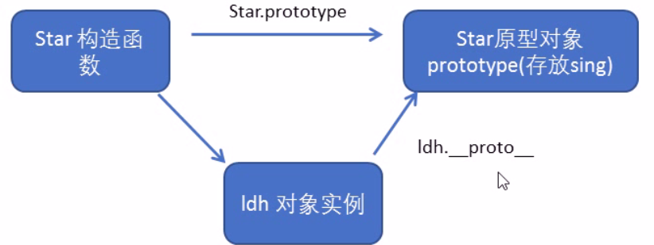
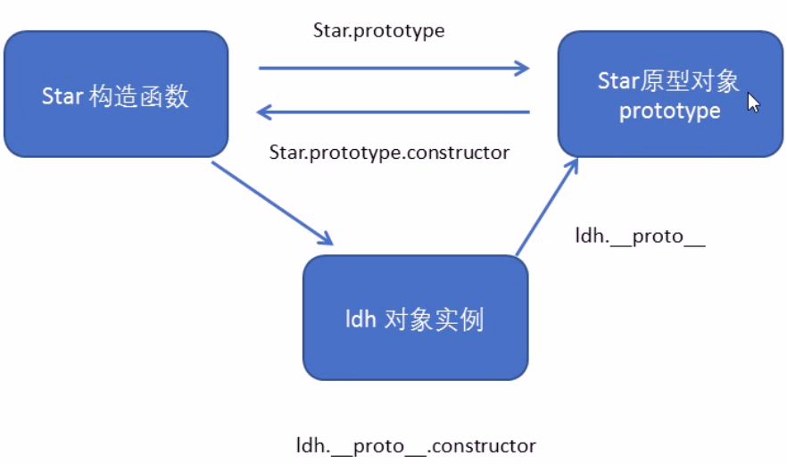
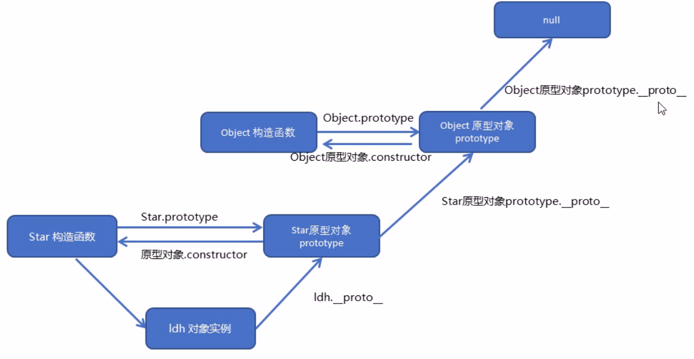

# 1. 构造函数和原型
## 1.1. 概述
在典型的OOP语言中（如Java），都存在类的概念，类就是对象的模板，对象就是类的实例，但是在ES6之前，js中并没有引入类的概念

ES6，全称ECMAScript6.0,2015年6月发布，但是目前的浏览器的JavaScript是ES5版本，大多数高版本的浏览器也支持ES6，不过只实现了ES6的部分特性和功能

在ES6之前，对象不是基于类创建的，而是用一种称为构建函数的特殊函数来定义对象和他们的特征

创建对象可以通过以下三种方式：
- 对象字面量
- new Object()
- 自定义构造函数


## 1.2. 构造函数
JavaScript的构造函数中可以添加一些成员，可以在构造函数本身上添加，也可以在构造函数内部的this上添加。通过这两种方式添加的成员，就分别称为**静态成员**和**实例成员**

**静态成员**：在构造函数本身上添加的成员称为静态成员，只能由构造函数本身来访问

**实例成员**：在构造函数内部创建的对象成员称为实例成员，只能由实例化的对象来访问


## 1.3. 构造函数的问题
构造函数方法很好用，但是存在浪费内存的问题


## 1.4. 构造函数原型prototype
构造函数通过原型分配的函数是所有对象所共享的

JavaScript规定，每一个构造函数都有一个prototype属性，指向另一个对象，注意这个prototype就是一个对象，这个对象的所有属性和方法，都会被构造函数所拥有

我们可以把那些不变的方法，直接定义在prototype对象上，这样所有的对象的实例就可以共享这些方法

原型是什么？ 一个对象，我们也称prototype为原型对象
原型的作用是什么？ 共享对象


## 1.5. 对象原型__proto__
对象都会有一个属性__proto__指向构造函数的prototype原型对象，之所以我们对象可以使用构造函数prototype原型对象的属性和方法，就是因为对象有__proto__原型的存在

__proto__对象原型和原型对象prototype是等价的

__proto__对象原型的意义就在于为对象的查找机制提供一个方向，或者说是一条线路，但它是一个非标准属性，因此实际开发中，不可以使用这个属性，它只是内部指向原型对象prototype
（图：原型对象）



## 1.6. constructor构造函数
对象原型__proto__和构造函数prototype原型对象里面都有一个属性constructor属性，constructor我们称之为构造函数，因为它指回构造函数本身

constructor主要用于记录该对象引用于那个构造函数，它可以让原型对象重新指向原来的构造函数


## 1.7. 构造函数、实例、原型对象三者之间的关系
（图：构造函数实例原型对象三者之间的关系）



## 1.8.原型链
(图：原型链)


## 1.9. JavaScript的成员查找机制（规则）
按照原型链的机制查找

当访问一个对象的属性（包括方法）时，首先查找这个对象自身有没有该属性

如果没有就查找它的原型（也就是__proto__指向的prototype原型对象）

如果还没有就查找原型对象的原型（Object的原型对象）
以此类推一直找到Object为止（null）

__proto__对象原型的意义就在于为对象成员查找机制提供一个方向，或者说是一条路线


## 1.10. 原型对象的this指向
        // 在构造函数中，里面的this指向的是对象实例  ldh


## 1.11. 扩展内置对象
可以通过原型对象，对原来的内置对象进行扩展自定义的方法。比如给数组增加自定义求偶数和的功能

注意：数组和字符串内置对象不能给原型对象覆盖操作Array.prototype={},只能是Array.prototype.xxx=function(){}的方式


# 2. 继承
ES6之前并没有给我们提供extends继承，我们可以通过构造函数+原型对象模拟实现继承，被称为组合继承

## 2.1. call()
调用这个函数，并且修改函数运行时的this指向
```javascript
fun.call(thisArg,arg1,arg2...);
```
- thisArg:当前调用函数this的指向对象
- arg1,arg2:传递的其他参数


## 2.2. 借用构造函数继承父类型的属性
核心原理：通过call()把父类型的this指向子类型的this，这样就可以实现子类型继承父类型的属性


## 2.3. 借用原型对象继承父类型方法


# 3. 类的本质
class本质还是function
```html
<script>
        class Star{

        }

        // 类的本质其实还是一个函数，我们可以简单地认为类就是构造函数的另外一种写法
        console.log(typeof Star);

        // 构造函数的特点：

        // 构造函数有原型对象prototype
        console.log(Star.prototype);

        // 构造函数原型对象prototype里面有constructor指向构造函数本身
        console.log(Star.prototype.constructor);

        // 构造函数可以通过原型对象添加方法
        Star.prototype.sing=function(){
            console.log('sing a song');
        }

        // 构造函数创建的实例对象有__proto__原型指向构造函数的原型对象
        var ldh=new Star();
        console.dir(ldh);
        console.log(ldh.__proto__===Star.prototype);
</script>
```
所以ES6的类的绝大部分功能ES5都可以做到，新的class写法只是让对象原型的写法更加清晰，更像面向对象的编程的语法而已

所以，ES6中的类其实就是语法糖

**语法糖**：语法糖就是一种便捷的写法。简单理解，有两种方法可以实现相同的功能，但是一种写法更加清晰，方便，那么这个写法就是语法糖


# 3. ES5中的新增方法
## 3.1. ES5 新增方法概述
ES5只给你给我们新增了一些方法，可以很方便的操作数组或者字符串，这些方法包括：
- 数组方法
- 字符串方法
- 对象方法 


## 3.2. 数组方法
迭代（遍历）方法：forEach() map()  filter()  some()  every()
```javascript
array.forEach(function(currentValue,index,arr))
```
- currentValue:数组当前项的值
- index：数组当前项的索引
- arr：数组对象本身
```javascript
array.filter(function(currentValue,index,arr))
```
filter()方法创建一个新的数组，新数组的元素是通过检查指定数组中符合条件的所有元素，主要用于筛选数组

注意它直接返回一个新的数组

- currentValue:数组当前项的值
- index：数组当前项的索引
- arr：数组对象本身
```javascript
array.some(functin(currentValue,index,arr))
```
some()方法用于检测数组中的元素是否满足指定条件。通俗点 查找数组中是否有满足条件的元素
注意它返回的是布尔值，如果查找到这个元素，就返回true，如果查找不到就返回false 
如果找到第一个满足条件的元素，则终止循环，不再继续查找
- currentValue:数组当前项的值
- index：数组当前项的索引
- arr：数组对象本身


## 3.3. 字符串方法trim()
trim()方法会从一个字符串的两端删除空白字符
str.trim()

trim方法并不影响原字符本身，它返回的是一个新的字符串


## 3.4. 对象方法 
Object.defineProperty()定义对象中新属性或者修改原有的属性
```javascript
object.defineProperty(obj,prop,descriptor)
```
- obj:必须。目标对象
- prop：必须。需定义或修改的属性的名字
- descriptor:必须。目标属性所拥有的特性

第三个属性的scriptor 说明：以对象的形式{}书写
- value:设置属性的值，默认为underfined
- writable:值是否可以重写。true|false默认为false
- enumerable：目标属性是否可以被枚举。true|false默认为false
- confingurable：目标属性是否可以被删除或是否可以再次修改特性true|flase 默认为false


# 查询商品的案例
