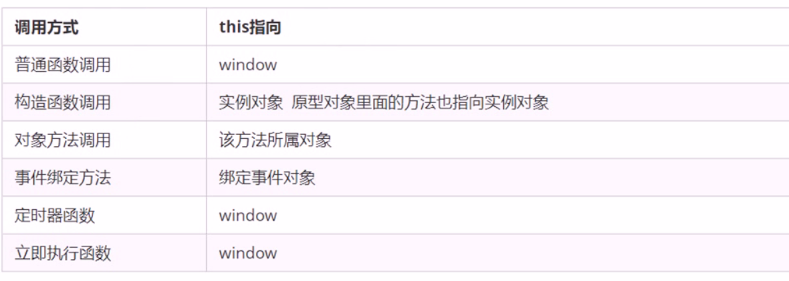

# 1. 函数的定义和调用
## 1.1. 函数的定义方式
- 函数声明方式function关键字（命名函数）
- 函数表达式（匿名函数）
- new Function()

var fn=new Function('参数1','参数2','函数体');

Function里面的参数必须是字符串格式

第三种方式执行效率低，也不方便书写，因此较少使用

所有函数都是Function的实例（对象）

函数也属于对象

（图：函数的定义方式）


## 1.2.  函数的调用方式
- 普通函数
- 对象的方法
- 构造函数
- 绑定事件函数
- 定时器函数
- 立即执行函数
```html
    <script>
        //普通函数
        function fn() {
            console.log('hi');
        };
        fn();
        fn.call();

        // 对象的方法
        var o = {
            sayHi: function () {
                console.log(hi);
            }
        }
        o.sayHi();

        // 构造函数
        function Star() {};
        new Star();

        // 绑定事件函数
        btn.onclick=function(){};     //点击了按钮就可以调用这个函数

        // 定时器函数
        setInterval(function(){},1000);    //这个函数是定时器一秒钟自动调用一次

        // 立即执行函数
        (function(){
            console.log('hi');
        })()
        // 立即执行函数是自动调用
    </script>
```


# 2. this
## 2.1. 函数内this的指向
（图：this指向）


## 2.2. 改变函数内部的this指向
JavaScript为我们专门提供了一些函数方法来帮我们更优雅的处理函数内部this指向的问题，常用的有
**bind()    call()     apply()**

### call 方法
call() 方法调用一个对象，简单理解为调用函数的方式，但是它可以改变函数的this指向
```javascript
fun.call(thisArg,arg1,arg2,...)
```
### apply 方法
apply()方法调用一个函数，简单理解为调用函数的方式，但是它可以改变函数的this指向
```javascript
fun.apply(thisArg,[argsArray])
```
- thisArg：在fun函数运行时指定的this值
- argsArray:传递的值，必须包含在数组里面

返回值就是函数的返回值，因为它就是调动函数

### bind方法
bind()方法不会调用函数。但是能改变函数内部的this指向
```javascript
fun.bind(thisArg,arg1,arg2,...);
```
- thisArg:在fun函数运行时指定的this值
- arg1，arg2：传递的其他参数

返回指定的this值和初始化参数改造的原函数拷贝


## 2.3. call apply bind  总结
**相同点：**
都可以改变函数内部的this指向

**区别点：**
call和apply会调用函数，并且改变函数内部this指向
call和apply传递的参数不一样，call传递参数arg1,arg2...形式     apply必须数组形式[arg]
bind 不会调用函数，可以改变函数内部的this指向

**主要应用场景**：
call经常做继承
apply经常跟数组有关系，比如借助与数学对象实现数组最大值最小值
bind不调用函数，但是还想改变this指向，比如改变定时器内部的this指向


# 3. 严格模式
## 3.1. 什么是严格模式
JavaScript除了提供正常模式以外，还提供了严格模式（strict mode）ES5的严格模式是采用具有限制性JavaScript变体的一种方式，即在严格的条件下运行js代码

严格模式在IE10以上的版本的浏览器才会被支持，旧版本浏览器中会被忽略

严格模式对正常的JavaScript语义做了一些更改：
- 消除了JavaScript语法的一些不合理不严谨之处，减少了一些怪异行为
- 消除了代码中一些不安全的地方，保证代码运行的安全
- 提高编译器效率，增加运行速度
- 禁用了在ECMAScript的未来版本中可能会定义的一些语法，为未来的新版本的JavaScript做好铺垫。比如一些保留字如：class enum export extends import super 不能做变量名


## 3.2. 开启严格模式
严格模式可以应用到整个脚本或者个别函数中，因此在使用时，我们可以将严格模式分为脚本开启严格模式和为函数开启严格模式两种 情况

### 为脚本开启严格模式：
为整个脚本文件开启严格模式，需要在所有语句之前放一个特定语句 "use strict";  (或者 'use strict';)
```html
  <script>
        // 为整个脚本开启严格模式
        'use stirct';
        // 下面 的js代码就会按照严格模式执行
    </script>

    <script>
        (function(){
            'use strict';
        })();
    </script>
```
### 为某个函数开启严格模式：
```html
 <!-- 为某个函数开启严格模式 -->
    <script>
        // 只给fn函数开启严格模式
        function fn() {
            'use strict';
            // 下面的代码按照严格模式执行
        };

        function fun() {
            // 里面的还是按照普通函数执行
        };
    </script>
```

## 3.4. 严格模式中的变化
严格模式对JavaScript的语法和行为，都做了一些改变

### (1)变量规定：
在正常模式下，如果一个变量没有声明就赋值，默认是全局变量，严格模式禁止这种用法，变量必须先用 var命令声明，然后再使用
严禁删除已经声明的变量。例如：delete x;语法是错误的

### (2)严格模式下this的指向问题
以前在全局作用域函数中this指向window对象
严格模式下全局作用域中函数中的this是underfined
以前构造函数不加new也可以调用，当普通函数，this指向全局对象
严格模式下，如果构造函数下不加new调用this会报错
new实例化的构造函数指向创建的实例对象
定时器this还是指向window
事件、对象还是指向调用者

### (3)函数变化
函数不能有重名的参数
函数必须声明在顶层 新版本的JavaScript会引入“块级作用域”(ES6中引入)为了与新版本接轨，不允许在非函数的代码块内声明函数


# 4. 高阶函数
高阶函数是对其他函数进行操作的函数，它接收函数作为参数或将函数作为返回值输出
```html
<script>
function fn(callback){
    callback&&callback();
}
fn(function(){alert('hi')})
</script>

<script>
function fn(){
    return function(){}
}
fn();
</script>
```
此时fn就是一个高阶函数
函数也是一种数据类型，同样可以作为参数，传递给另外一个参数使用，最典型的是作为回调函数

           

# 5. 闭包
## 5.1. 变量作用域
变量根据作用域的不同分为两种：全局变量和局部变量

函数内部可以使用全局变量
函数外部不可以使用局部变量

当函数执行完毕，本作用域内的局部变量会被销毁


## 5.2. 什么是闭包
闭包（closure）指有权访问另一个函数作用域中变量的函数

简单理解就是一个作用域可以访问另外 一个函数内部的局部变量
```html
    <script>
        // 闭包（closure）指有权访问另一个函数作用域中变量的函数
        // 闭包：我们fun这个函数作用域访问了另一个函数fn里面的局部变量 num

        // fn外面的作用域可以访问fn内部的局部变量
        // 闭包的主要作用：延伸了变量的作用范围
        function fn() {
            var num = 10;

            // function fun() {
            //     console.log(num);
            // }
            // // fun();
            return function () {
                console.log(num);
            };
        }
        var f = fn();
        f();
    </script>
```

## 5.5. 闭包案例
### 循环注册点击事件
```javascript
 // 利用闭包的方式得到当前li的索引号
        for (var i = 0; i < lis.length; i++) {
            // 利用for循环创建了4个立即执行函数

            // 立即执行函数也称为小闭包，因为立即执行函数里面的任何一个函数都可以使用它的i这变量
            (function (i) {
                // console.log(i);
                lis[i].onclick=function(){
                    console.log(i);
                }
            })(i);
        }
```
### 循环中的setTimeout()
```javascript
 // 闭包应用：3秒钟之后，打印所有li元素的内容
        // for(var i=0;i<lis.length;i++){
        //     (function(i){
        //         setTimeout(function(){
        //             console.log(lis[i].innerHTML);
        //         },3000)
        //     })(i);
        // }
```
### 闭包应用：计算打车价格
打车起步价13（3公里以内），之后每多一公里增加5块钱，用户输入公里数就可以计算打车价格

如果有拥堵情况，总价格多收10块钱拥堵费
```javascript
 // 闭包应用：计算打车价格
        //         打车起步价13（3公里以内），之后每多一公里增加5块钱，用户输入公里数就可以计算打车价格
        // 如果有拥堵情况，总价格多收10块钱拥堵费
        var car = (function () {
            var start = 13; //起步价
            var total = 0; //总价
            return {
                price: function (n) {
                    if (n <= 3) {
                        total = start;
                    } else {
                        total = 13 + (n - 3) * 5
                    }
                    return total;
                }, //正常的总价
                yd: function (flag) {
                    return flag ? total + 10 : total;
                } //拥堵之后的费用
            }

        })();
console.log(car.price(10));
        // console.log(car.price(1));
        console.log(car.yd(true));
```

## 5.6. 闭包总结
**闭包是什么？**

闭包是一个函数（一个作用域可以访问另外一个函数的局部变量）

**闭包的作用是什么？**

延伸变量的作用范围


# 6. 递归
## 6.1. 什么是递归
如果一个函数在内部可以调用其本身，那么这个函数就是递归函数

简单理解：函数内部自己调用自己，这个函数就是递归函数

递归函数的效果和循环效果一样

由于递归很容易发生栈溢出错误（stack overflow），所以必须要加退出条件return


## 6.2. 利用递归求数学题
### 求1*2*3....*n的阶乘
```html
<script>
        // 利用递归求1~n的阶乘
        function fn(n) {
            if (n == 1) {
                return 1;
            }
            return n * fn(n - 1);
        };

        console.log(fn(100));

        // 详细思路：
        // 假如用户输入的是3
        //  return 3*fn(3-1)  即:3*fn(2)
        // return 3*(2*fn(2-1))
        // return 3*(2*1)
</script>
```
### 求斐波那契数列
```html
    <script>
        // 用户输入一个数字n，就可以求出这个数字对应的兔子序列值

        // 我们只需要知道用户输入的n前面的两项(n-1)、(n-2)就可以计算出n对应的序列值
        function fb(n) {
            if (n == 1 | n == 2) {
                return 1;
            }
            return fb(n - 1) + fb(n - 2);

        };
        console.log(fb(6));
    </script>
```

## 6.3. 利用递归求：根据id返回对应的数据对象
```html
    <script>
        var data = [{
                id: 1,
                name: '家电',
                goods: [{
                    id: 11,
                    gname: '冰箱',
                    goods: [{
                        id: 111,
                        gname: 'haier'
                    }, {
                        id: 112,
                        gname: 'media'
                    }, ]
                }, {
                    id: 12,
                    gname: '洗衣机'
                }]
            },
            {
                id: 2,
                name: '服饰'
            }
        ];

        // 我们想要输入id号，就可以返回对应的数据对象
        // 1.利用forEach遍历每一个对象
        function getID(json, id) {
            var o = {};
            json.forEach(function (item) {
                // console.log(item);
                if (item.id == id) {
                    // console.log(item);
                    o = item;

                    // 我们想要得到里层的数据   11 12   可以利用递归函数
                    // 里面应该有goods数组并且这个数组的长度不为0
                } else if (item.goods && item.goods.length > 0) {
                    o = getID(item.goods, id);
                }
            });
            return o;
        };
        console.log(getID(data, 1));
        console.log(getID(data, 2));
        console.log(getID(data, 11));
        console.log(getID(data, 12));
        console.log(getID(data, 111));
    </script>
```

## 6.4. 浅拷贝和深拷贝
浅拷贝只是拷贝一层，更深层对象级别的只拷贝引用

深拷贝拷贝多层，每一级别的数据都会拷贝

Object.assign(target,...sources)   es6新增方法可以实现浅拷贝


