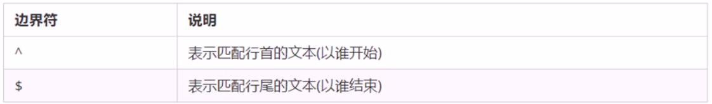
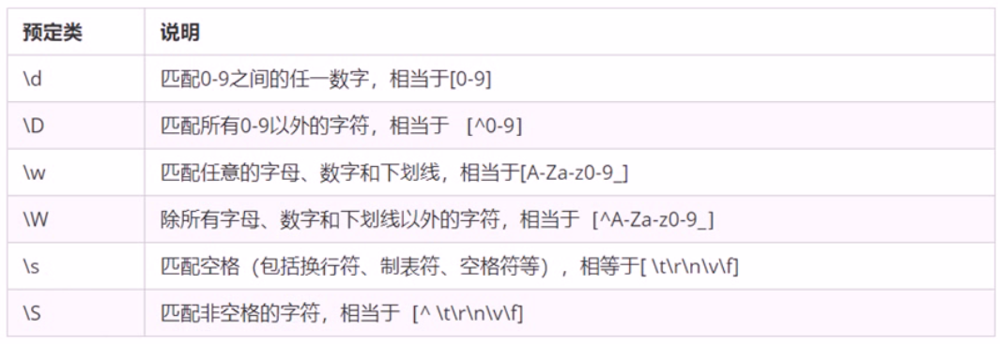

# 1. 正则表达式概述
## 1.1. 什么是正则表达式
正则表达式（Regular Expression）是用于匹配字符串中字符组合的模式，在JavaScript中，正则表达式也是对象

**匹配 替换 提取**
正则表达式通常被用来检索，替换那些符合某个模式（规则）的文本，例如验证表单：用户名只能输入英文字母数字或者下划线，昵称输入框可输入中文（**匹配**）。此外，正则表达式还常用于过滤页面内容中的一些敏感词（**替换**），或从字符串中获取我们想要的特定部分（**提取**）等

其他语言也会使用正则表达式，我们主要利用JavaScript中的正则表达式完成表单验证


## 1.2. 正则表达式的特点
- 灵活性、逻辑性和功能性非常强
- 可以迅速地用既简单的方式达到字符串的复杂控制
- 对于刚接触的人来说比较晦涩难懂
- 实际开发中，一般都是直接复制写好的正则表达式，但是要求会使用正则表达式并且根据实际情况修改正则表达式 


# 2. 正则表达式在JavaScript中的使用
## 2.1. 创建正则表达式
在JavaScript中我们通过两种方式创建一个正则表达式
### （1）通过RegExp对象的构造函数创建
var 变量名 = new RegExp(/表达式/);
### （2）利用字面量创建正则表达式
var 变量名=/表达式/;.   


## 2.2. 测试正则表达式test
test()正则对象方法，用于检测字符串是否符合该规则，该对象会返回true或者false，其参数是测试字符串
```javascript
regexObj.test(str)
```
regexObj是写的正则表达式
str是我们要测试的文本
就是检测str文本是否符合我们写的正则表达式规范


# 3. 正则表达式中的特殊字符
## 3.1. 正则表达式的组成
一个正则表达式可以由简单的字符组成，比如/abc/，也可以是简单和特殊字符的组合，比如/ab*c/  其中特殊字符也被称为元字符，在正则表达式中是具有特殊意义的专用符号，如^ $ +等


## 3.2. 边界符
正则表达式中的边界符（位置符）用来提示字符所处的位置，主要有两个字符

（图：边界符）


如果^和$在一起，表示必须是精确匹配

## 3.3. 字符类
```javascript
        // 字符类：[]表示有一系列字符可供选择，只要匹配其中一个就可以了
        var rg1 = /^[abc]$/; //三选一  只有是a 或者b 或者c这三个字母才会返回true
        var rg3 = /^[a-zA-Z0-9-_]$/; //26个字母和数字和短横线和下划线大小写的任何一个返回true
        var rg4 = /^[^a-zA-Z0-9-_]$/; //如果中括号里面有^，表示取反

[^]方括号内取反符^
var rg4 = /^[^a-zA-Z0-9-_]$/; //如果中括号里面有^，表示取反
```

## 3.4. 量词符
量词符用来设定某个模板出现的次数

        // 简单理解就是让下面的这个字符重复多少次
        // *相当于>=0 可以出现0次或者很多次
        // + 相当于可以出现1次或者很多次
        // ?  相当于可以出现1次或者0次
        // {3}就是重复3次
        // // {3,}  大于等于3
         // {3,16}  大于等于3 并且小于等于16


## 3.5. 括号总结
大括号 量词符 里面表示重复次数

中括号 字符集合 。匹配方括号只给你的任意字符

小括号表示优先级


## 3.6. 预定义类
预定义类指的是某些常见模式的简写方式

（图：预定义类）



# 4. 正则表达式中的替换
## 4.1. replace替换
replace()方法可以实现替换字符串操作，用来替换的参数可以是一个字符串或是一个正则表达式
```javascript
stringObject.replace(regexp/substr,replacement)
```
第一个参数：被替换的字符串或者正则表达式
第二个参数：替换为的字符串
返回值是一个替换完毕的新字符串


## 4.2. 正则表达式参数
```javascript
/表达式/[switch]
```
switch (也称修饰符)按照什么样的模式来匹配，有三种值：
- g:全局匹配
- i:忽略大小写
- gi:全局匹配+忽略大小写


