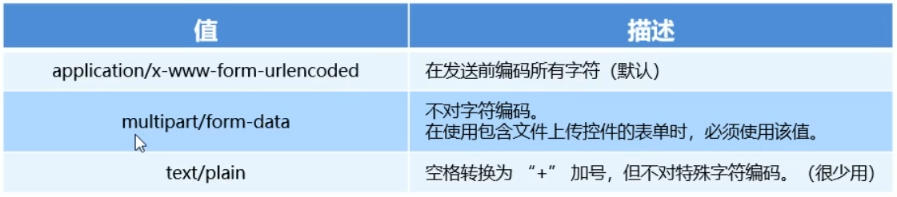
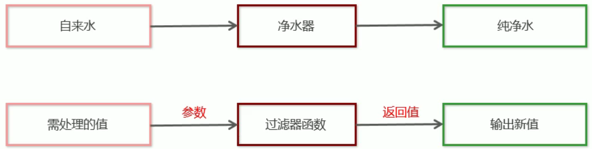

# 1. form表单的基本使用
## 1.1 什么是表单  
表单在网页中主要负责**数据采集功能**。HTML中的&lt;from&gt;标签，就是用于采集用户输入的信息，并通过&lt;form&gt;标签的提交操作，把采集到的信息提交到服务器端进行处理。
## 1.2 表单的组成部分   
表单由三个基本部分组成：
**表单标签**
**表单域**
表单域包含了文本框、密码框、隐藏框、多行文本框、复选框、单选框、下拉框和文件上传框等
**表单按钮**
## 1.3 &lt;form&gt;标签的属性
&lt;form&gt;标签用来采集数据，&lt;form&gt;标签的属性则是用来规定如何把收集到的数据发送到服务器

### 1. action
action属性用来规定当提交表单时，向何处发送表单数据
action的属性应该是后端提供的一个URL地址，这个URL地址专门负责接收表单提交过来的数据
当 &lt;form&gt;表单为指定action属性值的情况下，action的默认值为当前页面的URL地址
**注意**：当提交表单后，页面会立即跳转到action属性指定的URL页面
### 2. target
target属性用来规定在**何处打开actionURL**
它的可选值有5个，默认情况下，target的值是_self,表示在相同框架打开action URL

### 3. method
method属性用来规定以**何种方式**把表单数据提交到action URL
它的可选值有两个：get和post
默认情况下，method的值为get，表示通过URL地址的形式，把表单数据提交到action URL
**注意：**
get 方式适合用来提交少量的简单的数据
post方式适合用来提交大量的，复杂的，或者包含文件上传的数据
在实际开发中，&lt;form&gt;表单的post提交方式用的最多，很少用get，例如登陆、注册、添加数据等操作，都需要使用post方式来提交表单
### 4. enctype
enctype属性用来规定在发送表单数据之前如何对数据进行编码
它的可选值有三个：
默认：application/x-www-form-urlencoded 表示在发送前编码所有的字符

**注意:**
在涉及到**文件上传**的操作时，必须将enctype的值设置为**multipart/form-data**
不涉及文件上传，默认
## 1.4 表单的同步提交及缺点
### 1. 什么是表单的同步提交
通过点击submit按钮，触发表单的提交操作，从而使页面跳转到action URL的行为，叫做表单的同步提交
### 2. 表单同步提交的缺点
- &lt;form&gt;表单同步提交之后，整个页面会发生跳转，跳转到action URL所指向的地址，用户体验很差
- &lt;form&gt;表单同步提交之后，页面之前状态和数据会消失
### 3. 如何解决表单同步提交的缺点
解决方案：**表单只负责采集数据，Ajax负责将数据提交到服务器**
# 2. 通过Ajax提交表单数据
## 2.1. 监听表单提交时间
在jQuery中，可以使用以下两种方式，监听到表单的提交事件：
- 方法1：
```javascript
$('#form1').submit(function(e){
    alert('监听到了表单的提交事件')
})
```
- 方法2：
```javascript
$('#form1).on('submit',function(e){
    alert('监听到了表单的提交事件')
})
```
## 2.2. 阻止表单默认提交行为    
当监听到表单的提交事件以后，可以调用事件对象的event.preventDefault()函数，来阻止表单的提交和页面的跳转，示例代码如下：
- 方法1：
```javascript
$('#form1').submit(function(e){
    e.preventDefault()
})
```
- 方法2：
```javascript
$('#form1).on('submit',function(e){
    e.preventDefault()
})
```
## 2.3. 快速获取表单中的数据
### 1. serialize()函数
为了简化表单中的数据获取操作，jQuery提供了serialize()函数，其语法格式如下：
```javascript
$(selector).serialize()
```
好处：**可以一次性获取到表单中所有的数据**
### 2. serialize()函数示例
注意：在使用serialize()函数获取表单元素时，**必须为每个表单元素添加name属性**
# 3. 案例-评论列表
## 3.1. 渲染UI结构
```html
<!DOCTYPE html>
<html lang="en">

<head>
    <meta charset="UTF-8">
    <meta http-equiv="X-UA-Compatible" content="IE=edge">
    <meta name="viewport" content="width=device-width, initial-scale=1.0">
    <title>Document</title>
    <link rel="stylesheet" href="lib/bootstrap.css">
    <script src="lib/jquery.js"></script>
    <script src="js/cmt.js"></script>
</head>

<body style="padding:15px">
    <!-- 评论面板 -->

    <div class="panel panel-primary">
        <div class="panel-heading">
            <h3 class="panel-title">发表评论</h3>
        </div>
        <div class="panel-body">
            <div>评论人</div>
            <input type="text" class="form-control">
            <div>评论内容</div>
            <textarea class="form-control"></textarea>
            <button type="submit" class="btn btn-primary">发表评论</button>
        </div>
    </div>

    <!-- 评论列表 -->

    <ul class="list-group" id="cmt-list">
        <li class="list-group-item">
            <span class="badge" style="background-color: #f0ad4e;">评论时间</span>
            <span class="badge" style="background-color:#5bc0de">评论人</span>
            Item 1
        </li>
    </ul>
</body>

</html>
```
## 3.2. 获取评论列表数据
```javascript
function getCommentList(){
    $.ajax({
        method:'get',
        url:'http://www.liulongbin.top:3006/api/cmtlist',
        success:function(res){
            // console.log(res);
            if(res.status!==200) return alert('获取评论列表失败！')
            console.log('获取数据成功');

           
        }
    })
}

getCommentList();
```
## 3.3. 渲染评论列表
```javascript
            var rows = []
            $.each(res.data, function (i, item) {
                var str = '<li class="list-group-item"><span class="badge" style="background-color: #f0ad4e;">评论时间：'+item.time+'</span><span class="badge" style="background-color:#5bc0de">评论人：'+item.username+'</span>'+item.content+'</li>'
                rows.push(str)
            })
            $('#cmt-list').empty().append(rows.join(''))
```
## 3.4. 改造form表单
- 将发表评论的div改为form
- 为每一个input 和textarea添加name属性
- 监听form表单submit事件，获取表单中填写的数据：
```javascript
$(function () {
    $('#formAddCmt').submit(function (e) {
        e.preventDefault();
        var data=$(this).serialize()
        console.log(data);
    })
})
```
## 3.5. 发表评论
```javascript
$.post('http://www.liulongbin.top:3006/api/addcmt', data, function (res) {
            if (res.status !== 201) {
                return alert('发表评论失败！')
            }
            getCommentList()
            
            // 把jQuery对象转换为原生DOM对象+[0]
            $('#formAddCmt')[0].reset()
        })
```
# 4. 模板引擎的基本概念
## 4.1. 渲染UI结构时遇到的问题
如果UI结构比较复杂，则拼接字符串的时候需要格外注意**引号之前的嵌套关系**，且一旦需求发生变化，修改起来非常麻烦
## 4.2. 什么是模板引擎
模板引擎，顾名思义，可以根据程序员指定的**模板结构**和**数据**，自动生成一个完整的HTML页面
## 4.3. 模板引擎的好处
- 减少了字符串的拼接操作
- 使代码结构更加清晰
- 使代码更容易阅读和后期维护
# 5. art-template模板引擎
## 5.1. art-template简介
art-template是一个简约，超快的模板引擎。[官网](https://aui.github.io/art-template/zh-cn/)
## 5.2. art-template下载
官网下载“在浏览器中实时编译：template-web.js”
## 5.3. art-template基本使用
### 1. 使用传统方式渲染UI结构
```html
<!DOCTYPE html>
<html lang="en">

<head>
    <meta charset="UTF-8">
    <meta http-equiv="X-UA-Compatible" content="IE=edge">
    <meta name="viewport" content="width=device-width, initial-scale=1.0">
    <title>Document</title>
    <script src="lib/jquery.js"></script>
</head>

<body>
    <div id="title"></div>
    <div>姓名：<span id="name"></span></div>
    <div>年龄：<span id="age"></span></div>
    <div>会员：<span id="isVIP"></span></div>
    <div>注册时间：<span id="regTime"></span></div>
    <div>爱好：
        <ul id="hobby">
            <li>爱好1</li>
            <li>爱好2</li>
        </ul>
    </div>

    <script>
        data = {
            title: '<h3>用户信息</h3>',
            name: 'zs',
            age: 20,
            isVIP: true,
            regTime: new Date(),
            hobby: ['吃饭', '睡觉', '打豆豆']
        }

        $(function () {
            $('#name').html(data.name)
            $('#title').html(data.title)
            $('#age').html(data.age)
            $('#isVIP').html(data.isVIP)
            $('#regTime').html(data.regTime)

            var rows = []
            $.each(data.hobby, function (i,item) {
                rows.push('<li>' + item + '</li>')
            })
            $('#hobby').html(rows.join(''))
        })
    </script>
</body>

</html>
```
### 2. art-template的使用步骤
- 导入art-template
- 定义数据
- 定义模板调用template函数
- 渲染HTML结构

演示代码：
```html
<!DOCTYPE html>
<html lang="en">

<head>
    <meta charset="UTF-8">
    <meta http-equiv="X-UA-Compatible" content="IE=edge">
    <meta name="viewport" content="width=device-width, initial-scale=1.0">
    <title>Document</title>
    <!-- 1. 导入模板引擎 -->
    <!-- 在window全局，多了一个函数，叫做template('模板的id',需要渲染的数据对象) -->
    <script src="js/template-web.js"></script>
    <script src="lib/jquery.js"></script>
</head>

<body>
    <div id="container"></div>

    <!-- 3. 定义模板 -->
    <!-- 3.1 模板的HTML结构，必须定义到script中 -->
    <!-- 当script标签内什么都不写时，script默认的type是text/javascript，因为定义模板需要在script内写HTML结构，所以需要修改script的type属性 -->
    <script type="text/html" id="tpl-user">
        <h1>{{name}}--------{{age}}</h1>
    </script>

    <script>
        // 2. 定义需要渲染的数据
        var data = {
            name: 'zs',
            age:20
        }

        // 4. 调用template函数
        var htmlStr = template('tpl-user', data)
        console.log(htmlStr);

        // 5. 渲染HTML结构
        $('#container').html(htmlStr)
    </script>
</body>

</html>
```
## 5.4. art-template标准语法
### 1. 什么是标准语法
art-template提供了{{}}这种语法格式，在{{}}内可以进行**变量输出**，或**循环数组**等操作，这种{{}}语法在art-template中被称为标准语法。
### 2. 标准语法-输出
在标准语法中，可以进行变量的输出，对象属性的输出，三元表达式的输出，逻辑或输出，加减乘除等表达式输出。
```javascript
{{value}}
{{obj.key}}
{{obj['key']}}
{{a?a:c}}
{{a||b}}
{{a+b}}
```
### 3. 标准语法-原文输出
```javascript
{{@ value}}
```
如果要输出的value值中，包含了HTML结构标签，需要使用原文输出语法，才能保证HTML标签被正常渲染。
### 4. 标准语法-条件输出
如果要实现条件输出，则可以在{{}}中使用if...else if.../if的方式，进行按需输出
```javascript
{{if value}} 按需输出的内容{{/if}}

{{if v1}} 按需输出的内容{{else if v2}}按需输出的内容{{/if}}
```
### 5. 标准语法-循环输出
如果要实现循环输出，则可以在{{}}内，通过each语法循环数组，当前循环的索引使用$index进行访问，当前的循环项使用$value进行访问
```javascript
{{each arr}}
{{index}} {{value}}
{{/each}}
```
### 6. 标准语法-过滤器


过滤器的本质就是一个function函数

语法：
```javascript
{{value | filterName}}
```
过滤器的语法类似 **管道操作符**，它的上一个输出作为下一个输入

定义过滤器的基本语法：
```javascript
template.default.imports.filterName=function(value){/*return处理的结果*/}
```
## 5.5 案例-新闻列表
