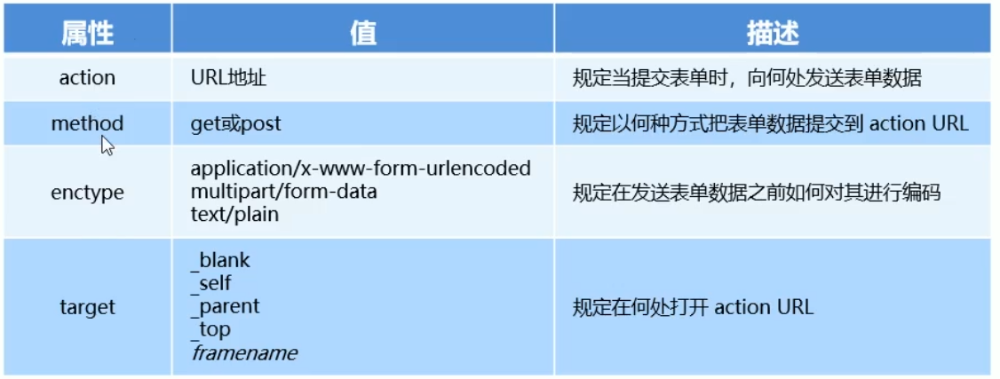
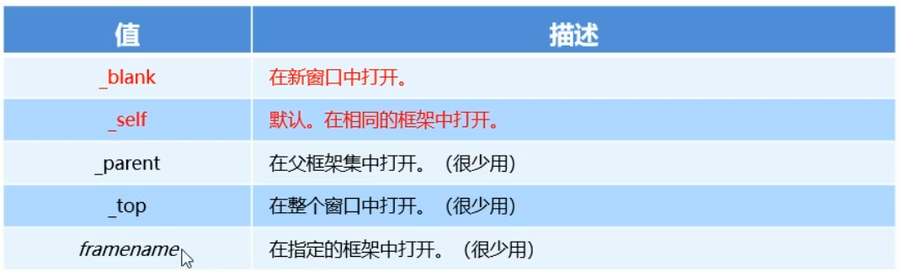

#1. form表单的基本使用
##1.1 什么是表单  
表单在网页中主要负责**数据采集功能**。HTML中的&lt;from&gt;标签，就是用于采集用户输入的信息，并通过&lt;form&gt;标签的提交操作，把采集到的信息提交到服务器端进行处理。
##1.2 表单的组成部分   
表单由三个基本部分组成：
**表单标签**
**表单域**
表单域包含了文本框、密码框、隐藏框、多行文本框、复选框、单选框、下拉框和文件上传框等
**表单按钮**
##1.3 &lt;form&gt;标签的属性
&lt;form&gt;标签用来采集数据，&lt;form&gt;标签的属性则是用来规定如何把收集到的数据发送到服务器

###1. action
action属性用来规定当提交表单时，向何处发送表单数据
action的属性应该是后端提供的一个URL地址，这个URL地址专门负责接收表单提交过来的数据
当 &lt;form&gt;表单为指定action属性值的情况下，action的默认值为当前页面的URL地址
**注意**：当提交表单后，页面会立即跳转到action属性指定的URL页面
###2. target
target属性用来规定在**何处打开actionURL**
它的可选值有5个，默认情况下，target的值是_self,表示在相同框架打开action URL

