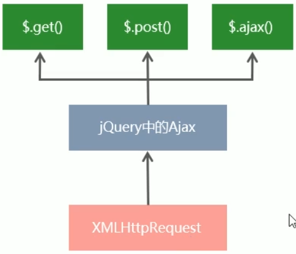

# 1. XMLHttpRequest的基本使用
## 1.1. 什么是XMLHttpRequest
XMLHttpRequest(简称xhr)是浏览器提供的JavaScript对象，通过它，可以 **请求服务器上的数据资源**。之前所学的jQuery中中的Ajax函数，就是基于xhr对象封装出来的

## 1.2. 使用xhr发起get请求
步骤：
- 创建xhr对象
- 调用xhr.open()函数
- 调用xhr.send()函数
- 监听xhr.onreadystatechange事件

```html
    <script>
        // 1. 创建xhr对象
        var xhr = new XMLHttpRequest()
        // 2. 调用open函数
        xhr.open('get', 'http://www.liulongbin.top:3006/api/getbooks')
        // 3. 调用send函数
        xhr.send()
        // 4. 监听onreadystatechange事件
        xhr.onreadystatechange = function () {
            if (xhr.readyState === 4 && xhr.status === 200) {
                console.log(xhr.responseText);
            }
        }
    </script>
```
## 1.3. 了解xhr对象的readyState属性
XMLHttpRequest对象的readyState属性，表示 **当前Ajax请求所处的状态**。每个Ajax请求必然处于以下状态中的一个：


## 1.4. 使用xhr发起带参数的get请求
使用xhr对象发起带参数的get请求时，只需在调用xhr.open期间，为URL地址指定参数即可

在URL地址之后用？拼接的参数，叫做 **查询字符串**

## 1.5. 查询字符串
### 1. 查询字符串定义

定义：查询字符串（URL参数）是指在URL的末尾加上用于向服务器发送信息的字符串（变量）

格式：将英文的 **?**放在URL的末尾，然后再加上 **参数=值**，想加上多个参数的话，使用 **&**符号进行分隔。以这个形式，可以将想要发送给服务器的数据添加到URL中

### 2. get请求携带参数的本质
无论使用\$.ajax(),还是使用\$.get(),又或者使用xhr对象发起get请求，当需要携带参数的时候，本质上，都是直接将参数以查询字符串的形式，追加到URL地址的后面，发送到服务器的
```html
    <script>
        // $.get('http://www.liulongbin.top:3006/api/getbooks', {
        //     id: 1,
        //     bookname: '西游记'
        // }, function (res) {
        //     console.log(res);
        // })

        $.ajax({
            method:'get',
            url:'http://www.liulongbin.top:3006/api/getbooks',
            data:{
                id:1,
                bookname:'西游记'
            },
            success:function(res){
                console.log(res);
            }
        })
    </script>
```

## 1.6. url编码与解码
### 1. 什么是URL编码
URL地址中，只允许出现英文相关的字母、标点符号、数字，因此，在URL地址中国不允许出现中文字符。

如果URL中需要包含中文这样的字符，则必须对中文字符进行**编码**（转义）

**URL编码的原则**：使用安全的字符（没有特殊用途或者特殊意义的可打印字符）去表示哪些不安全的字符。

URL编码原则的通俗理解：使用英文字符去表示非英文字符

### 2. 如何对URL进行编码与解码
浏览器提供了URL编码与解码的API，分别是
- encodeUR()编码的函数
- decodeURI()解码的函数

```html
    <script>
        var str='海绵宝宝'
        var str2=encodeURI(str)
        console.log(str2); //%E6%B5%B7%E7%BB%B5%E5%AE%9D%E5%AE%9D

        var str3=decodeURI('%E6%B5%B7%E7%BB%B5%E5%AE%9D%E5%AE%9D')
        console.log(str3);
    </script>
```
### 3. url编码的注意事项
由于浏览器会自动的对URL地址进行编码操作，因此，大多数情况下，程序员不需要关心URL地址的编码与解码操作
## 1.7. 使用xhr发起post请求

步骤：
- 创建xhr对象
- 调用xhr.open()函数
-  **设置Content-Type属性**(固定写法)
-  调用xhr.send()函数， **同时指定要发送的数据**
-  监听xhr.onreadystatechange事件

```html
    <script>
        // 1. 创建xhr对象
        var xhr = new XMLHttpRequest()
        // 2. 调用open函数
        xhr.open('post', 'http://www.liulongbin.top:3006/api/addbook')
        // 3. 设置Content-Type属性
        xhr.setRequestHeader('Content-Type', 'application/x-www-form-urlencoded')
        // 4. 调用send函数
        xhr.send('bookname=水浒传&author=施耐庵&publisher=上海图书出版社')
        // 5. 监听onreadystatechange事件
        xhr.onreadystatechange = function () {
            if (xhr.readyState === 4 && xhr.status === 200) {
                console.log(xhr.responseText);
            }
        }
    </script>
```
# 2. 数据交换格式
## 2.1. 什么是数据交换格式
数据交换格式就是服务器端与客户端之间进行数据传输与交换的格式

前端领域，经常提及的两种数据交换格式分别是 **XML**和 **JSON**，XML应用较少，重点学习JSON


## 2.2. XML
### 1. 什么是XML
XML的英文全称是 EXtensible Makeup Language，即**可扩展标记语言**。因此，XML和HTML类似，也是一种标记语言

### 2. XML和HTML的区别
XML和HTML虽然都是标记语言，但是两者没有任何关系
- HTML被设计用来描述网页的内容，是网页内容的载体
- XML被设计用来传输和储存数据，是数据的载体

### 3. XML的缺点
- XML格式臃肿，和数据无关的 代码多，体积大，传输效率低
- 在JavaScript中解析XML比较麻烦

## 2.3. JSON
### 1. 什么是JSON
概念：JSON的英文全称 JavaScript Object Notation，即“JavaScript对象表示法”。简单来讲，JSON就是**JavaScript对象和数组的字符串表示法**，它使用文本表示一个js对象和数组的信息，因此，**JSON的本质是字符串**

作用：JSON是一种**轻量级的文本数据交换格式**，在作用上类似于XML，专门用于储存和传输数据，但是JSON比XML更小，更快，更易解析

现状：JSON已经成为主流数据交换格式

### 2. JSON的两种结构
JSON就是字符串表示JavaScript的对象和数组。所以，JSON中包含**对象**和**数组**两种结构，通过这两种结构的**相互嵌套**，可以表示各种复杂的数据结构

**对象结构**：对象结构在JSON中表示为{}括起来的内容。数据结构为{key:value,key:value,...}的键值对结构。其中，key必须是使用英文的**双引号**包裹的字符串，value的数据类型可以是 **数字、字符串、布尔值、null、数组、对象**6种类型

### 3. JSON语法注意事项
- 属性名必须使用双引号包裹
- 字符串类型的值必须使用双引号包裹
- JSON中不允许使用单引号表示字符串
- JSON中不能写注释
- JSON的最外层必须是数组或者对象格式
- 不能使用undefined或者函数作为JSON的值

JSON的作用：**在计算机和网络之间传输数据**
JSON的本质：**用字符串来表示JavaScript对象数据或者数组数据**

### 4. JSON和js对象的关系
JSON是js对象的字符串表示法，它使用文本表示一个js对象的信息，本质上是一个字符串

### 5. JSON和js对象的互转
JSON字符串转换为js对象，使用JSON.parse()方法：
```html
    <script>
        var jsonStr='{"a":"hello","b":"world"}'
        var obj=JSON.parse(jsonStr)
        console.log(obj);
    </script>
```

要实现从js对象转换为JSON字符串，使用JSON.stringify()方法：
```javascript
        var obj2={a:'hello',b:'world',c:false}
        var string=JSON.stringify(obj2)
        console.log(string);
```

### 6. 序列化和反序列化
把数据对象转换为字符串的过程，叫做序列化，例如：调用JSON.stringify()的操作，叫做JSON序列化

把字符串转换为数据对象的过程，叫做反序列化，例如：调用JSON.parse()函数的操作，叫做JSON反序列化


# 3. 封装自己的Ajax函数
## 3.1. 要实现的效果
调动自定义的itheima函数，发起Ajax数据请求

## 3.2. 定义options参数选项
itheima()函数是我们自定义的Ajax函数，它接收一个配置对象作为参数，配置对象中可以配置如下属性：
- method--请求的类型
- URL--请求的URL地址
- data--请求携带的数据
- success--请求成功之后的回调函数

## 3.3. 处理data参数
需要把data对象，转化成查询字符串的格式，从而提交给服务器，因此提前定义resolveData函数如下：
```javascript
function resolveData(data) {
    var arr = []
    for (var k in data) {
        var str = k + '=' + data[k]
        arr.push(str)
    }

    return arr.join('&')
}

var res=resolveData({name:'zs',age:12})
console.log(res);
```
## 3.4. 定义itheima函数
在itheima()函数中，需要创建xhr对象，并监听onreadystatechange事件：
```javascript
function itheima(options) {
    var xhr = new XMLHttpRequest()

    // 把外界传递过来的参数对象转化为查询字符串
    var qs = resolveData(options.data)

    xhr.onreadystatechange = function () {
        if (xhr.readyState === 4 && xhr.status === 200) {
            var result = JSON.parse(xhr.responseText)
            options.success(result)
        }
    }
}
```

## 3.5. 判断请求的类型
不同的请求类型，对应xhr对象不同的操作，因此需要对请求类型进行if...else...的判断
```javascript
function itheima(options) {
var xhr = new XMLHttpRequest()

// 把外界传递过来的参数对象，转换为查询字符串
if (options.method.toUpperCase() === 'GET') {
    //发起get请求
    xhr.open(options.method, options.url + '?' + qs)
    xhr.send()

} else if (options.method.toUpperCase() === 'POST') {
    // 发起post请求
    xhr.open(options.method, options.url)
    xhr.setRequestHeader('Content-Type', 'application/x-www-form-urlencoded')
    xhr.send(qs)
}
```

# 4. XMLHttpRequest Level2的新特性
## 4.1. 认识XMLHttpRequest Level2
### 1. 旧版XMLHttpRequest的缺点
- 只支持文本数据的传输，无法用来读取和上传文件
- 传送和接受数据时，没有进度信息，只能提示有没有完成

### 2. XMLHttpRequest Level2的新功能
- 可以设置http请求的时限
- 可以使用FormData对象管理表单数据
- 可以上传文件
- 可以获取数据传输的进度信息

## 4.2. 设置http请求时限
XMLHttpRequest Level2增加了timeout属性，可以设置http请求时限

```javascript
// 设置超时时间
xhr.timeout=3000
// 设置超时以后的处理函数
xhr.ontimeout=function(){
    console.log('请求超时');
}
```
## 4.3. FormData对象管理表单数据
Ajax操作往往用来提交表单数据，为了方便表单管理，HTML5新增了一个FormData对象，可以模拟表单操作：
```html
<script>
    // 创建formdata实例
    var fd = new FormData()

    // 2. 调用append函数，向fd中追加数据
    fd.append('uname', 'zs')
    fd.append('upwd', '123456')

    var xhr = new XMLHttpRequest()
    xhr.open('post', 'http://www.liulongbin.top:3006/api/formdata')
    xhr.send(fd)
    xhr.onreadystatechange = function () {
        if (xhr.readyState === 4 && xhr.status === 200) {
            console.log(JSON.parse(xhr.responseText));
        }
    }
</script>
```

FormData对象也可以用来获取网页表单的值，示例代码如下：
```html
<form id="form1">
    <input type="text" name="uname" autocomplete="off" />
    <input type="password" name="upwd" />
    <button type="submit">提交</button>
</form>


<script>
    // 1. 通过DOM操作获取form表单元素
    var form = document.querySelector('#form1')

    form.addEventListener('submit', function (e) {
        // 阻止表单的默认提交行为
        e.preventDefault()

        // 创建FormData，快速获取到form表单的数据
        var fd = new FormData(form)

        var xhr = new XMLHttpRequest()
        xhr.open('post', 'http://www.liulongbin.top:3006/api/formdata')

        xhr.send(fd)

        xhr.onreadystatechange = function () {
            if (xhr.readyState === 4 && xhr.status === 200) {
                console.log(JSON.parse(xhr.responseText));
            }
        }

    })
</script>
```
## 4.4. 上传文件
新版本XMLHttpRequest对象，可以实现上传文件

实现步骤：
- 定义UI结构
- 验证是否选择了文件
- 向FormData中追加文件
- 使用xhr发起上传文件的请求
- 监听onreadystatechange事件

### 1. 定义UI结构
```html
    <!-- !. 文件选择框 -->
    <input type="file" id="file1" />

    <!-- 2. 上传文件袋按钮 -->
    <button id="btnUpload">上传文件</button>
    <br />

    <!-- 3. img标签 来显示上传成功以后的图片-->
    
```
### 2. 验证是否选择了文件
```html
<script>
// 1. 获取文件上传按钮
var btnUpload=document.querySelector('#btnUpload')

// 2. 为按钮绑定单击事件处理函数
btnUpload.addEventListener('click',function(){
    // 3. 获取到用户选择的文件列表
    var files=document.querySelector('#file1').files

    if(files.length<=0){
        return alert('请选择要上传的文件')
    }
    console.log('用户选择了待上传的文件');
})
</script>
```
### 3. 向FormData中追加文件
```javascript
        var fd=new FormData()
        
        // 将用户选择的文件，添加到FormData中
        fd.append('avatar',files[0])
```

### 4. 使用xhr发起上传文件的请求
```javascript
var xhr=new XMLHttpRequest()
xhr.open('post','http://www.liulongbin.top:3006/api/upload/avatar')
xhr.send(fd)
```
### 5. 监听onreadystatechange事件
```javascript
xhr.onreadystatechange = function () {
    if (xhr.readyState === 4 && xhr.status === 200) {
        var data = JSON.parse(xhr.responseText)
        console.log(data);
        if (data.status === 200) {
            // 上传成功
            document.querySelector('#img').src = 'http://www.liulongbin.top:3006' + data.url
        } else {
            // 上传失败
            console.log('上传图片失败' + data.message);
        }
    }
}
```

## 4.5. 显示文件上传进度
新版本的xhr对象中，可以通过监听xhr.upload.onprogress事件，来获取到文件的上传进度

语法格式：
```html
<link rel="stylesheet" href="lib/bootstrap.css" />
<script src="lib/jquery.js"></script>

<body>
<!-- bootstrap中的进度条 -->
<div class="progress" style="width: 500px; margin:15px 10px;">
    <div class="progress-bar progress-bar-striped active" style="width: 0%" id="percent">
        0%
    </div>
</div>
</body>

<script>
xhr.upload.onprogress = function (e) {
    if (e.lengthComputable) {
        // 计算出上传的进度
        var procentComplete = Math.ceil((e.loaded / e.total) * 100)
        console.log(procentComplete);

        // 动态设置进度条
        $('#percent').attr('style','width:'+procentComplete+'%').html(procentComplete+'%')
    }
}

// 设置上传完成之后的进度条样式
xhr.upload.onload = function () {
    $('#percent').removeClass().addClass('progress-bar progress-bar-success')
}
</script>
```


#  5. jQuery高级用法
## 5.1. jQuery实现文件上传
### 1. 定义UI结构
```html
    <input type="file" id="file1" />
    <button id="btnUpload">上传文件</button>
```
### 2. 验证是否选择了文件
```javascript
$(function(){
    $('#btnUpload').on('click',function(){
        var files=$('#file1')[0].files
        if (files.length<=0){
            return alert('请选择文件后再上传')
        }
        console.log('ok');
    })
})
```
### 3. 向FormData中追加文件

```javascript
var fd=new FormData()
fd.append('avatar',files[0])
```
### 4. 使用jQuery发起上传文件的请求
```javascript
$.ajax({
    method: 'post',
    url: 'http://www.liulongbin.top:3006/api/upload/avatar',
    data: fd,
    processData: false,
    contentType: false,
    success: function (res) {
        console.log(res);
    }
})
```
- processData和contentType必须为FALSE，不写也不行
- 必须使用\$.ajax() 不能使用\$.post()
 
## 5.2. jQuery实现loading效果
### 1. ajaxStart(callback)
Ajax请求开始时，执行ajaxStart函数，可以在ajaxStart的callback中显示loading效果

代码如下：
```javascript
$(document).ajaxStart(function(){
    // 监听到ajax请求被发起了
    $('#loading').show()
})
```
注意：
- 自jQuery版本1.8起，该方法只能被附加到文档
- \$(document).ajaxStart()函数会监听当前文档内所有的ajax请求

### 2. ajaxStop(callback)
Ajax请求结束时，执行ajaxStop函数。可以在ajaxStop函数的callback中隐藏loading效果

代码如下：
```javascript
// 监听到ajax完成的事件
$(document).ajaxStop(function(){
    $('#loading').hide()
})
```

# 6. axios
## 6.1. 什么是axios
Axios是专注于 **网络数据请求**的库

相比于原生的XMLHttpRequest对象，axios简单易用

相比于jQuery,axios更加轻量化
## 6.2. axios发起get请求
语法：
```html
<script src="lib/axios.js"></script>
<button id="btn1">发起get请求</button>
<script>
    document.querySelector('#btn1').addEventListener('click',function(){
        var url='http://www.liulongbin.top:3006/api/get'
        var paramsObj={name:'zhangsan',age:20}
        axios.get(url,{params:paramsObj}).then(function(res){
            // res对象并不是服务器响应回来的真实数据，而是axios包装的对象，在res对象身上永远都有6个属性：config data headers request status statusText  其中data才是真正服务器响应回来的数据
            console.log(res.data);
        })
    })
</script>
```
## 6.3. axios发起post请求
代码：
```javascript
document.querySelector('#btn2').addEventListener('click',function(){
    var url='http://www.liulongbin.top:3006/api/post'
    var dataObj={name:'zhangsan',age:20}
    axios.post(url,dataObj).then(function(res){
        // res对象并不是服务器响应回来的真实数据，而是axios包装的对象，在res对象身上永远都有6个属性：config data headers request status statusText  其中data才是真正服务器响应回来的数据
        console.log(res.data);
    })
})
```
## 6.4. 直接使用axios发起请求
axios也提供了类似于jQuery中\$.ajax()的函数，语法如下：
```javascript
axios({
    method:'请求类型',
    url:'URL地址',
    data:{post数据},
    params:{get参数}
}).then(callback)
```
### 1. 直接使用axios发起get请求
```javascript
document.querySelector('#btn3').addEventListener('click', function () {
    var url = 'http://www.liulongbin.top:3006/api/get'
    var paramsData = {
        name: 'zhangsan',
        age: 20
    }
    axios({
        method: 'get',
        url: url,
        params: paramsData
    }).then(function (res) {
        console.log(res.data);
    })
})
```
### 2. 直接使用axios发起post请求
```javascript
document.querySelector('#btn4').addEventListener('click', function () {
    var url = 'http://www.liulongbin.top:3006/api/post'
    var data = {
        name: 'zhangsan',
        age: 20
    }
    axios({
        method: 'post',
        url: url,
        data: data
    }).then(function (res) {
        console.log(res.data);
    })
})
```

