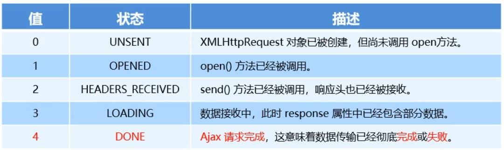

# 1. XMLHttpRequest的基本使用
## 1.1. 什么是XMLHttpRequest
XMLHttpRequest(简称xhr)是浏览器提供的JavaScript对象，通过它，可以 **请求服务器上的数据资源**。之前所学的jQuery中中的Ajax函数，就是基于xhr对象封装出来的

## 1.2. 使用xhr发起get请求
步骤：
- 创建xhr对象
- 调用xhr.open()函数
- 调用xhr.send()函数
- 监听xhr.onreadystatechange事件

```html
    <script>
        // 1. 创建xhr对象
        var xhr = new XMLHttpRequest()
        // 2. 调用open函数
        xhr.open('get', 'http://www.liulongbin.top:3006/api/getbooks')
        // 3. 调用send函数
        xhr.send()
        // 4. 监听onreadystatechange事件
        xhr.onreadystatechange = function () {
            if (xhr.readyState === 4 && xhr.status === 200) {
                console.log(xhr.responseText);
            }
        }
    </script>
```
## 1.3. 了解xhr对象的readyState属性
XMLHttpRequest对象的readyState属性，表示 **当前Ajax请求所处的状态**。每个Ajax请求必然处于以下状态中的一个：



## 1.4. 使用xhr发起带参数的get请求
使用xhr对象发起带参数的get请求时，只需在调用xhr.open期间，为URL地址指定参数即可

在URL地址之后用？拼接的参数，叫做 **查询字符串**

## 1.5. 查询字符串
### 1. 查询字符串定义

定义：查询字符串（URL参数）是指在URL的末尾加上用于向服务器发送信息的字符串（变量）

格式：将英文的 **?**放在URL的末尾，然后再加上 **参数=值**，想加上多个参数的话，使用 **&**符号进行分隔。以这个形式，可以将想要发送给服务器的数据添加到URL中

### 2. get请求携带参数的本质
无论使用\$.ajax(),还是使用\$.get(),又或者使用xhr对象发起get请求，当需要携带参数的时候，本质上，都是直接将参数以查询字符串的形式，追加到URL地址的后面，发送到服务器的
```html
    <script>
        // $.get('http://www.liulongbin.top:3006/api/getbooks', {
        //     id: 1,
        //     bookname: '西游记'
        // }, function (res) {
        //     console.log(res);
        // })

        $.ajax({
            method:'get',
            url:'http://www.liulongbin.top:3006/api/getbooks',
            data:{
                id:1,
                bookname:'西游记'
            },
            success:function(res){
                console.log(res);
            }
        })
    </script>
```

## 1.6. url编码与解码
### 1. 什么是URL编码
URL地址中，只允许出现英文相关的字母、标点符号、数字，因此，在URL地址中国不允许出现中文字符。

如果URL中需要包含中文这样的字符，则必须对中文字符进行**编码**（转义）

**URL编码的原则**：使用安全的字符（没有特殊用途或者特殊意义的可打印字符）去表示哪些不安全的字符。

URL编码原则的通俗理解：使用英文字符去表示非英文字符

### 2. 如何对URL进行编码与解码
浏览器提供了URL编码与解码的API，分别是
- encodeUR()编码的函数
- decodeURI()解码的函数

```html
    <script>
        var str='海绵宝宝'
        var str2=encodeURI(str)
        console.log(str2); //%E6%B5%B7%E7%BB%B5%E5%AE%9D%E5%AE%9D

        var str3=decodeURI('%E6%B5%B7%E7%BB%B5%E5%AE%9D%E5%AE%9D')
        console.log(str3);
    </script>
```


