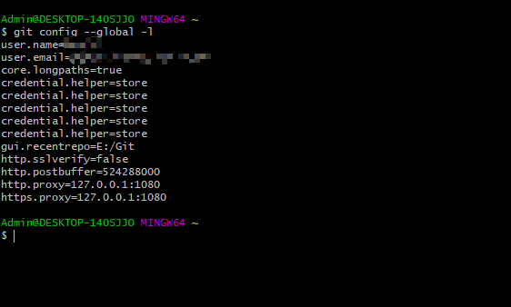

## 更换科学上网工具后重新设置Git代理

话说今天我的机场到期，因为对其速度不太满意就更换了另外一个机场。但是发现更换机场后Git无法正常使用，才想起可能是代理端口发生了改变。

打开 设置->网络和Internet->代理   发现端口果然被更改了（原先使用的代理端口是7898）


于是打开 Git Bash，先将原先的代理取消掉：
```java
git config --global --unset http.proxy

git config --global --unset https.proxy
```

然后重新设置代理：
```
git config --global https.proxy http://127.0.0.1:1080

git config --global https.proxy https://127.0.0.1:1080
```

不太放心，查看一下自己的配置信息，输入：
```
git config --global -l
```
发现：


代理已经设置好了，vscode试了一下也可以正常推送

完成！
