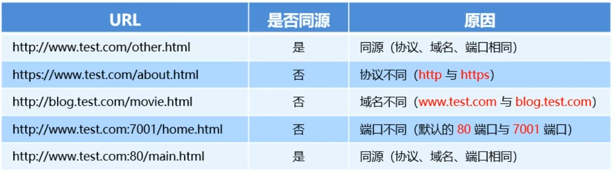
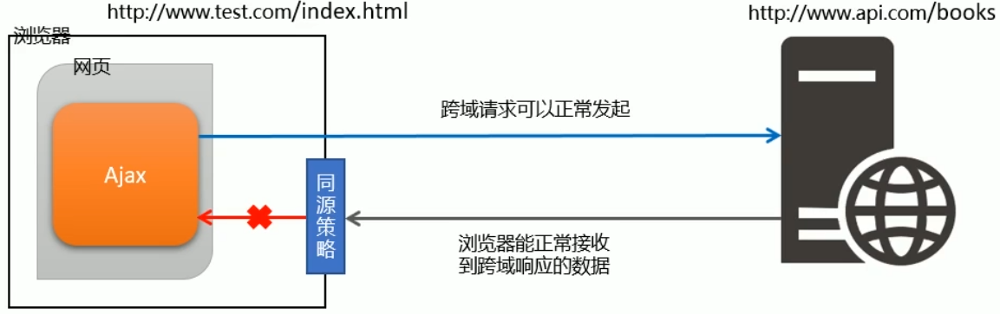
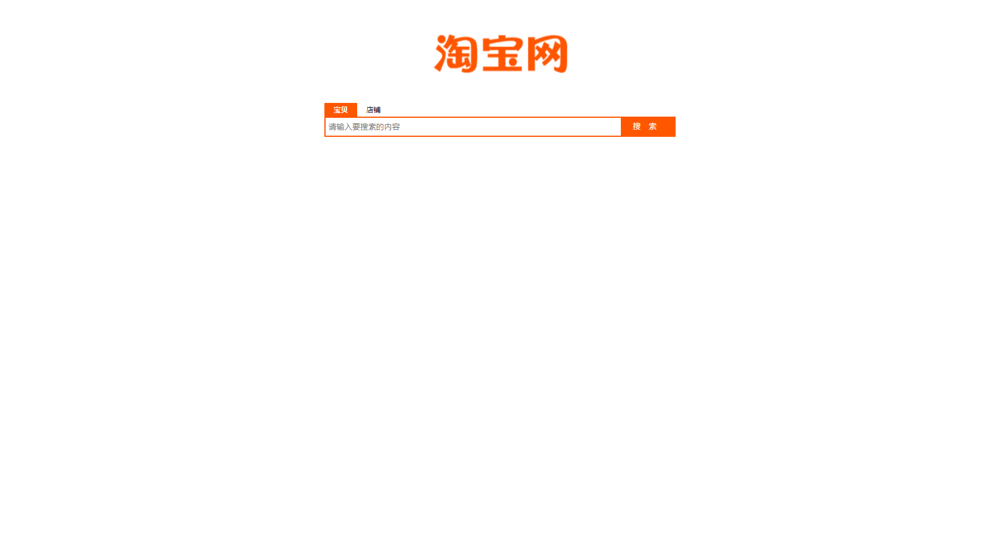

# 1. 了解同源策略和跨域
## 1.1. 同源策略
### 1. 什么是同源
如果两个页面的**协议**，**域名**和**端口**都相同，则两个页面具有相同的源

例如下表给出了相对于http://www.test.com/index.html页面的同源检测：

### 2. 什么是同源策略
同源策略（英文全称：Same origin policy）是**浏览器**提供的一个**安全功能**

MDN官方给定的概念：同源策略限制了从同一个源加载的文档或者脚本如何与来自另一个源的资源进行交互。这是一个用于隔离潜在恶意文件的重要安全机制

通俗理解：浏览器规定,A网站的JavaScript，不允许和非同源的网站C之间，进行资源的交互

例如：
- 无法读取非同源网页的cookie、LocalStorage和IndexedDB
- 无法接触非同源网页的DOM
- 无法向非同源地址发送ajax请求

## 1.2. 跨域
### 1. 什么是跨域
同源指两个URL协议、域名、端口一致，反之就是跨域
（只要协议、域名、端口三项中有任何一项不一致就是跨域）

出现跨域的根本原因：**浏览器的同源策略**不允许非同源的URL之间进行资源的交互
### 2. 浏览器对跨域请求的拦截

浏览器允许发起跨域请求，但是，跨域请求回来的数据，会被浏览器拦截，无法被页面获取到

### 3. 如何实现跨域数据请求
两种解决方案：**JSONP**和**CORS**

JSONP:出现较早，兼容性好。是前端程序员为了解决跨域问题，被迫想出来的一种 **临时解决方案**。缺点是 **只支持get请求** ，不支持post请求

CORS：出现较晚，是W3C标准，属于跨域Ajax请求的根本解决方案。支持GET和POST请求。缺点是兼容性较差

# 2， JSONP
## 2.2. JSONP的实现原理
由于浏览器的同源策略的限制，网页中无法通过Ajax请求非同源的接口数据。但是&lt;script&gt;标签不受浏览器同源策略的影响，可以通过src属性，请求非同源的js脚本

因此，JSONP的实现原理，就是通过&lt;script&gt;标签的src属性，请求跨域的数据接口，并通过**函数调用**的形式，接收跨域接口响应回来的数据

```javascript
$.ajax({
    method: 'get',
    url: 'http://ajax.frontend.itheima.net:3006/api/jsonp',
    data: {
        name: 'zhang',
        age: 20
    },
    success: function (res) {
        console.log(res);
    }
})
```
## 2.3. 自己实现一个简单的JSONP
定义一个success回调函数
```html
<script>
    function success(data){
        console.log('JSONP响应回来的数据是：');
        console.log(data);
    }
</script>

<script src="http://ajax/frontend.itheima.net:3006/api/jsonp?callback=abc"></script>
```
## 2.4.JSONP的缺点
由于JSONP是通过&lt;script&gt;标签的src属性，来实现跨域数据获取的，所以，JSONP只支持get数据请求，不支持POST数据请求

注意：JSONP和Ajax之间没有任何关系，不能把JSONP请求数据的方式叫做Ajax，因为JSONP没有用到XMLHttpRequest这个对象

## 2.5. jQuery中的JSONP
jQuery提供的\$.ajax()函数，除了可以发起真正的Ajax请求之外，还能够发起JSONP数据请求
```html
<script src="lib/jquery.js"></script>

<script>
    $(function () {
        // 发起JSONP请求
        $.ajax({
            url: 'http://ajax.frontend.itheima.net:3006/api/jsonp?name=zs&age=20',

            // 代表我们要发起JSONP的数据请求
            dataType: 'jsonp',
            success: function (res) {
                console.log(res);
            }
        })
    })
</script>
```
默认情况下，使用jQuery发起JSONP请求，会自动携带一个callback=jQueryxxx的参数，jQueryxxx是随机生成的一个回调函数名称
## 2.6. 自定义参数及回调函数名称
在使用jQuery发起JSONP请求时，如果想要自定义JSONP的参数及回调函数名称，可以通过如下两个参数来指定：
```javascript
//发送到服务端的参数名称，默认值为callback
jsonp:'cb',

//自定义的回调函数名称，默认值为jQueryxxx格式
jsonpCallback:'abc',
```

## 2.7. jQuery中JSONP的实现过程
jQuery中的JSONP,也是通过&lt;script&gt;标签的src属性实现跨域数据访问的，只不过，jQuery采用的是动态创建和移除&lt;script&gt;标签的方式，来发起JSONP的数据请求

- 在发起JSONP请求的时候，动态向&lt;header&gt;中append一个&lt;script&gt;标签；
- 在JSONP请求成功之后，动态从&lt;header&gt;中移除刚才append进去的&lt;script&gt;标签

```html
<script src="lib/jquery.js"></script>

<button id="btnJSONP">发起JSONP数据请求</button>
<script>
    $(function () {
        $('#btnJSONP').on('click', function () {
            $.ajax({
                url: 'http://ajax.frontend.itheima.net:3006/api/jsonp?address=北京&location=顺义',
                dataType: 'jsonp',
                jsonpCallback: 'abc',
                success: function (res) {
                    console.log(res);
                }

            })
        })
    })
</script>
```
# 3. 案例-淘宝搜索
## 3.1. 要实现的UI效果


## 3.2.获取用户输入的搜索关键词
为了获取到用户每次按下键盘输入的内容，需要监听输入框的keyup事件
```javascript
$(function () {
    //为输入框绑定keyup事件
    $('#ipt').on('keyup',function(){
    var keywords=$(this).val().trim()

    if (keywords.length<=0){
        reutrn
    }
    TODO://获取搜索建议列表
    console.log(keywords);
    })
})
```

## 3.3. 封装getSuggestList函数
将获取搜索建议列表的代码，封装到getSuggestList函数中

```javascript
function getSuggestList(kw) {
$.ajax({
    url: 'http://suggest.taobao.com/sug?q=' + kw,
    dataType: 'jsonp',
    success: function (res) {
    console.log(res);
    }
})
}
```
## 3.4. 渲染建议列表的UI结构
### 1. 定义搜索建议列表
```html
      <!-- 搜索建议列表 -->
      <div id="suggest-list"></div>
```
### 2. 定义模板结构
```html
  <!-- 模板结构 -->

  <script type="text/html" id="tpl-suggestList">
    {{each}}
    <!-- 搜索建议项 -->
    <div class="suggest-item">{{$value[0]}}</div>
    {{/each}}
  </script>
```

### 3. 定义渲染模板结构的函数
```javascript
// 渲染UI结构
function renderSuggestList(res) {
if (res.result.length <= 0) {
    return $('#suggest-list').empty().hide()
}
var htmlStr = template('tpl-suggestList', res)
$('#suggest-list').html(htmlStr).show()
}
})
```
### 4. 搜索关键词为空时隐藏搜索建议列表
在keyup事件中判断输入关键字符串长度是否为0中加入：
```javascript
return $('#suggest-list').empty().hide()
```
### 5. 搜索建议列表美化
```css
#suggest-list {
  border:1px solid #ccc;
  display: none;
}

.suggest-item{
  line-height: 30px;
  padding-left: 5px;
}

.suggest-item:hover{
  cursor:pointer;
  background-color: #eee;
}
```
## 3.5. 输入框的防抖
### 1. 什么是防抖
**防抖策略**：（debounce）是当事件被触发后，**延迟n秒**后再执行回调，如果在这n秒内事件又被触发，则重新计时

例子：王者荣耀游戏回城操作读条

### 2. 防抖的应用场景
用户在输入框中连续输入一串字符时，可以通过防抖策略，在输入完后，才执行查询的请求，这样可以有效减少请求次数，节约请求资源

### 3. 实现输入框的防抖
