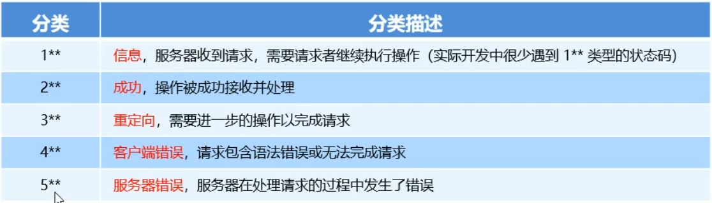

# 1. HTTP协议简介
## 1.1. 什么是通信
通信就是信息的传递和交换

通信三要素：
- 通信的 **主体**
- 通信的 **内容**
- 通信的 **方式**

我是红字
### 1. 互联网中的通信
 案例：**服务器**把**山东蓝翔技师学院的简介**通过**响应**的方式发送给**浏览器客户端**

 其中，
 - 服务的主体是服务器和浏览器
 - 服务的内容是山东蓝翔技师学院的简介
 - 服务的方式是响应

## 1.2. 什么是通信协议
**通信协议**(Communication Protocol)是指通信的双方完成通信所必须遵守的**规则和约定**

通俗的理解：通信双方采用约定好的格式来发送和接受消息，这种事先约定好的通信格式，叫做通信协议

### 1. 互联网中的通信协议
客户端与服务器之间要实现 **网页内容**的传输，则通信的双方必须遵守 **网页内容的传输协议**

网页内容又叫做 **超文本**，因此网页内容的传输协议又叫做 **超文本传输协议** (HttpText Transfer Protocol)，简称**HTTP协议**

## 1.3. HTTP
### 1. 什么是HTTP
HTTP协议即超文本传输协议(HttpText Transfer Protoco)，它规定了客户端与服务器之间进行网页内容传输时，所必须遵守的传输格式
### 2. HTTP协议的交互模型
HTTP协议采用了 **请求/响应**的交互模型

# 2. HTTP请求消息
## 2.1.什么是HTTP请求消息
客户端发起的请求叫做HTTP请求，客户端发送到服务器的消息，叫做HTTP请求消息

注意：HTTP请求消息又叫做HTTP请求报文

## 2.2.  HTTP请求消息的组成部分
HTTP请求消息由 **请求行**(request line)、 **请求头部**(header)、**空行**和 **请求体**四个部分组成

### 1. 请求行
请求行由 **请求方式**、**URL**和 **HTTP协议**3个部分组成，他们之间用空格隔开

### 2. 请求头部
请求头部用来描述客户端的基本信息，从而把客户端相关的信息告知服务器，比如：
- User-Agent:用来说明当前是什么类型的浏览器
- Content-Type:用来描述发送到服务器的数据格式
- Accept：用来描述客户端能能够接收什么类型的返回内容
- Accept-Language:用来描述客户端期望接收哪种人类语言的文本内容
  
请求头部用多行 **键/值对**组成，每行的键值之间用英文冒号分隔

#### 2. 请求头部-常见的请求头字段

### 3. 空行
最后一个请求头部字段的后面是一个 **空行**，通知服务器请求头部至此结束

空行就是用来分隔头部与请求体

### 4. 请求体
请求体中存放的，是要通过**post**方式提交到服务器的数据

注意：**只有post请求才有请求体，get请求没有请求体**

# 3. HTTP响应消息
## 3.1. 什么是HTTP响应消息
响应消息就是服务器响应给客户端的消息内容，也叫做响应报文

## 3.2.HTTP响应消息的组成部分
HTTP响应消息由 **状态行**、 **响应头部**(header)、**空行**和 **响应体**四个部分组成

### 1. 状态行
状态行由HTTP协议版本、状态码和状态码的描述文本3个部分组成，他们之间用空格隔开

### 2. 响应头部
响应头部是用来描述服务器的基本信息。响应头部由多行键值对组成，每行的键和值之间用英文的冒号分隔

#### 常见的响应头部字段

### 3. 空行
在最后一个响应头部字段结束之后，会紧跟一个空行，用来通知客户端响应头部至此结束

空行就是用来分隔响应头部和响应体
### 4. 响应体
响应体中存放的，是服务器响应给客户端的资源内容

在浏览器中Network选项卡中的Response面板可以看到响应体
# 4. HTTP请求方法
## 4.1. 什么是HTTP请求方法
HTTP请求方法是HTTP协议中的一部分，请求方法的作用是：用来表明 **要对服务器上的资源执行的操作**。
最常用的方法是get和post

## 4.2. HTTP的请求方法

# 5. HTTP响应状态码
## 5.1. 什么是HTTP响应状态码
HTTP响应状态码(HTTP Status Code),也属于HTTP协议的一部分，**用来标识响应的状态**

响应状态码会随着响应消息一起被发送到客户端浏览器，根据响应状态码，可以知道这次请求时成功还是失败

- 200：响应状态码
- OK：响应状态码的描述文本

## 5.2. HTTP响应状态码的组成和分类
HTTP响应状态码是由 **三个十进制数字**组成，第一个十进制数字定义了**状态码的类型**，后两个数字用来对状态码进行细分

HTTP状态码共分为5种类型：

## 5.3. 常见的HTTP响应状态码
### 1. 2** 成功相关的响应状态码
2..范围的状态码，表示服务器已经成功的接收到请求并进行处理。常见的2..类型状态码如下

### 2. 3** 重定向相关的响应状态码
3.. 范围的状态码，表示服务器要求客户端重定向，需要客户端进一步的操作以完成资源的请求。

### 3. 4**客户端错误相关的响应状态码
4..范围的状态码，表示客户端的请求有非法内容，从而导致这次请求失败。

### 4. 5**服务器错误相关的响应状态码
5.. 范围的状态码，表示服务器未能正常处理客户端的请求而出现的意外错误。

