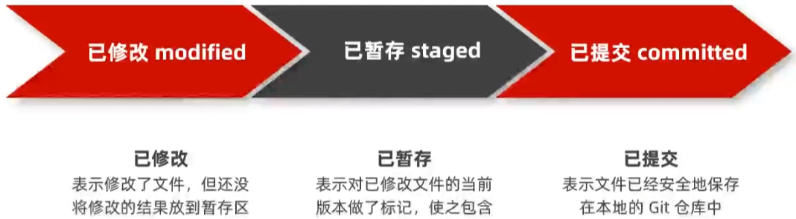

# 起步-Git基础概念
## 1. 什么是Git
Git是一个开源分布式版本控制系统，是目前世界上最先进，最流行的版本控制系统
## 2. Git的特性
- 直接记录快照，而非差异比较
- 近乎所有的操作都是本地执行
### 2.1. SVN差异比较
传统的版本控制系统（例如SVN）是基于差异的版本控制，他们存储的是**一组基本文件**和**每个文件随时间积累的差异**

好处：节省磁盘空间
缺点：耗时、效率低

### 2.2. Git的记录快照
Git快照是在原有文件版本的基础上重新生成一份新的文件，类似于**备份**。为了效率，如果文件没有修改，Git不再重新储存该文件，而是只保留一个链接指向之前储存的文件

缺点：占用磁盘空间较大
优点：版本切换时非常快，因为每个版本都是完整的文件快照，切换版本时直接恢复目标版本的快照即可
特点:空间换时间

### 2.3. 近乎所有的操作都是在本地执行
在Git中的绝大多数操作都只需要访问本地文件和资源，一般不需要来自网络上其他计算机的信息

特性：
- 断网之后依旧可以在本地对项目进行版本管理
- 联网后，把本地修改的记录同步到云端服务器即可

## 3. Git中的三个区域
- 工作区
- 暂存区
- Git仓库

## 4. Git中的三种状态

注意：
- 工作区的文件被修改了，但是还没有放到暂存区，就是已修改状态
- 如果文件已修改并放入暂存区，就是已暂存状态
- 如果Git仓库保存着特定版本的文件，就属于已提交状态

## 5. 基本的Git工作流程
基本的Git工作流程如下：
- 在工作区中修改文件
- 将你想要下次提交的更改进行暂存
- 提交更新，找到暂存区的文件，将快照永久性存储到Git仓库

