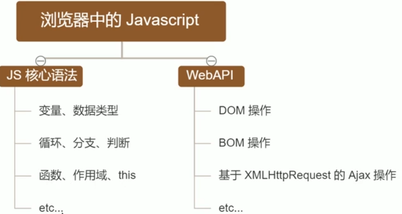
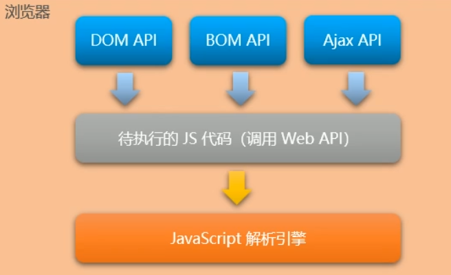
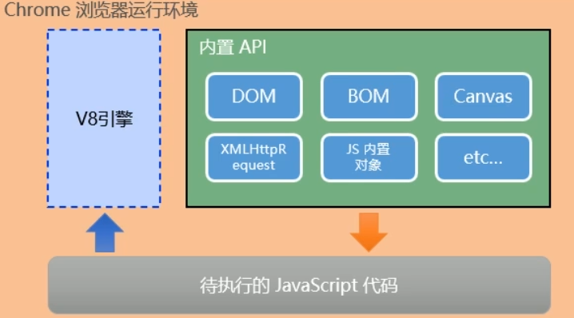
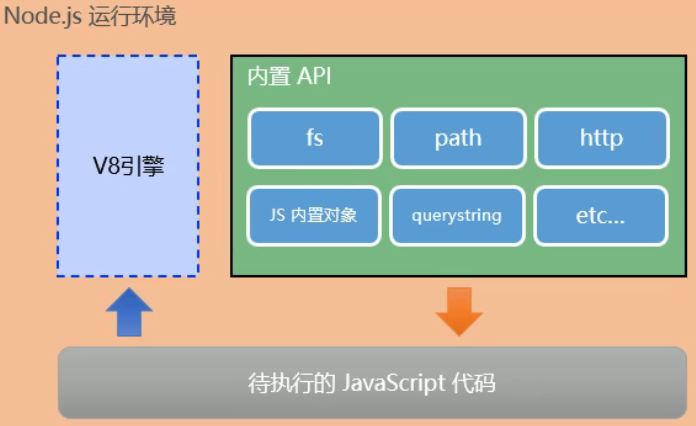

# 1. 初识Node.js
## 1.1. 回顾与思考
### 1. 已经掌握了哪些技术
- HTML
- CSS
- JavaScript

### 2. 浏览器中JavaScript的组成部分


### 3. 思考：为什么JavaScript可以在浏览器中被执行
待执行的JavaScript代码会通过JavaScript`解析引擎`解析后被浏览器执行

不同的浏览器使用不同的JavaScript解析引擎：
- Chrome=>V8
- Firefox=>OdinMonkey
- Safri=>JSCore
- IE=>Chakra
- etc...
### 4. 为什么JavaScript可以操作DOM和BOM
每个浏览器都内置了DOM，BOM这样的API函数，因此，浏览器中的JavaScript才可以调用他们


### 5. 浏览器中的JavaScript运行环境
    运行环境是指代码正常运行所需的必要环境


总结：
- V8引擎负责解析和执行JavaScript代码
- 内置API是由运行环境提供的特殊接口，只能在所属的运行环境中被调用

### 6. 思考：JavaScript能否做后端开发
可以
使用 `Node.js`
`Node.js`也是一个运行环境

## 1.2. Node.js简介
### 1. 什么是Node.js
Node.js是一个基于Chrome V8引擎的**JavaScript运行环境**

### 2. Node.js中的JavaScript运行环境



注意：
- 浏览器是JavaScript的前端运行环境
- Node.js是JavaScript的后端运行环境
- Node.js中无法调用DOM BOM等浏览器内置API

### 3. Node.js可以做什么
- 基于EXpress框架，可以快速构建Web应用
- 基于Electron框架可以构建跨平台的桌面应用
- 基于restify框架可以快速构建API接口项目
- 读写和操作数据库、创建实用的命令行工具辅助前端开发、etc

### 4.Node.js怎么学
JavaScript基础语法+**Node.js内置API模块**（fs path http等）+**第三方API模**块（express mysql等）


## 1.3. Node.js环境的安装
### 1. 安装
官网下载，直接安装即可
### 2. 查看已安装的Node.js的版本号
打开终端，在 终端输入命令 `node -v` 后，按下回车键，即可查看已安装的 Node.js的版本号

打开终端：
使用快捷键 Win+R 打开运行面板，输入cmd后直接回车，即可打开终端

### 3. 什么是终端
终端（Terminal）是专门为开发人员设计的，用于**实现人机交互**的一种方式

## 1.4. 在Node.js环境中执行JavaScript代码
- 打开终端
- 输入node要执行的js文件的路径

### 1. 终端里的快捷键
- 使用**↑**键，可以快速定位到上一次执行的命令
- 使用**tab**键，可以快速补全文件的路径
- 使用**Esc**键，可以快速清空当前已输入的命令
- 输入**cls**命令，可以清空终端

# 2. fs文件系统模块
## 2.1. 什么是fs文件系统模块
fs模块是Node.js官方提供的，用来操作文件的模块，它提供了一系列的方法和属性，用来满足用户对文件的操作需求

例如：
- `fs.readFile()`方法，用来 **读取**指定的文件中的内容
- `fs.whiteFile()`方法，用来向指定的文件中 **写入**内容
  
如果 要在JavaScript代码中，使用fs模块来操作文件，则需要使用如下的方式先导入它：
```
const fs=require('fs')
```
## 2.2. 读取指定文件中的内容
### 1. fs.readFile()的语法格式
```node
fs.readfile(path[,options],callback)
```
参数解读：
- 参数1：必选参数，字符串，表示文件的路径
- 参数2：可选参数，表示以什么编码格式来读取文件
- 参数3：必选参数，文件读取完成后，通过回调函数拿到读取的结果

### 2. fs.readFile()的示例代码
以utf8的编码格式，读取指定文件的内容，并打印err和dataStr的值


