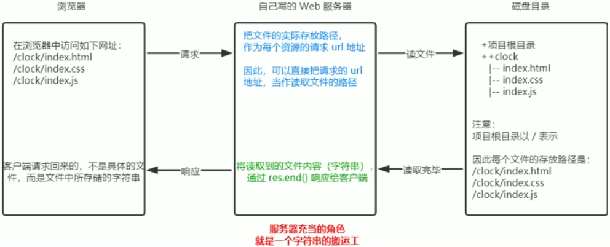

# 4. http模块
## 4.1. 什么是http模块
http模块是`Node.js`官方提供的、用来**创建web服务器**的模块，通过http模块提供的`http.createServer()`方法，就能方便的把一台电脑变成一台web服务器，从而对外提供web资源服务

如果要希望使用http模块创建web服务器，则需要先导入它：
```js
const http=require('http')
```
## 4.2.进一步理解http模块的作用
服务器和普通电脑的区别在于，服务器上安装了web服务器软件，例如：`IIS` 、`Apache`等。通过安装这些服务器软件，就能把一台普通的电脑，变成一台web服务器

在Node.js中，我们不需要使用`IIS` 、`Apache`等这些第三方web服务器软件。因为我们可以基于Node.js提供的`http`模块，通过几行代码，就能简单地手写一个服务器软件，从而对外提供web服务

## 4.3. 服务器相关的概念
### 1. IP地址
IP地址就是互联网上**每台计算机的唯一地址**，因此IP地址具有唯一性，如果把“个人电脑”比作一台电话，那么IP地址就相当于“电话号码”，只有在知道对方IP地址的前提下，才能与对应的电脑之间进行数据通信

ip地址的格式：通常用“点分十进制”表示成`(a.b.c.d)`的形式，其中,a,b,c,d都是0~255之间的十进制整数。

注意：
- 互联网中每台web服务器，都有自己的ip地址，例如：可以在Windows的终端中运行 `ping www.baidu.com`命令，即可查看到百度服务器的ip地址
- 在开发期间，自己的电脑即是一台服务器，也是一个客户端，为了测试方便，可以在自己的浏览器中输入`127.0.0.1`这个ip地址，就能把自己的电脑当做一台服务器进行访问了

### 2. 域名和域名服务器
尽管IP地址能够唯一地标记网络上的计算机，但是IP地址是一长串数字，不直观，而且不便于记忆，于是人们又发明了另一套**字符型**的地址方案，即所谓的**域名(Domain Name)地址**

IP地址和域名是一一对应的关系，这份对应关系放在一种叫做**域名服务器**（DNS，Domain name server）的电脑中，使用者只需要通过好记的域名访问对应的服务器即可，对应的转换工作由域名服务器实现。因此，**域名服务器就是提供IP地址和域名之间的转换服务的服务器**

注意：
- 在开发测试期间，`127.0.0.1`对应的域名是`localhost`，他们都代表我们自己的这台电脑，在使用效果上没有任何区别
### 3. 端口号
计算机中的端口号，就好像是现实生活中的门牌号一样。
在一台电脑里，可以运行成百上千个web服务，每个web服务都对应一个唯一的端口号，客户端发来的网络请求，通过端口号，可以被准确的交给对应的web服务进行处理

注意：
- 每个端口号不能同时被多个web服务占用
- 在实际应用中，URL中的**80端口可以被省略**


## 4.4. 创建最基本的web服务器

### 1. 创建web服务器的基本步骤
- 导入http模块
- 创建web服务器实例
- 为服务器绑定`requset`事件，监听客户端的请求
- 启动服务器


### 2. 步骤1-导入http模块
如果希望在自己的电脑上创建一个web服务器，从而对外提供web服务，则需要导入http模块

```js
const http=require('http')
```
### 2. 步骤2-创建web服务器实例
调用`http.createServer()`方法，即可快速创建一个web服务器实例

```js
const server=http.createServer()
```
### 3. 步骤3-为服务器实例绑定request事件
```js
// 使用服务器实例的.on()方法，为服务器绑定一个request事件
server.on('request',(req,res)=>{
    //只要有客户端来请求我们自己的服务器，就会触发request事件，从而调用这个事件处理函数
    console.log('someone visit our web server')
})
```
### 4. 步骤4-启动服务器
调用服务器实例的.listen()方法，即可启动当前的web服务器实例：
```js
//调用 server.listen(端口号，cb回调)方法，即可启动web服务器
server.listen(80,()=>{
    console.log('http server running at http://127.0.0.1')
})
```
### 3. req请求对象
只要服务器接收到了客户端的请求，就会调用通过`server.on()`为服务器绑定的request事件处理函数。
如果想要在事件处理函数中，访问与客户端相关的数据或属性，可以使用如下的方式：
```js
const http = require('http')
const server = http.createServer()

// req是请求对象，包含了与客户端相关的数据和属性
server.on('request', (req) => {
    // req.url是客户端请求的URL地址
    const url = req.url

    // req.method是客户端请求的method类型
    const method = req.method

    const str='Your request url is ${url} ,and request method is ${method}'

    console.log(str);
})
server.listen(80, () => {
    console.log('server running at http://127.0.0.1');
})
```
### 4. res响应对象
在服务器的request事件处理函数中，如果想要访问与服务器相关的数据或者属性，可以使用如下的方式：
```js
 // 调用res.end()方法向客户端响应一些内容
res.end(str)
```
### 5. 解决中文乱码的问题
当调用res.end()方法，向客户端发送中文内容时，会出现乱码的问题，此时，需要手动设置内容的编码格式
```js
const http = require('http')
const server = http.createServer()
server.on('request', (req, res) => {
    // 定义一个字符串，包含中文的内容
    const str = `您请求的URL地址是${req.url}，请求的method类型为${req.method}`

    // 调用res.setHeader()方法，设置Content-Type响应头，解决中文乱码的问题
    res.setHeader('Content-Type', 'text/html;charset=utf-8')

    // res.end()将内容响应给客户端
    res.end(str)
})

server.listen(80, () => {
    console.log('server running at http://127.0.0.1');
})
```

## 4.5.根据不同的URL响应不同的HTML内容
### 1. 核心实现步骤
- 请求的URL地址
- 设置默认的响应内容为404 Not found
- 判断用户请求的是否为/或者、index.html首页
- 判断用户请求的是否为/about.html关于页面
- 设置Content-Type响应头，防止中文乱码
- 使用res.end()把内容响应给客户端

### 2. 动态响应内容
```js
const http = require('http')
const server = http.createServer()
server.on('request', (req, res) => {
    // - 请求的URL地址
    const url = req.url

    // - 设置默认的响应内容为404 Not found
    let content = '<h1>404 Not found</h1>'

    // - 判断用户请求的是否为/或者、index.html首页
    // - 判断用户请求的是否为/about.html关于页面
    if (url === '/' || url === '/index.html') {
        content = '<h1>首页</h1>'
    } else if (url === '/about.html') {
        content = '<h1>关于页面</h1>'
    }

    // - 设置Content-Type响应头，防止中文乱码
    res.setHeader('Content-Type', 'text/html;charset=utf-8')


    // - 使用res.end()把内容响应给客户端
    res.end(content)
})
server.listen(80, () => {
    console.log('server running at http://127.0.0.1');
})
```
## 4.6. 案例-实现clock时钟的web服务器
### 1. 核心思路
把文件的实际存放路径，作为每个资源请求的URL地址


### 2. 实现步骤
- 导入需要的模块
- 创建基本的web服务器
- 将资源请求的URL地址映射为文件的存放路径
- 读取文件的内容并响应给客户端
- 优化资源的请求路径

### 3. 步骤1-导入需要的模块
